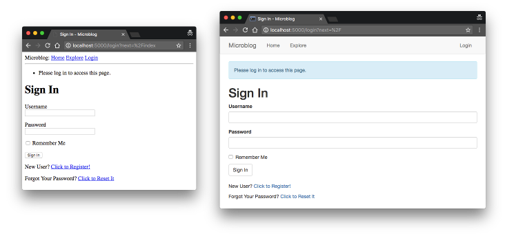
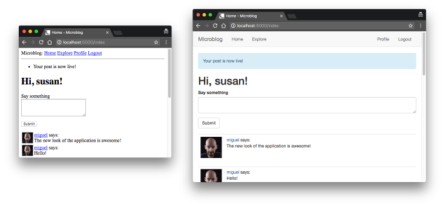

## Chapter 11: Facelift

> Posted by on [Miguel Grinberg](https://blog.miguelgrinberg.com/author/Miguel%20Grinberg)

這是 Flask Mega-Tutorial 系列的第十一期，在這一期中，我將告訴你如何用基於 Bootstrap 使用者介面框架的新一套模板來替換基本的 HTML 模板。

### 目錄

- [Chapter 1: Hello, World!](/python/flask-mega-tutorial/chapter_1_hello_world)
- [Chapter 2: Templates](/python/flask-mega-tutorial/chapter_2_templates)
- [Chapter 3: Web Forms](/python/flask-mega-tutorial/chapter_3_web_forms)
- [Chapter 4: Database](/python/flask-mega-tutorial/chapter_4_database)
- [Chapter 5: User Logins](/python/flask-mega-tutorial/chapter_5_user_logins)
- [Chapter 6: Profile Page and Avatars](/python/flask-mega-tutorial/chapter_6_profile_page_and_avatars)
- [Chapter 7: Error Handling](/python/flask-mega-tutorial/chapter_7_error_handling)
- [Chapter 8: Followers](/python/flask-mega-tutorial/chapter_8_followers)
- [Chapter 9: Pagination](/python/flask-mega-tutorial/chapter_9_pagination)
- [Chapter 10: Email Support](/python/flask-mega-tutorial/chapter_10_email_support)
- [Chapter 11: Facelift](/python/flask-mega-tutorial/chapter_11_facelift)
- [Chapter 12: Dates and Times](/python/flask-mega-tutorial/chapter_12_dates_and_times)
- [Chapter 13: I18n and L10n](/python/flask-mega-tutorial/chapter_13_i18n_and_l10n)
- [Chapter 14: Ajax](/python/flask-mega-tutorial/chapter_14_ajax)
- [Chapter 15: A Better Application Structure](/python/flask-mega-tutorial/chapter_15_a_better_application_structure)
- [Chapter 16: Full-Text Search](/python/flask-mega-tutorial/chapter_16_full_text_search)
- [Chapter 17: Deployment on Linux](/python/flask-mega-tutorial/chapter_17_deployment_on_linux)
- [Chapter 19: Deployment on Docker Containers](/python/flask-mega-tutorial/chapter_19_deployment_on_docker_containers)
- [Chapter 20: Some JavaScript Magic](/python/flask-mega-tutorial/chapter_20_some_javascript_magic)
- [Chapter 21: User Notifications](/python/flask-mega-tutorial/chapter_21_user_notifications)
- [Chapter 22: Background Jobs](/python/flask-mega-tutorial/chapter_22_background_jobs)
- [Chapter 23: Application Programming Interfaces （APIs）](/python/flask-mega-tutorial/chapter_23_application_programming_interfaces_apis)

> 你正在閱讀 Flask Mega-Tutorial 的 2024 年版本。完整的課程也可以在 [Amazon](https://amzn.to/3ahVnPN) 以電子書和平裝書的形式訂購。感謝你的支持！
> 如果你正在尋找 2018 年版本的課程，你可以在[這裡](https://blog.miguelgrinberg.com/post/the-flask-mega-tutorial-part-i-hello-world-2018)找到它。

你已經玩了一段時間我的 Microblog 應用程式，所以我相信你已經注意到，我並沒有花太多時間讓它看起來很好，或者更確切地說，我根本沒有在這方面花時間。我拼湊起來的模板非常基本，完全沒有自訂風格。對我來說，專注於應用程式的實際邏輯，而不必分心於撰寫好看的 HTML 和 CSS，是有用的。

但我已經專注於這個應用程式的後端部分一段時間了。所以在這一章，我將暫時放下這些，花一些時間向你展示可以做些什麼來讓應用程式看起來更加光鮮亮麗和專業。

這一章會有點不同於之前的章節，因為我不會像平常那樣詳細地講解 Python 這一方面，畢竟，這才是這個教學的主題。建立出色的網頁是一個廣泛的主題，與 Python 網頁開發大部分無關，但我會討論一些基本的指導方針和想法，如何著手這項任務，你也將有重新設計外觀的應用程式來研究和學習。

這一章的 GitHub 連結為：[Browse](https://github.com/miguelgrinberg/microblog/tree/v0.11) [Zip](https://github.com/miguelgrinberg/microblog/archive/v0.11.zip) [Diff](https://github.com/miguelgrinberg/microblog/compare/v0.10...v0.11)

### CSS 框架 (CSS Frameworks)

雖然我們可以爭論寫程式是困難的，但我們的困難與網頁設計師相比根本算不了什麼，他們必須建立在一系列網頁瀏覽器上看起來既漂亮又一致的網頁。近年來已經有所改善，但在某些瀏覽器中仍然存在一些不明顯的錯誤或怪異，使得設計到處都看起來不錯的網頁非常困難。如果你還需要針對資源和屏幕有限的平板電腦和智能手機瀏覽器，這就更加困難了。

如果你和我一樣，是一個只想建立看起來不錯的網頁的開發者，但沒有時間或興趣學習通過撰寫原始 HTML 和 CSS 有效達成這一目的的低階機制，那麼唯一實際的解決方案就是使用 CSS 框架來簡化任務。走這條路，你將失去一些創造性自由，但另一方面，你的網頁在所有瀏覽器中看起來都會很好，而且不需要花太多力氣。CSS

 框架提供了一系列高階 CSS 類別，用於常見類型的使用者介面元素的預製樣式。這些框架大多還提供 JavaScript 附加元件，用於那些無法僅用 HTML 和 CSS 完成的事情。

### 介紹 Bootstrap

最受歡迎的 CSS 框架之一是 Bootstrap。如果你想看到可以用這個框架設計的頁面類型，文檔中有一些範例。

使用 Bootstrap 來設計你的網頁時，你可以獲得的一些好處包括：

- 在所有主流網頁瀏覽器中看起來相似
- 處理桌面、平板電腦和手機屏幕尺寸
- 可定制的佈局
- 漂亮的導航欄、表單、按鈕、警報、彈出窗口等

使用 Bootstrap 最直接的方式是在你的基本模板中直接導入 bootstrap.min.css 檔案。你可以下載這個檔案的副本並將其加入到你的專案中，或者直接從 CDN 導入。然後你可以開始根據文檔使用它提供的通用用途 CSS 類別，這個文檔寫得很好。你可能還想導入框架的 JavaScript 程式碼，這樣你也可以使用最先進的功能。

像大多數開源專案一樣，Bootstrap 也在不斷進化。Flask Mega-Tutorial 的原始版本是為 Bootstrap 3 構建的。你目前閱讀的修訂版是為 Bootstrap 5.3 構建的。集成 Bootstrap 的當前方法相當通用，可以適應 Bootstrap 的新版本。

### 使用 Bootstrap

將 Bootstrap 與 Microblog 整合的第一步是將其 CSS 和 JavaScript 檔案加入到基本模板中。Bootstrap 的快速入門頁面提供了一個簡短卻完整的 HTML 頁面作為範例，我在下面為你方便起見複製了它：

```html
<!doctype html>
<html lang="en">
  <head>
    <meta charset="utf-8">
    <meta name="viewport" content="width=device-width, initial-scale=1">
    <title>Bootstrap 示範 </title>
    <link
        href="https://cdn.jsdelivr.net/npm/bootstrap@5.3.2/dist/css/bootstrap.min.css"
        rel="stylesheet"
        integrity="sha384-T3c6CoIi6uLrA9TneNEoa7RxnatzjcDSCmG1MXxSR1GAsXEV/Dwwykc2MPK8M2HN"
        crossorigin="anonymous">
  </head>
  <body>
    <h1> 哈囉，世界！</h1>
    <script
        src="https://cdn.jsdelivr.net/npm/bootstrap@5.3.2/dist/js/bootstrap.bundle.min.js"
        integrity="sha384-C6RzsynM9kWDrMNeT87bh95OGNyZPhcTNXj1NW7RuBCsyN/o0jlpcV8Qyq46cDfL"
        crossorigin="anonymous">
    </script>
  </body>
</html>
```

我可以採取的方法是以上述為我的新基本模板，分別用原始基本模板的 `<title>` 和 `<h1>` 標籤來替換。

下一步是用 Bootstrap 更漂亮的導航欄取代基本導航欄。Bootstrap 的 Navbar 文件頁面在頂部附近展示了一個很好的範例。以此為指引，我建立了一個包含 Microblog 的首頁、探索、個人資料、登入和登出連結的導航欄。為了更好的效果，我將個人資料和登入登出連結配置在最右側。

使用 Bootstrap 時，有一些基本的佈局原始碼需要知道。最重要的之一是 container，它定義了頁面的內容區域。主要有兩種 container，分別是 container 和 container-fluid。前者設置頁面使用五種預定義頁面寬度之一，並將內容置於瀏覽器視窗中央。而 fluid container 則讓你可以使用頁面的整個寬度。對於這個應用程式，我決定使用預設的 container，因為它可以防止頁面變得過寬，無論螢幕大小如何。所以，頁面的內容部分將被包裹在這樣的 container 中，如下所示：

```html
<div class="container">
    ... 頁面內容在這裡 ...
</div>
```

base.html 模板中需要調整的最後一部分 HTML 標記是顯示閃現訊息的部分。Bootstrap 的 Alert 元件很適合這個需求。

你可以從這章節的 Github 倉庫中獲取完全重新設計的 base.html 模板。下面你可以看到一個簡化的結構，如果你想了解它的外觀：

app/templates/base.html: 重新設計的基本模板。

```html
<!doctype html>
<html lang="en">
  <head>
    <meta charset="utf-8">
    <meta name="viewport" content="width=device-width, initial-scale=1">
    
    <title>{{ title }} - Microblog</title>
    
    <title> 歡迎來到 Microblog</title>
    
    <link ... bootstrap CSS ...>
  </head>
  <body>
    <nav>
      ... 導航欄（完整程式碼請見 GitHub）...
    </nav>
    <div class="container mt-3">
      
      
        
        <div class="alert alert-info" role="alert">{{ message }}</div>
        
      
      
      
    </div>
    <script ... bootstrap JavaScript ...></script>
  </body>
</html>
```

有了重新設計的基本模板，應用程式的外觀已經有了顯著的改善，而且不需要更改一行 Python 程式碼。如果你想親自查看，可以從這章節開始顯示的連結中下載 base.html 的副本。

### 呈現 Bootstrap 表單

Bootstrap 在呈現表單欄位方面做得非常出色，這些欄位看起來比瀏覽器提供的預設欄位更好看、更清潔。Bootstrap 的文件中也有一節關於表單的內容。在這一節的開頭有一個登入表單的範例，顯示了基本的 HTML 結構。

每個欄位所需的 HTML 程式碼有點長。下面你可以看到文件中範例

表單中的一個文字欄位：

```html
  <div class="mb-3">
    <label for="exampleInputPassword1" class="form-label"> 密碼 </label>
    <input type="password" class="form-control" id="exampleInputPassword1">
  </div>
```

但對於 Microblog 的需求來說這太簡單了，它包括欄位驗證並可能需要向使用者顯示驗證錯誤。文件頁面中有一節關於伺服器端驗證，展示了如何設計帶有錯誤訊息的欄位。這裡是一個範例：

```html
  <div class="col-md-3">
    <label for="validationServer05" class="form-label"> 郵遞區號 </label>
    <input type="text" class="form-control is-invalid" id="validationServer05" aria-describedby="validationServer05Feedback" required>
    <div id="validationServer05Feedback" class="invalid-feedback">
      請提供有效的郵遞區號。
    </div>
  </div>
```

不幸的是，每個表單欄位都要輸入這麼多模板程式碼是不可行的。這會花費太多時間，且容易出錯。一種解決方案是利用 Jinja 宏，它允許你定義可重複使用的 HTML 片段，然後像函式一樣從你的模板中調用它們。

例如，一個類似上述所示的文字欄位的 Jinja 宏會是：

```html

  <div class="mb-3">
    {{field.label(class='form-label') }}
    {{field(class='form-control' + ('is-invalid' if field.errors else '')) }}
    
    <div class="invalid-feedback">{{ error }}</div>
    
  </div>

```

注意如何使用條件式選擇性地加入錯誤樣式，如果欄位包含一個或多個錯誤訊息。

在 templates 目錄中有一個名為 bootstrap_wtf.html 的檔案，當需要呈現一個欄位時，可以調用這個宏。例如：

```html

...
{{wtf.form_field(form.username) }}
```

欄位呈現宏可以擴展以支援複選框、選擇下拉菜單、提交按鈕和其他欄位類型的呈現。它還可以接受第二個參數，帶有一個布林值，指示是否應該自動將焦點放在頁面上的該欄位，這應該在表單的第一個欄位上完成。為了更方便，還可以建立另一個宏來呈現整個表單，只需遍歷表單欄位並為每一個調用 form_field() 宏。

完整的 bootstrap_wtf.html 檔案可在本章節開頭連結的 GitHub 倉庫中找到。它包括了上述 form_field() 宏的更完整版本，以及一個名為 quick_form() 的第二個宏，它接受一個表單對象並使用第一個宏呈現其所有欄位。

在實際應用程式表單上實現這一點看起來如何？下面你可以看到作為範例的重新設計的 register.html 模板：

app/templates/register.html: 使用者註冊範本。

```html




    <h1> 註冊 </h1>
    {{wtf.quick_form(form) }}

```
不是很棒嗎？頂部附近的導入語句在模板方面類似於 Python 的導入。它增加了一個 `wtf.quick_form()` 宏，在單行程式碼中渲染完整的表單，包括驗證錯誤，並且全部適當地遵循 Bootstrap 框架的風格。

我這次不打算展示我為應用程式中其他表單所做的所有更改，但這些更改都在你可以從 GitHub 下載或檢查的範本中進行了。

### 部落格帖子的渲染

渲染單個部落格帖子的呈現邏輯被抽象成一個名為 _post.html 的子範本。我需要對這個範本做的就是進行一些小調整，使其在 Bootstrap 下看起來不錯。

app/templates/_post.html: 重新設計的帖子子範本。

```html
<table class="table table-hover">
    <tr>
        <td width="70px">
            <a href="{{ url_for('user', username=post.author.username) }}">
                
            </a>
        </td>
        <td>
            <a href="{{ url_for('user', username=post.author.username) }}">
                {{post.author.username}}
            </a>
            說：
            <br>
            {{post.body}}
        </td>
    </tr>
</table>
```

### 渲染分頁連結

分頁連結是 Bootstrap 提供支援的另一個領域。對此，我再次參考了 Bootstrap 文件並適應了其中的一個範例。這是它們在 index.html 頁面中的樣子：

app/templates/index.html: 重新設計的分頁連結。

```html
...
<nav aria-label="帖子導航">
    <ul class="pagination">
        <li class="page-item disabled">
            <a class="page-link" href="{{ prev_url}}">
                <span aria-hidden="true">&larr;</span> 較新的帖子
            </a>
        </li>
        <li class="page-item disabled">
            <a class="page-link" href="{{ next_url}}">
                較舊的帖子 <span aria-hidden="true">&rarr;</span>
            </a>
        </li>
    </ul>
</nav>
```
請注意，在這個實現中，當該方向沒有更多內容時，我不是隱藏下一個或上一個連結，而是應用一個禁用狀態，這將使連結看起來變灰。

我這裡不會展示，但需要對 user.html 進行類似的更改。這一章節的下載套件包含了這些更改。

### Before And After

要用這些更改更新你的應用程式，請下載本章節的壓縮檔，並相應地更新你的範本。

下面你可以看到一些變更前後的圖片，看看變化。請記住，這個變化是在沒有更改任何一行應用程式邏輯的情況下實現的！





