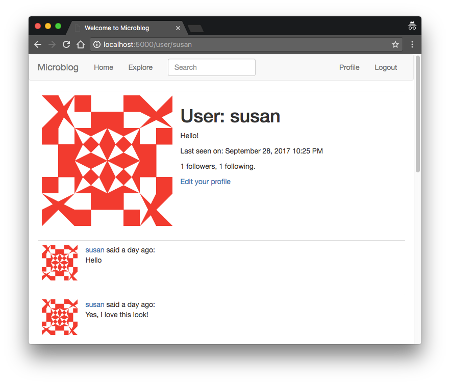

## Chapter 12: Dates and Times

> Posted by on [Miguel Grinberg](https://blog.miguelgrinberg.com/author/Miguel%20Grinberg)

這是 Flask Mega-Tutorial 系列的第十二部分，在這一章，我將告訴你如何處理日期和時間，以便適應所有使用者，不論他們居住在哪裡。

### 目錄

- [Chapter 1: Hello, World!](/python/flask-mega-tutorial/chapter_1_hello_world)
- [Chapter 2: Templates](/python/flask-mega-tutorial/chapter_2_templates)
- [Chapter 3: Web Forms](/python/flask-mega-tutorial/chapter_3_web_forms)
- [Chapter 4: Database](/python/flask-mega-tutorial/chapter_4_database)
- [Chapter 5: User Logins](/python/flask-mega-tutorial/chapter_5_user_logins)
- [Chapter 6: Profile Page and Avatars](/python/flask-mega-tutorial/chapter_6_profile_page_and_avatars)
- [Chapter 7: Error Handling](/python/flask-mega-tutorial/chapter_7_error_handling)
- [Chapter 8: Followers](/python/flask-mega-tutorial/chapter_8_followers)
- [Chapter 9: Pagination](/python/flask-mega-tutorial/chapter_9_pagination)
- [Chapter 10: Email Support](/python/flask-mega-tutorial/chapter_10_email_support)
- [Chapter 11: Facelift](/python/flask-mega-tutorial/chapter_11_facelift)
- [Chapter 12: Dates and Times](/python/flask-mega-tutorial/chapter_12_dates_and_times)
- [Chapter 13: I18n and L10n](/python/flask-mega-tutorial/chapter_13_i18n_and_l10n)
- [Chapter 14: Ajax](/python/flask-mega-tutorial/chapter_14_ajax)
- [Chapter 15: A Better Application Structure](/python/flask-mega-tutorial/chapter_15_a_better_application_structure)
- [Chapter 16: Full-Text Search](/python/flask-mega-tutorial/chapter_16_full_text_search)
- [Chapter 17: Deployment on Linux](/python/flask-mega-tutorial/chapter_17_deployment_on_linux)
- [Chapter 19: Deployment on Docker Containers](/python/flask-mega-tutorial/chapter_19_deployment_on_docker_containers)
- [Chapter 20: Some JavaScript Magic](/python/flask-mega-tutorial/chapter_20_some_javascript_magic)
- [Chapter 21: User Notifications](/python/flask-mega-tutorial/chapter_21_user_notifications)
- [Chapter 22: Background Jobs](/python/flask-mega-tutorial/chapter_22_background_jobs)
- [Chapter 23: Application Programming Interfaces （APIs）](/python/flask-mega-tutorial/chapter_23_application_programming_interfaces_apis)


> 你正在閱讀 Flask Mega-Tutorial 的 2024 年版本。完整的課程也可以在 [Amazon](https://amzn.to/3ahVnPN) 以電子書和平裝書的形式訂購。感謝你的支持！
> 如果你正在尋找 2018 年版本的課程，你可以在[這裡](https://blog.miguelgrinberg.com/post/the-flask-mega-tutorial-part-i-hello-world-2018)找到它。

我長時間忽略了我的 Microblog 應用程式的一個方面，那就是日期和時間的顯示。直到現在，我只是讓 Python 渲染 User 模型中的 datetime 物件，甚至沒有顯示 Post 模型中的時間。在這一章，你將學習如何處理這些時間戳記。

本章的 GitHub 連結是：[Browse](https://github.com/miguelgrinberg/microblog/tree/v0.12) [Zip](https://github.com/miguelgrinberg/microblog/archive/v0.12.zip) [Diff](https://github.com/miguelgrinberg/microblog/compare/v0.11...v0.12)


### 時區地獄
在伺服器上使用 Python 來渲染展示給網頁瀏覽器上使用者的日期和時間，實際上並不是一個好主意，因為伺服器認為的當地時間對於居住在不同時區的使用者來說並沒有意義。

很明顯，伺服器必須管理與其自身位置和使用者位置無關的一致時間。如果這個應用程式發展到需要在世界各地不同地區部署多個生產伺服器，我不希望每個伺服器都以不同時區將時間戳記寫入資料庫，因為這會使得處理這些時間變得不可能。由於 UTC 是最常用的統一時區，且在 datetime 類別中受到支援，這就是我將要使用的。

在第四章中，你已經看到了如何為博客文章生成 UTC 時間戳記。作為提醒，這裡有一個簡短的例子，展示了這是如何完成的：

```bash
>>> from datetime import datetime, timezone
>>> str(datetime.now(timezone.utc))
'2023-11-19 19:05:51.288261+00:00'
```

但這種方法有一個重要的問題。對於處於不同位置的使用者來說，如果他們看到的是 UTC 時區的時間，將很難確定文章是何時發表的。他們需要事先知道這些時間是 UTC，這樣他們才能在心理上將時間調整到自己的時區。想像一下，假設在美國西海岸 PDT 時區的一位使用者在下午 3:00 發表了某些內容，並立即看到該帖子顯示為晚上 10:00 的 UTC 時間，或更確切地說是 22:00。這將非常令人困惑。

雖然將時間戳記標準化為 UTC 從伺服器的角度來看很有意義，但這為使用者創造了一個可用性問題。本章的目標是提出一個解決方案，保持伺服器管理的所有時間戳記都在 UTC 時區，而不會疏遠使用者。

### 時區轉換
解決這個問題的顯而易見的方法是將所有存儲的 UTC 時間轉換為每個使用者的當地時間，當它們

被渲染時。這允許伺服器繼續使用 UTC 以保持一致性，同時針對每個使用者的即時轉換解決了可用性問題。這個解決方案的棘手之處在於要知道每個使用者的位置。

許多網站都有一個配置頁面，讓使用者可以指定他們的時區。這將要求我加入一個新頁面，並在其中提供一個下拉菜單，列出時區。可以在使用者首次訪問網站時作為他們註冊的一部分，要求他們輸入自己的時區。

雖然這是一個解決問題的不錯方案，但要求使用者輸入他們在作業系統中已經配置的訊息有點奇怪。似乎如果我可以直接從他們的電腦中獲取時區設置會更有效率。

事實證明，網頁瀏覽器知道使用者的時區，並通過標準的日期和時間 JavaScript API 公開它。實際上有兩種方法可以利用 JavaScript 提供的時區訊息：

“傳統” 方法是讓網頁瀏覽器在使用者首次登錄應用程式時以某種方式將時區訊息發送給伺服器。這可以通過 Ajax 調用來完成，或者更簡單地通過 meta 刷新標籤來完成。一旦伺服器知道了時區，它可以將其保留在使用者的會話中，或寫入到資料庫中的使用者表中，然後從那時起在渲染範本時調整所有時間戳記。
“新派” 方法則是在伺服器上不做任何改變，讓 UTC 轉換為當地時區的工作在瀏覽器中使用 JavaScript 完成。
這兩種選擇都是有效的，但第二種有一個很大的優勢。僅僅知道使用者的時區並不足以以使用者期望的格式呈現日期和時間。瀏覽器還可以訪問系統區域設置，該設置指定了 AM/PM 與 24 小時制、DD/MM/YYYY 與 MM/DD/YYYY 日期格式等許多文化或地區風格。

如果這還不夠，對於新派方法還有一個更大的優勢。有一個開源庫可以完成所有這些工作！

### 介紹 Moment.js 和 Flask-Moment

Moment.js 是一個小型的開源 JavaScript 函式庫，它將日期和時間的呈現提升到另一個層次，因為它提供了所有想得到的格式化選項，甚至更多。不久前，我建立了 Flask-Moment，這是一個小型的 Flask 擴充套件，使得將 moment.js 整合到你的應用程式變得非常簡單。

那我們就從安裝 Flask-Moment 開始：

```bash
(venv) $ pip install flask-moment
```

這個擴充套件以常見的方式加入到 Flask 應用程式中：

`app/__init__.py`: Flask-Moment 實例。

```python
## ...
from flask_moment import Moment

app = Flask(__name__)
## ...
moment = Moment(app)
## ...
```

與其他擴充套件不同，Flask-Moment 與 moment.js 一起工作，因此所有應用程式的範本都必須包含這個函式庫。為了確保這個函式庫始終可用，我打算在基本範本中加入它。這可以通過兩種方式完成。最直接的方式是明確加入一個 `<script>` 標籤來導入函式庫，但 Flask-Moment 使之更簡單，通過暴露一個 `moment.include_moment()` 函式來生成 `<script>` 標籤：

`app/templates/base.html`: 在基本範本中包含 moment.js。

```html
...

    {{moment.include_moment() }}
  </body>
</html>
```

在大多數情況下，應用程式使用的 JavaScript 函式庫都包含在 `<body>` 內容的末尾，那裡有 Bootstrap 的 JavaScript 程式碼。

### 使用 Moment.js

Moment.js 為瀏覽器提供了一個 moment 類。渲染時間戳的第一步是建立這個類的對象，傳入所需的時間戳，格式為 ISO 8601。這裡是在瀏覽器的 JavaScript 控制台中運行的一個範例：

```javascript
t = moment('2021-06-28T21:45:23+00:00')
```

如果你不熟悉 ISO 8601 標準的日期和時間格式，該格式如下：

```
{yyyy}-{mm}-{dd}T{hh}:{mm}:{ss}{tz}
```

我已經決定只使用 UTC 時區，因此最後一部分始終是 +00:00，或在某些情況下是等效的 Z，代表 ISO 8601 標準中的 UTC。

moment 對象提供了多種不同的渲染選項。以下是一些最常見的選項：

```javascript
moment('2021-06-28T21:45:23+00:00').format('L')
'06/28/2021'
moment('2021-06-28T21:45:23+00:00').format('LL')
'June 28, 2021'
moment('2021-06-28T21:45:23+00:00').format('LLL')
'June 28, 2021 10:45 PM'
moment('2021-06-28T21:45:23+00:00').format('LLLL')
'Monday, June 28, 2021 10:45 PM'
moment('2021-06-28T21:45:23+00:00').format('dddd')
'Monday'
moment('2021-06-28T21:45:23+00:00').fromNow()
'2 years ago'
```

本範例建立了一個初始化為 2021 年 6 月 28 日下午 9:45 UTC 的 moment 物件。你可以看到我上面嘗試的所有選項都顯示為 UTC+1，這是我電腦上配置的時區。你可以在瀏覽器的主控台輸入上述指令，確保你開啟主控台的頁面已包含 moment.js。只要你已經做了上述更改以包含 moment.js，就可以在 microblog 上進行，或也可以在 https://momentjs.com/ 上操作。

注意不同方法如何建立不同的表示形式。使用 format() 時，你可以用格式字串控制輸出的格式。fromNow() 方法很有趣，因為它是根據目前時間渲染時間戳，所以你會得到像是「一分鐘前」或「兩小時後」等輸出。

如果你是直接在 JavaScript 中工作，上述調用會返回一個包含渲染時間戳的字串。然後由你將此文本插入頁面的適當位置，這不幸地需要與 DOM 進行互動。Flask-Moment 擴充功能透過在你的模板中啟用類似於 JavaScript 中的 moment 物件，大大簡化了 moment.js 的使用。

我們來看看個人資料頁面上的時間戳。目前的 user.html 模板讓 Python 生成時間的字串表示。我現在可以用 Flask-Moment 來渲染這個時間戳，如下所示：

app/templates/user.html：使用 moment.js 渲染時間戳。

```html

<p> 最後上線時間：{{ moment(user.last_seen).format('LLL') }}</p>

```
所以正如你所見，Flask-Moment 使用的語法類似於 JavaScript 函式庫的語法，不同之處在於，傳遞給 moment() 的參數現在是一個 Python datetime 物件，而不是 ISO 8601 字串。從模板發出的 moment() 調用會自動生成所需的 JavaScript 程式碼，將渲染的時間戳插入 DOM 的適當位置。

我可以利用 Flask-Moment 的第二個地方是在 _post.html 子模板中，該模板從 index 和 user 頁面調用。在目前版本的模板中，每個帖子前面都有一行「使用者名稱說：」。現在我可以加上用 fromNow() 渲染的時間戳：

app/templates/_post.html：在帖子子模板中渲染時間戳。

```html
<a href="{{ url_for('user', username=post.author.username) }}">
    {{post.author.username}}
</a>
說 {{moment(post.timestamp).fromNow() }}：
<br>
{{post.body}}
```
下面你可以看到使用 Flask-Moment 和 moment.js 渲染的這兩個時間戳的樣子：



