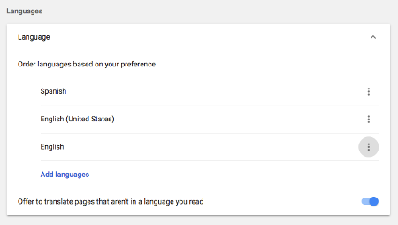
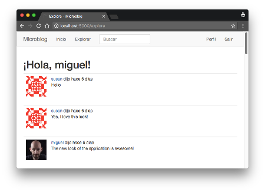

## Chapter 13: I18n and L10n

> Posted by on [Miguel Grinberg](https://blog.miguelgrinberg.com/author/Miguel%20Grinberg)

這是 Flask Mega-Tutorial 系列的第十三篇文章，在這篇文章中，我將告訴你如何擴展 Microblog 以支援多種語言。作為這個努力的一部分，你還將學習如何為 flask 命令建立自己的命令列擴展。

### 目錄

- [Chapter 1: Hello, World!](/python/flask-mega-tutorial/chapter_1_hello_world)
- [Chapter 2: Templates](/python/flask-mega-tutorial/chapter_2_templates)
- [Chapter 3: Web Forms](/python/flask-mega-tutorial/chapter_3_web_forms)
- [Chapter 4: Database](/python/flask-mega-tutorial/chapter_4_database)
- [Chapter 5: User Logins](/python/flask-mega-tutorial/chapter_5_user_logins)
- [Chapter 6: Profile Page and Avatars](/python/flask-mega-tutorial/chapter_6_profile_page_and_avatars)
- [Chapter 7: Error Handling](/python/flask-mega-tutorial/chapter_7_error_handling)
- [Chapter 8: Followers](/python/flask-mega-tutorial/chapter_8_followers)
- [Chapter 9: Pagination](/python/flask-mega-tutorial/chapter_9_pagination)
- [Chapter 10: Email Support](/python/flask-mega-tutorial/chapter_10_email_support)
- [Chapter 11: Facelift](/python/flask-mega-tutorial/chapter_11_facelift)
- [Chapter 12: Dates and Times](/python/flask-mega-tutorial/chapter_12_dates_and_times)
- [Chapter 13: I18n and L10n](/python/flask-mega-tutorial/chapter_13_i18n_and_l10n)
- [Chapter 14: Ajax](/python/flask-mega-tutorial/chapter_14_ajax)
- [Chapter 15: A Better Application Structure](/python/flask-mega-tutorial/chapter_15_a_better_application_structure)
- [Chapter 16: Full-Text Search](/python/flask-mega-tutorial/chapter_16_full_text_search)
- [Chapter 17: Deployment on Linux](/python/flask-mega-tutorial/chapter_17_deployment_on_linux)
- [Chapter 19: Deployment on Docker Containers](/python/flask-mega-tutorial/chapter_19_deployment_on_docker_containers)
- [Chapter 20: Some JavaScript Magic](/python/flask-mega-tutorial/chapter_20_some_javascript_magic)
- [Chapter 21: User Notifications](/python/flask-mega-tutorial/chapter_21_user_notifications)
- [Chapter 22: Background Jobs](/python/flask-mega-tutorial/chapter_22_background_jobs)
- [Chapter 23: Application Programming Interfaces （APIs）](/python/flask-mega-tutorial/chapter_23_application_programming_interfaces_apis)

> 你正在閱讀 Flask Mega-Tutorial 的 2024 年版本。完整的課程也可以在 [Amazon](https://amzn.to/3ahVnPN) 以電子書和平裝書的形式訂購。感謝你的支持！
> 如果你正在尋找 2018 年版本的課程，你可以在[這裡](https://blog.miguelgrinberg.com/post/the-flask-mega-tutorial-part-i-hello-world-2018)找到它。

本章的主題是國際化和本地化，通常縮寫為 I18n 和 L10n。為了讓不會說英語的人也能友善地使用我的應用程式，我將實現一個翻譯流程。藉助於一個翻譯團隊的幫助，將允許我以多種語言向使用者提供應用程式。

本章的 GitHub 連結包括：瀏覽、壓縮檔、差異。[Browse](https://github.com/miguelgrinberg/microblog/tree/v0.13) [Zip](https://github.com/miguelgrinberg/microblog/archive/v0.13.zip) [Diff](https://github.com/miguelgrinberg/microblog/compare/v0.12...v0.13)


### 介紹 Flask-Babel
如你所猜，有一個 Flask 擴展使得處理翻譯變得非常容易。這個擴展叫做 Flask-Babel，可以通過 pip 安裝：

```python
(venv) $ pip install flask-babel
```
在這一章中，我將展示如何將應用程式翻譯成西班牙語，因為我恰好會說這門語言。我也可以與其他語言流利的翻譯者合作，同樣支援這些語言。為了追蹤支援的語言列表，我將加入一個配置變數：

```python
## config.py: 支援的語言列表。
class Config(object):
    ## ...
    LANGUAGES = ['en', 'es']
```
我在這個應用程式中使用了兩個字母的語言程式碼，但如果你需要更具體，也可以加入國家程式碼。例如，你可以使用 `en-US`、`en-GB` 和 `en-CA` 分別支援美國英語、英國英語和加拿大英語作為不同的語言。

`Babel` 實例是使用一個 `locale_selector` 參數初始化的，這個參數必須設定為一個函式，該函式將在每個請求中被調用。這個函式可以查看使用者請求並為該請求選擇最佳語言翻譯。以下是 Flask-Babel 擴展的初始化：

```python
## app/__init__.py: 初始化 Flask-Babel。
from flask import request
## ...
from flask_babel import Babel

def get_locale():
    return request.accept_languages.best_match(app.config['LANGUAGES'])

app = Flask(__name__)
## ...
babel = Babel(app, locale_selector=get_locale)
## ...
```

在這裡，我使用了 Flask 的請求物件的一個屬性，稱為 accept_languages。這個物件提供了一個高級接口，用於處理客戶端隨請求發送的 Accept-Language 頭部。這個

頭部指定了客戶端的語言和地區偏好作為一個加權列表。這個頭部的內容可以在瀏覽器的偏好設定頁面中配置，預設值通常從電腦作業系統的語言設定中導入。大多數人甚至不知道這樣的設定存在，但這是有用的，因為使用者可以提供一個首選語言列表，每種語言都有一個權重。如果你好奇，這裡有一個複雜的 Accept-Languages 頭部範例：

```
Accept-Language: da, en-gb;q=0.8, en;q=0.7
```

這表示丹麥語（da）是首選語言（預設權重 = 1.0），其次是英國英語（en-GB）權重為 0.8，最後是通用英語（en）權重為 0.7。

為了選擇最佳語言，你需要將客戶端請求的語言列表與應用程式支援的語言進行比較，並使用客戶端提供的權重來找到最佳語言。這個邏輯有點複雜，但都封裝在 request.accept_languages 的 best_match() 方法中，它以應用程式提供的語言列表作為參數，並返回最佳選擇。

##### 在 Python 源碼中標記待翻譯文本

好的，現在來說說壞消息。當讓應用程式支援多種語言時的正常工作流程是在源碼中標記所有需要翻譯的文本。在文本被標記後，Flask-Babel 將掃描所有檔案，並使用 gettext 工具將這些文本提取到一個單獨的翻譯檔案中。不幸的是，這是一項繁瑣的任務，需要完成以啟用翻譯。

我將在這裡展示幾個這種標記的範例，但你可以從上面顯示的本章的 GitHub 庫連結獲得完整的變更集。

為翻譯標記文本的方式是將它們包裹在一個函式呼叫中，習慣上稱為 _()，只是一個底線。最簡單的情況是源碼中出現的字面字符串。這裡是一個 flash() 語句的範例：

```python
from flask_babel import _
## ...
flash(_('Your post is now live!'))
```

這個想法是 `_()`` 函式包裹了基礎語言中的文本（在這個案例中是英語）。這個函式將使用 `get_locale()` 函式選擇的語言來找到給定客戶端的正確翻譯。`_()` 函式然後返回翻譯後的文本，在這個案例中將成為 flash() 的參數。

不幸的是，並非所有案例都這麼簡單。考慮應用程式中的另一個 `flash()` 呼叫：

```python
flash(f'User {username} not found.')
```

這篇文章中有一個動態組件，它被插入到靜態文本的中間。`_()` 函式的語法支援這類文本，但它是基於 Python 舊版的字串替代語法：

```python
flash(_('使用者 %(username)s 未找到。', username=username))
```

還有一個更難處理的情況。一些字串常數是在網頁請求外部分配的，通常是在應用程式啟動時，所以在這些文本評估時，無法知道要使用什麼語言。這類的例子包括與表單欄位相關的標籤。處理這些文本的唯一解決方案是找到一種方法，延遲字串的評估，直到它們被使用，這將在實際的請求下進行。Flask-Babel 提供了一個 `_()` 的延遲評估版本，稱為 `lazy_gettext()`：

```python
from flask_babel import lazy_gettext as _l

class LoginForm(FlaskForm):
    username = StringField(_l('使用者名稱'), validators=[DataRequired()])
    ## ...
```

這裡我導入了這個替代翻譯函式，並將它重命名為 `_l()`，這樣它看起來與原始的 `_()` 相似。這個新函式將文本包裹在一個特殊物件中，觸發翻譯在稍後執行，當字串在請求內部使用時。

Flask-Login 擴充套件在每次將使用者重定向到登入頁面時都會閃爍一條訊息。這條訊息是英文的，來自擴充套件本身。為了確保這條訊息也被翻譯，我將覆蓋預設訊息，並提供我自己的，用 `_l()` 函式包裹以進行延遲處理：

```python
login = LoginManager(app)
login.login_view = 'login'
login.login_message = _l('請登入以訪問此頁面。')
```

### 在模板中標記待翻譯的文本

在前一節中，你已經看到如何在 Python 源程式碼中標記可翻譯的文本，但這只是這個過程的一部分，因為模板檔案也有文本。`_()` 函式也可在模板中使用，因此過程相當類似。例如，請考慮來自 404.html 的 HTML 片段：

```html
<h1> 檔案未找到 </h1>
```

啟用翻譯的版本變成：

```html
<h1>{{ _('檔案未找到') }}</h1>
```

請注意，這裡除了使用 `_()` 包裹文本外，還需要加入 `{{ ...}}`，以強制評估 `_()`，而不是被視為模板中的字面量。

對於有動態組件的更複雜短語，也可以使用參數：

```html
<h1>{{ _('嗨，%(username)s！', username=current_user.username) }}</h1>
```

在 `_post.html` 中有一個特別棘手的情況，讓我花了一段時間才弄明白：

```html
        
            <a href

="{{url_for('user', username=post.author.username) }}">
                {{post.author.username}}
            </a>
        
        {{_('%(username)s 說 %(when)s',
            username=user_link, when=moment(post.timestamp).fromNow()) }}
```

這裡的問題是我希望 `username` 是指向使用者個人檔案頁面的連結，而不僅僅是名稱，所以我必須使用 `set` 和 `endset` 模板指令建立一個名為 `user_link` 的中間變數，然後將其作為參數傳遞給翻譯函式。

如我上面提到的，你可以下載一個應用程式版本，其中所有 Python 源程式碼和模板中的可翻譯文本都已標記。

### 提取待翻譯文本
一旦你有了應用程式，所有的 `_()` 和 `_l()` 都到位了，你可以使用 pybabel 命令將它們提取到一個 .pot 檔案中，這代表可攜物件模板。這是一個文本檔案，包括所有被標記為需要翻譯的文本。這個檔案的目的是作為為每種語言建立翻譯檔案的模板。

提取過程需要一個小的配置檔案，告訴 pybabel 哪些檔案應該掃描可翻譯的文本。以下是我為這個應用程式建立的 babel.cfg：

babel.cfg: PyBabel 配置檔案。

```
[python: app/**.py]
[jinja2: app/templates/**.html]
```

這些行分別定義了 Python 和 Jinja 模板檔案的檔名模式。Flask-Babel 將尋找匹配這些模式的任何檔案，並掃描它們以尋找被包裹以進行翻譯的文本。

要將所有文本提取到一個 .pot 檔案中，你可以使用以下命令：

```shell
(venv) $ pybabel extract -F babel.cfg -k _l -o messages.pot .
```

`pybabel extract` 命令讀取在 `-F` 選項中給定的配置檔案，然後掃描與配置的源匹配的目錄中的所有程式碼和模板檔案，從命令中給定的目錄開始（在這個例子中是當前目錄或 .）。預設情況下，pybabel 將尋找 _() 作為文本標記，但我也使用了 lazy 版本，我導入為 _l()，所以我需要告訴工具也用 -k _l 尋找這些。-o 選項提供輸出檔案的名稱。

我應該指出，messages.pot 檔案不是需要納入項目的檔案。這是一個可以在需要時輕鬆重新生成的檔案，只需再次運行上面的命令。因此，無需將此檔案提交到源程式控制中。

### 生成語言目錄

接下來的步驟是為除基礎語言（本案例中為英文）之外的每種語言建立翻譯。我說我要開始加入西班牙語（語言程式碼 es），所以這是執行該操作的指令：

```bash
(venv) $ pybabel init -i messages.pot -d app/translations -l es
creating catalog app/translations/es/LC_MESSAGES/messages.po based on messages.pot
```

`pybabel init` 指令將 `messages.pot` 檔案作為輸入，並為在 `-l` 選項中指定的語言，在 `-d` 選項中給出的目錄寫入新的語言目錄。我將在 `app/translations` 目錄中安裝所有翻譯，因為 Flask-Babel 預設會在這裡尋找翻譯檔案。該指令將在該目錄內建立一個用於西班牙語資料檔的 `es` 子目錄。特別地，會有一個新檔案 `app/translations/es/LC_MESSAGES/messages.po`，需要在那裡進行翻譯。

如果你想支援其他語言，只需重複上述指令，為你想要的每種語言程式碼，以便每種語言都有其自己的帶有 `messages.po` 檔案的儲存庫。

每個語言儲存庫中建立的 `messages.po` 檔案使用的格式是語言翻譯的標準格式，即 gettext 工具所使用的格式。這裡有一些西班牙語 `messages.po` 開頭的幾行：

```plaintext
## PROJECT 的西班牙語翻譯。
## 版權所有 (C) 2021 ORGANIZATION
## 此檔案在與 PROJECT 項目相同的許可下分發。
## FIRST AUTHOR <EMAIL@ADDRESS>, 2021.
#
msgid ""
msgstr ""
"Project-Id-Version: PROJECT VERSION\n"
"Report-Msgid-Bugs-To: EMAIL@ADDRESS\n"
"POT-Creation-Date: 2021-06-29 23:23-0700\n"
"PO-Revision-Date: 2021-06-29 23:25-0700\n"
"Last-Translator: FULL NAME <EMAIL@ADDRESS>\n"
"Language: es\n"
"Language-Team: es <LL@li.org>\n"
"Plural-Forms: nplurals=2; plural=(n != 1)\n"
"MIME-Version: 1.0\n"
"Content-Type: text/plain; charset=utf-8\n"
"Content-Transfer-Encoding: 8bit\n"
"Generated-By: Babel 2.5.1\n"

#: app/email.py:21
msgid "[Microblog] Reset Your Password"
msgstr ""

#: app/forms.py:12 app/forms.py:19 app/forms.py:50
msgid "Username"
msgstr ""

#: app/forms.py:13 app/forms.py:21 app/forms.py:43
msgid "Password"
msgstr ""
```

如果跳過標頭，你會看到接下來是從 _() 和 _l() 呼叫中提取的字串列表。對於每個文本，你會得到你應用中文本位置的參考。然後 `msgid` 行包含基礎語言的文本，接下來的 `msgstr` 行包含一個空字串。這些空字串需要被編輯以包含目標語言中的文本版本。

有許多與 `.po` 檔案一起工作的翻譯應用。如果你覺得編輯文本檔案就足夠了，但如果你正在處理一個大型項目，則可能建議使用專業的翻譯編輯器。最受歡迎的翻譯應用是開源的  [poedit](http://www.poedit.net/)，那麼 [po.vim](https://vim.sourceforge.io/scripts/script.php?script_id=695)
 插件提供了一些鍵映射，使這些檔案的工作更容易。

下面你可以看到我加入翻譯後的西班牙語 `messages.po` 的一部分：

```bash
#: app/email.py:21
msgid "[Microblog] Reset Your Password"
msgstr "[Microblog] Nueva Contraseña"

#: app/forms.py:12 app/forms.py:19 app/forms.py:50
msgid "Username"
msgstr "Nombre de usuario"

#: app/forms.py:13 app/forms.py:21 app/forms.py:43
msgid "Password"
msgstr "Contraseña"
```

本章的下載包也包含了這個檔案，所有翻譯都已就位，所以你不必為這個應用擔心這部分。

`messages.po` 檔案是翻譯的一種源檔案。當你想開始使用這些翻譯文本時，需要將此檔案編譯成一種在應用運行時使用的高效格式。要編譯應用的所有翻譯，可以按以下方式使用 `pybabel compile` 指令：

```bash
(venv) $ pybabel compile -d app/translations
compiling catalog app/translations/es/LC_MESSAGES/messages.po to
app/translations/es/LC_MESSAGES/messages.mo
```

這個操作在每個語言儲存庫中的 `messages.po` 旁邊加入了一個 `messages.mo` 檔案。`.mo` 檔案是 Flask-Babel 將用於加載應用翻譯的檔案。

在為西班牙語或你加入到專案中的任何其他語言建立了 `messages.mo` 檔案後，這些語言就準備好在應用中使用了。如果你想看看應用以西班牙語顯示的樣子，你可以編輯網頁瀏覽器中的語言配置，將西班牙語設為首選語言。對於 Chrome，這在設置頁面的進階部分：



如果你不想更改瀏覽器設置，另一種選擇是通過使 `get_locale()` 函式始終返回你想使用的語言來強制設置語言。對於西班牙語，你可以這樣做：

```python
app/__init__.py: 選擇最佳語言。

def get_locale():
    ## return request.accept_languages.best_match(app.config['LANGUAGES'])
    return 'es'
```

以西班牙語配置瀏覽器運行應用，或 `get_locale()` 函式返回 es，將使所有文本在使用應用時以西班牙語顯示。

### 更新翻譯

當使用翻譯時，一個常見情況是你可能想要開始使用一個尚未完成的翻譯檔案。這完全沒問題，你可以編譯一個不完整的 messages.po 檔案，任何可用的翻譯將被使用，而任何缺失的翻譯將使用基礎語言。然後你可以繼續進行翻譯，並再次編譯以更新 messages.mo 檔案，隨著你的進展。

另一個常見情況是，當你加入 _() 包裝器時，可能漏掉了一些文本。在這種情況下，你會發現那些你漏掉的文本將保持英文，因為 Flask-Babel 對它們一無所知。在這種情況下，當你發現沒有包裝器的文本時，你會想要加入 _() 或 _l() 包裝器，然後進行更新程式，這包括兩個步驟：

```shell
(venv) $ pybabel extract -F babel.cfg -k _l -o messages.pot .
(venv) $ pybabel update -i messages.pot -d app/translations
```

extract 命令與我之前發出的命令相同，但現在它將生成一個新版本的 messages.pot，其中包含所有之前的文本以及你最近使用 _() 或 _l() 包裝的任何新文本。update 命令將新的 messages.pot 檔案合併到與專案關聯的所有 messages.po 檔案中。這將是一個智能合併，其中任何現有文本將保持不變，而僅在 messages.pot 中加入或刪除的條目將受到影響。

更新了 messages.po 之後，你可以繼續翻譯任何新文本，然後再次編譯訊息，使其可供應用程式使用。

### 翻譯日期和時間

現在我有了 Python 程式碼和範本中所有文本的完整西班牙文翻譯，但如果你以西班牙文運行應用程式並且觀察仔細，你會注意到還有一些東西出現在英文中。我指的是由 Flask-Moment 和 moment.js 生成的時間戳，顯然它們沒有被包括在翻譯努力中，因為這些包生成的文本都不是應用程式的原始程式碼或範本的一部分。

moment.js 函式庫確實支援本地化和國際化，所以我需要做的就是配置適當的語言。Flask-Babel 透過 get_locale() 函式為給定請求返回選擇的語言和地區，所以我打算做的是在 before_request 處理器中將地區加入到 g 物件中，這樣我就可以從基礎範本中訪問它：

app/routes.py：在 flask.g 中儲存選擇的語言。

```python
## ...
from flask import g
from flask_babel import get_locale

## ...

@app.before_request
def before_request():
    ## ...
    g.locale = str(get_locale())
```

Flask-Babel 的 get_locale() 函式返回一個地區物件，但我只想要有語言程式碼，可以通過將物件轉換為字串

獲得。現在我有了 g.locale，我可以從基礎範本中訪問它，以配置 moment.js 的正確語言：

app/templates/base.html：為 moment.js 設定地區。

```html
...

    {{moment.include_moment() }}
    {{moment.lang(g.locale) }}
  </body>
</html>
```

現在所有的日期和時間應該以與文本相同的語言出現。以下你可以看到應用程式以西班牙文的樣子：



此時，除了使用者在部落格帖子或個人簡介中提供的文本之外，所有文本都應該可以翻譯成其他語言。

#### 命令行增強

你可能會同意我認為 pybabel 命令有點長且難以記住。我將利用這個機會向你展示如何建立與 flask 命令集成的自定義命令。到目前為止，你已經看到我使用 flask run、flask shell 和 Flask-Migrate 擴充功能提供的幾個 flask db 子命令。實際上，向 flask 加入特定於應用程式的命令也很容易。所以我現在要做的是建立一些簡單的命令，觸發特定於此應用程式的所有參數的 pybabel 命令。我要加入的命令是：

- `flask translate init LANG` 來加入新語言
- `flask translate update` 來更新所有語言儲存庫
- `flask translate compile` 來編譯所有語言儲存庫

babel export 步驟不會是一個命令，因為生成 messages.pot 檔案總是運行 init 或 update 命令的先決條件，因此這些命令的實現將生成翻譯範本檔案作為臨時檔案。

Flask 依賴於 Click 進行所有命令行操作。像 translate 這樣的命令，是幾個子命令的根，通過 app.cli.group() 裝飾器建立。我將這些命令放在一個名為 app/cli.py 的新模組中：

app/cli.py：翻譯命令組。

```python
from app import app

@app.cli.group()
def translate():
    """翻譯和本地化命令。"""
    pass
```

命令的名稱來自被裝飾的函式，幫助訊息來自文檔字串。由於這是一個僅用於為子命令提供基礎的父命令，該函式本身不需要做任何事情。

update 和 compile 實現起來很簡單，因為它們不需要任何參數：

app/cli.py：更新和編譯子命令。

```python
import os

## ...

@translate.command()
def update():
    """更新所有語言。"""
    if os.system('pybabel extract -F babel.cfg -k _l -o messages.pot .'):
        raise RuntimeError('extract 命令失敗')
    if os.system('pybabel update -i messages.pot -d app/translations'):
        raise RuntimeError('update 命令失敗')
    os.remove('messages.pot')

@translate.command()
def compile():
    """編譯所有語言。"""
    if os.system('pybabel compile -d app/translations'):
        raise RuntimeError('compile 命令失敗')
```

#### 注意函式裝飾器的來源

請注意這些函式的裝飾器是來自 translate 父函式。這可能看起來令人困惑，因為 translate() 是一個函式，但這是 Click 構建命令群組的標準方式。與 translate() 函式一樣，這些函式的文檔字串用作 --help 輸出中的幫助訊息。

你可以看到對於所有命令，我執行它們並確保返回值是零，這意味著命令沒有返回任何錯誤。如果命令出錯，那麼我將引發 RuntimeError，這將導致腳本停止。update() 函式將 extract 和 update 步驟結合在同一個命令中，如果一切成功，它會在更新完成後刪除 messages.pot 檔案，因為這個檔案在需要時可以輕鬆重新生成。

#### 初始化命令

init 命令以新語言程式碼為參數。實現如下：

app/cli.py：Init 子命令。

```python
import click

@translate.command()
@click.argument('lang')
def init(lang):
    """初始化一種新語言。"""
    if os.system('pybabel extract -F babel.cfg -k _l -o messages.pot .'):
        raise RuntimeError('extract 命令失敗')
    if os.system(
            'pybabel init -i messages.pot -d app/translations -l' + lang):
        raise RuntimeError('init 命令失敗')
    os.remove('messages.pot')
```

這個命令使用 @click.argument 裝飾器來定義語言程式碼。Click 將命令中提供的值作為參數傳遞給處理函式，然後我將該參數納入 init 命令中。

#### 啟用這些命令的最後一步

要讓這些命令工作的最後一步是導入它們，以便命令得到註冊。我決定在頂層目錄的 microblog.py 檔案中這樣做：

microblog.py：註冊命令行命令。

```python
from app import cli
```

在這裡，我需要做的就是導入新的 cli.py 模組，無需進行任何操作，因為導入會使命令裝飾器運行並註冊每個命令。

此時，運行 flask --help 將列出 translate 命令作為一個選項。而 flask translate --help 將顯示我定義的三個子命令：

```shell
(venv) $ flask translate --help
用法：flask translate [選項] 命令 [參數]...

  翻譯和本地化命令。

選項：
  --help  顯示此訊息並退出。

命令：
  compile  編譯所有語言。
  init     初始化一種新語言。
  update   更新所有語言。
```

所以現在，工作流程更簡單了，不需要記住長而複雜的命令。要加入新語言，你使用：

```shell
(venv) $ flask translate init < 語言程式碼 >
```

在對 _() 和 _l() 語言標記進行更改後更新所有語言：

```shell
(venv) $ flask translate update
```

在更新翻譯檔案後編譯所有

語言：

```shell
(venv) $ flask translate compile
```


