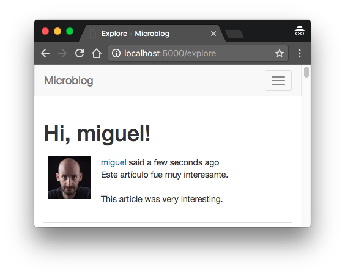

## Chapter 14: Ajax

> Posted by on [Miguel Grinberg](https://blog.miguelgrinberg.com/author/Miguel%20Grinberg)

這是 Flask 大型教程系列的第十四部分，在這部分中，我將使用 Microsoft 的翻譯服務和一點點 JavaScript 來增加即時語言翻譯功能。

### 目錄

- [Chapter 1: Hello, World!](/python/flask-mega-tutorial/chapter_1_hello_world)
- [Chapter 2: Templates](/python/flask-mega-tutorial/chapter_2_templates)
- [Chapter 3: Web Forms](/python/flask-mega-tutorial/chapter_3_web_forms)
- [Chapter 4: Database](/python/flask-mega-tutorial/chapter_4_database)
- [Chapter 5: User Logins](/python/flask-mega-tutorial/chapter_5_user_logins)
- [Chapter 6: Profile Page and Avatars](/python/flask-mega-tutorial/chapter_6_profile_page_and_avatars)
- [Chapter 7: Error Handling](/python/flask-mega-tutorial/chapter_7_error_handling)
- [Chapter 8: Followers](/python/flask-mega-tutorial/chapter_8_followers)
- [Chapter 9: Pagination](/python/flask-mega-tutorial/chapter_9_pagination)
- [Chapter 10: Email Support](/python/flask-mega-tutorial/chapter_10_email_support)
- [Chapter 11: Facelift](/python/flask-mega-tutorial/chapter_11_facelift)
- [Chapter 12: Dates and Times](/python/flask-mega-tutorial/chapter_12_dates_and_times)
- [Chapter 13: I18n and L10n](/python/flask-mega-tutorial/chapter_13_i18n_and_l10n)
- [Chapter 14: Ajax](/python/flask-mega-tutorial/chapter_14_ajax)
- [Chapter 15: A Better Application Structure](/python/flask-mega-tutorial/chapter_15_a_better_application_structure)
- [Chapter 16: Full-Text Search](/python/flask-mega-tutorial/chapter_16_full_text_search)
- [Chapter 17: Deployment on Linux](/python/flask-mega-tutorial/chapter_17_deployment_on_linux)
- [Chapter 19: Deployment on Docker Containers](/python/flask-mega-tutorial/chapter_19_deployment_on_docker_containers)
- [Chapter 20: Some JavaScript Magic](/python/flask-mega-tutorial/chapter_20_some_javascript_magic)
- [Chapter 21: User Notifications](/python/flask-mega-tutorial/chapter_21_user_notifications)
- [Chapter 22: Background Jobs](/python/flask-mega-tutorial/chapter_22_background_jobs)
- [Chapter 23: Application Programming Interfaces （APIs）](/python/flask-mega-tutorial/chapter_23_application_programming_interfaces_apis)

在這篇文章中，我將脫離伺服器端開發的 “安全區”，去處理一個同樣重要的伺服器和客戶端組件的功能。你有沒有看到一些網站旁邊使用者生成的內容旁邊顯示的“翻譯” 連結？這些連結觸發對使用者母語以外的內容進行即時自動翻譯。翻譯後的內容通常插入在原始版本下方。Google 在外語搜索結果中展示這個功能。Facebook 用於帖子，Twitter 用於推文。今天我將向你展示如何將同樣的功能加入到 Microblog！

這一章的 GitHub 連結是：[Browse](https://github.com/miguelgrinberg/microblog/tree/v0.14) [Zip](https://github.com/miguelgrinberg/microblog/archive/v0.14.zip) [Diff](https://github.com/miguelgrinberg/microblog/compare/v0.13...v0.14)


### 伺服器端對比客戶端
在我迄今為止所遵循的傳統伺服器端模型中，有一個客戶端（由使用者指揮的網頁瀏覽器）向應用伺服器發出 HTTP 請求。一個請求可以僅僅是請求一個 HTML 頁面，就像當你點擊 “個人資料” 連結時，或者它可以觸發一個動作，就像當你在編輯你的個人資料訊息後點擊提交按鈕時。在這兩種類型的請求中，伺服器通過將新網頁發送給客戶端來完成請求，要么直接發送，要么通過發出重定向。然後客戶端用新頁面替換當前頁面。只要使用者停留在應用的網站上，這個循環就會重複。在這個模型中，伺服器做所有工作，而客戶端僅僅顯示網頁並接受使用者輸入。

還有一種模型，客戶端扮演一個更積極的角色。在這種模型中，客戶端向伺服器發出請求，伺服器回應一個網頁，但與之前的情況不同的是，不是所有頁面數據都是 HTML，頁面上還有用通常用 JavaScript 寫的程式碼。一旦客戶端接收到頁面，它顯示 HTML 部分，並執行程式碼，這通常不會立即運行，而是設置事件處理器，在瀏覽器中作為對使用者觸發的動作的回應運行。從那時起，你就有了一個活躍的客戶端，它可以在幾乎不和伺服器聯繫或完全不聯繫的情況

下自行工作。在嚴格的客戶端應用中，整個應用程式隨著初始頁面請求下載到客戶端，然後應用程式完全在客戶端運行，只與伺服器聯繫以檢索或存儲數據，並對那個首個且唯一的網頁的外觀進行動態更改。這類應用被稱為單頁應用或 SPA。

大多數應用都是兩種模型的混合體，結合了兩者的技術。我的 Microblog 應用主要是伺服器端應用，但今天我將為它加入一點客戶端動作。為了實現使用者帖子的即時翻譯，客戶端瀏覽器將向伺服器發送異步請求，伺服器將回應而不會引起頁面刷新。然後客戶端將翻譯動態插入當前頁面。這種技術被稱為 Ajax，是 Asynchronous JavaScript 和 XML（即使這些天 XML 常常被 JSON 替代）的縮寫。

### 即時翻譯工作流程
這個應用程式因為 Flask-Babel 的支持，對外語有很好的支持，這使得支持我能找到翻譯的任何語言成為可能。但當然，還缺少一個元素。使用者將以他們自己的語言寫博客帖子，所以很可能使用者會遇到其他使用者用不知道的語言寫的帖子。自動翻譯的質量並不總是很好，但在大多數情況下，如果你只是想大致了解另一種語言的文字意思，它就足夠好了。

這是一個理想的功能，作為 Ajax 服務來實現。考慮到索引或探索頁面可能顯示幾個帖子，其中一些可能是外語。如果我使用傳統的伺服器端技術實現翻譯，對翻譯的請求將導致原始頁面被新頁面取代。事實是，對許多顯示的博客帖子中的一個請求翻譯不是一個足夠大的動作，需要完整的頁面更新，這個功能如果翻譯文本動態地插入原文下方，同時讓頁面的其餘部分保持不變，會運作得更好。

要實作即時自動翻譯需要幾個步驟。首先，我需要一種方法來識別要翻譯的文字的來源語言。我還需要知道每位使用者的首選語言，因為我只想對用其他語言寫的帖子顯示「翻譯」連結。當提供翻譯連結且使用者點擊時，我將需要向伺服器發送 Ajax 請求，伺服器會聯絡第三方翻譯 API。一旦伺服器返回帶有翻譯文字的回應，客戶端的 JavaScript 程式碼會動態地將這段文字插入頁面中。你肯定會注意到，這裡有一些非小題大作的問題。我將逐一來看這些問題。

### 語言識別
第一個問題是識別帖子是用什麼語言寫的。這不是一門精確的科學，因為不總是能夠毫無疑問地確定文本的語言，但對於大多數情況來說，自動檢測效果相當不錯。在 Python 中，有一個不錯的語言檢測函式庫叫做 langdetect。

```python
(venv) $ pip install langdetect
```

計畫是將每篇部落格帖子餵給這個套件，嘗試確定語言。由於進行這項分析有點耗時，我不想每次將帖子呈現到頁面上時都重複這項工作。我將要做的是在提交帖子時設定檢測到的語言。然後，檢測到的語言將被儲存在帖子表中。

首先要做的是向 Post 模型加入一個語言欄位：

```python
app/models.py: 向 Post 模型加入檢測到的語言。

class Post(db.Model):
    ## ...
    language: so.Mapped[Optional[str]] = so.mapped_column(sa.String(5))
```

如你所記，每當對資料庫模型進行更改時，需要發出資料庫遷移：

```python
(venv) $ flask db migrate -m "add language to posts"
INFO  [alembic.runtime.migration] Context impl SQLiteImpl.
INFO  [alembic.runtime.migration] Will assume non-transactional DDL.
INFO  [alembic.autogenerate.compare] Detected added column 'post.language'
  Generating migrations/versions/2b017edaa91f_add_language_to_posts.py ... done
```

然後需要將遷移應用於資料庫：

```python
(venv) $ flask db upgrade
INFO  [alembic.runtime.migration] Context impl SQLiteImpl.
INFO  [alembic.runtime.migration] Will assume non-transactional DDL.
INFO  [alembic.runtime.migration] Upgrade ae346256b650 -> 2b017edaa91f, add language to posts
```

現在我可以在提交帖子時檢測並儲存語言：

```python
app/routes.py: 為新帖子保存語言。

from langdetect import detect, LangDetectException

@app.route('/', methods=['GET', 'POST'])
@app.route('/index', methods=['GET',

 'POST'])
@login_required
def index():
    form = PostForm()
    if form.validate_on_submit():
        try:
            language = detect(form.post.data)
        except LangDetectException:
            language = ''
        post = Post(body=form.post.data, author=current_user,
                    language=language)
        ## ...
```

有了這個改變，每次提交帖子時，我都會透過 detect() 函式來嘗試確定語言。如果無法識別語言，langdetect 套件會引發一種 LangDetectException 例外。在這種情況下，我會安全起見，將一個空字串保存到資料庫中。我將採用這樣的慣例：任何將語言設為空字串的帖子都被假定為未知語言。

### 顯示「翻譯」連結
第二步涉及在當前使用者激活的語言不是帖子語言的情況下，加入一個「翻譯」連結到帖子旁邊。

```python
app/templates/_post.html: 為帖子加入翻譯連結。

                
                <br><br>
                <a href="#">{{ _('Translate') }}</a>
                
```

我是在 _post.html 子模板中做這件事，這樣這個功能就會出現在任何顯示部落格帖子的頁面上。翻譯連結僅出現在檢測到語言且此語言與 Flask-Babel 的 locale_selector 函式裝飾的函式選擇的語言不匹配的帖子上。回想一下第 13 章，選定的語言環境被儲存在 before_request 處理程式中的 g.locale。連結的文字需要以一種可以由 Flask-Babel 翻譯的方式加入，所以我在定義它時使用了 _() 函式。

注意，這個連結還沒有關聯任何動作。首先，我想弄清楚如何進行實際的翻譯。

### 使用第三方翻譯服務

兩大主要翻譯服務是 Google Cloud Translation API 和 Microsoft Translator Text API。兩者都是付費服務，並且都有針對低量翻譯的免費入門級選項。在這一章中，我將實現 Microsoft 解決方案，但我會以一種易於替換翻譯服務（如果你希望如此）的方式進行。

在你使用 Microsoft Translator API 之前，你需要在 Azure，即 Microsoft 的雲服務，註冊一個帳戶。你可以在他們的免費層上註冊。在註冊過程中，你將被要求提供信用卡號碼，但只要你留在那個服務層級，你的卡不會被收費。

一旦你擁有了 Azure 帳戶，前往 Azure 門戶並點擊「建立資源」按鈕，於搜索框輸入「translator」並按 Enter 鍵。從搜索結果中找到 Translator 資源，然後點擊「建立」按鈕。你現在將看到一個表單，你可以在其中定義將加入到你帳戶的新翻譯資源。按以下方式完成表單：

- 訂閱：選擇「按需付費」
- 資源群組：點擊「建立新的」，並輸入名稱「microblog-translator」
- 區域：選擇離你最近的區域
- 名稱：輸入「microblog」
- 定價層：選擇「免費 F0（每月最多 2M 字符翻譯）」

點擊「審查 + 建立」按鈕繼續到下一頁，在那裡你將看到你所選擇的選項摘要。點擊「建立」按鈕確認建立翻譯資源。如果你等待幾秒鐘，你將在頂部欄中收到一個通知，說明翻譯資源已部署。點擊「前往資源」按鈕，然後在左側欄中點擊「金鑰和端點」選項。你現在將看到兩個金鑰，標籤分別為「金鑰 1」和「金鑰 2」。複製其中一個金鑰到剪貼板，然後將其輸入到你終端機中的環境變數中（如果你正在使用 Microsoft Windows，請將 export 替換為 set）：

```shell
(venv) $ export MS_TRANSLATOR_KEY=< 粘貼你的金鑰 >
```

這個金鑰用於向翻譯服務進行身份驗證，因此需要將其加入到應用程式配置中：

config.py：將 Microsoft Translator API 金鑰加入到配置中。

```python
class Config(object):
    ## ...
    MS_TRANSLATOR_KEY = os.environ.get('MS_TRANSLATOR_KEY')
```

如同所有配置值，我更喜歡將它們安裝在環境變數中，並從那裡導入到 Flask 配置中。對於使能訪問第三方服務的敏感訊息，如金鑰或

密碼，這特別重要。你絕對不想在程式碼中明確寫出這些。

Microsoft Translator API 是一個接受 HTTP 請求的網絡服務。Python 中有幾個 HTTP 客戶端，但最受歡迎且易於使用的是 requests 套件。讓我們將其安裝到虛擬環境中：

```shell
(venv) $ pip install requests
```

以下你可以看到我編寫的使用 Microsoft Translator API 翻譯文本的函式。我將其放在一個新的 app/translate.py 模組中：

app/translate.py：文本翻譯函式。

```python
import requests
from flask_babel import _
from app import app

def translate(text, source_language, dest_language):
    if 'MS_TRANSLATOR_KEY' not in app.config or \
            not app.config['MS_TRANSLATOR_KEY']:
        return _('錯誤：翻譯服務未配置。')
    auth = {
        'Ocp-Apim-Subscription-Key': app.config['MS_TRANSLATOR_KEY'],
        'Ocp-Apim-Subscription-Region': 'westus',
    }
    r = requests.post(
        'https://api.cognitive.microsofttranslator.com'
        '/translate?api-version=3.0&from={}&to={}'.format(
            source_language, dest_language), headers=auth, json=[{'Text': text}])
    if r.status_code != 200:
        return _('錯誤：翻譯服務失敗。')
    return r.json()[0]['translations'][0]['text']
```

此函式接受要翻譯的文本和源語言程式碼與目標語言程式碼作為參數，並返回一個帶有翻譯文本的字串。它首先檢查配置中是否有翻譯服務的金鑰，如果未定義金鑰則返回錯誤。錯誤也是一個字串，所以從外部看，這將看起來像翻譯過的文本。這確保了在出錯的情況下，使用者將看到一個有意義的錯誤訊息。

requests 套件的 post() 方法向作為第一個參數給定的 URL 發送一個帶有 POST 方法的 HTTP 請求。我使用的基本 URL 出現在翻譯資源的「金鑰和端點」頁面中，即 https://api.cognitive.microsofttranslator.com/。翻譯端點的路徑為 /translate，如文檔中所述。

源語言和目標語言需要作為 URL 中的查詢字串參數給出，分別命名為 from 和 to。API 還要求在查詢字串中給出 api-version=3.0 參數。要翻譯的文本需要以 JSON 格式在請求的主體中給出，格式為 {"Text": "要翻譯的文本在這裡"}。

要與服務進行認證，我需要傳遞我加入到配置中的密鑰。這個密鑰需要在自定義的 HTTP 標頭中提供，名為 Ocp-Apim-Subscription-Key。同樣需要提供部署翻譯資源的區域，在名為 Ocp-Apim-Subscription-Region 的標頭中提供。你需要提供的區域名稱顯示在「金鑰和端點」頁面下方，就在兩個金鑰下面。在我的案例中，是 westus，代表我選擇的西美地區，但如果你選擇了不同的區域，則會有所不同。我已經用這兩個標頭建立了 auth 字典，然後將其傳遞給 requests 的 headers 參數。

#### 獲取響應物件
requests.post() 方法返回一個響應物件，其中包含服務提供的所有細節。我首先需要檢查狀態碼是否為 200，這是成功請求的程式碼。如果我得到任何其他程式碼，我知道出現了錯誤，所以在那種情況下我會返回一個錯誤字串。如果狀態碼是 200，則響應的主體中有一個 JSON 編碼的字串與翻譯，所以我需要做的就是使用響應物件的 json() 方法來解碼 JSON，轉換成我可以使用的 Python 字串。JSON 響應是一個翻譯列表，但由於我們翻譯的是單一文字，我可以獲取第一個元素並在翻譯結構內找到實際的翻譯文字。

#### 使用 translate() 函式
你可以在下面看到一個 Python 控制台會話，我在其中使用了新的 translate() 函式：

```python
>>> from app.translate import translate
>>> translate('Hi, how are you today?', 'en', 'es')  ## 英文轉西班牙文
'Hola, ¿cómo estás hoy?'
>>> translate('Hi, how are you today?', 'en', 'de')  ## 英文轉德文
'Are Hallo, how you heute?'
>>> translate('Hi, how are you today?', 'en', 'it')  ## 英文轉義大利文
'Ciao, come stai oggi?'
>>> translate('Hi, how are you today?', 'en', 'fr')  ## 英文轉法文
"Salut, comment allez-vous aujourd'hui ?"
```
非常酷，對吧？現在是時候將這個功能整合到應用程式中了。

### 從 Server 開始實作 Ajax
我將從實現伺服器端部分開始。當使用者點擊帖子下方出現的「翻譯」連結時，將向伺服器發出異步 HTTP 請求。我將在下一節中向你展示如何做到這一點，所以現在我將專注於實現伺服器對這個請求的處理。

一個異步（或 Ajax）請求與我在應用程式中建立的路由和視圖函式類似，唯一的區別是它不返回 HTML 或重定向，而只返回數據，格式為 XML 或更常見的 JSON。下面你可以看到翻譯視圖函式，它調用 Microsoft Translator API，然後以 JSON 格式返回翻譯後的文字：

```python
## app/routes.py: 文字翻譯視圖函式
from app.translate import translate

@app.route('/translate', methods=['POST'])
@login_required
def translate_text():
    data = request.get_json()
    return {'text': translate(data['text'],
                              data['source_language'],
                              data['dest_language'])}
```
正如你所看到的，這非常簡短。我將這個路由實現為 POST 請求，這是客戶端需要向伺服器提交數據時的首選格式。

request.get_json() 方法返回一個字典，其中包含客戶端以 JSON 格式提交的數據。我在這個函式中所做的是調用上一節的 translate() 函式，直接從提交的請求中的 JSON 數據傳遞三個參數。結果被整合到一個名為 text 的單一鍵的字典中，作為響應返回。Flask 會自動將視圖函式返回的字典轉換為 JSON 格式。

例如，如果客戶端想將字串 Hello, World! 翻譯成西班牙文，這個請求的響應將具有以下有效負載：

```json
{"text": "Hola, Mundo!"}
```

#### 從 Client 實作 Ajax
所以現在伺服器能夠通過 /translate URL 提供翻譯，我需要在使用者點擊我上面加入的「翻譯」連結時調用這個 URL，傳遞要翻譯的文字和源語言和目標語言。如果你不熟悉在瀏覽器中使用 JavaScript，這將是一個很好的學習經驗。

在瀏覽器中使用 JavaScript 時，當前顯示的頁面在內部以文檔物件模型或 DOM 表示。這是一個層次結構，參考頁面中存在的所有元素。在這個上下文中運行的 JavaScript 程式碼可以對 DOM 進行更改以觸發頁面中的更改。

讓我們首先討論一下我的 JavaScript 程式碼在瀏覽器中運行時如何獲取我需要發送到伺服器上運行的 translate() 函式的三個參數。要獲取文字，我需要找到包含博客帖子正文的 DOM 節點並讀取其內容。為了便於識別包含博客帖子的 DOM 節點，我將為它們附加一個唯一的 ID。如果你查看 _post.html 模板，渲染帖子正文的行僅為 {{ post.body}}。我要做的是將這個內容包裹在一個 <span> 元素中。這不會在視覺上有任何改變，但它提供了一個我可以插入識別符的地方：

app/templates/_post.html：為每篇部落格文章增加一個 ID。

```html
<span id="post{{ post.id}}">{{ post.body }}</span>
```

這會為每篇部落格文章指派一個獨特的識別符，格式為 post1、post2 等等，其中數字對應每篇文章在資料庫中的識別符。現在每篇部落格文章都有了獨特的識別符，我可以使用瀏覽器中可用的 document.getElementById() 函式來定位該文章的 `<span>` 元素並提取其中的文字。例如，如果我想獲得 ID 為 123 的文章的文字，我會這麼做：

```javascript
document.getElementById('post123').innerText
```

我也希望有一個地方，一旦從伺服器接收到翻譯後，我可以插入翻譯過的文字。因此，我要把「翻譯」連結替換成翻譯過的文字，所以我也需要有一個獨特的識別符來輕鬆定位它：

app/templates/_post.html：為翻譯連結增加一個 ID。

```html
<span id="translation{{ post.id}}">
    <a href="#">{{ _('翻譯') }}</a>
</span>
```

所以現在對於一個給定的文章 ID，我有一個 post<ID> 節點用於部落格文章，和一個相應的 translation<ID> 節點，我將需要在收到翻譯後替換翻譯連結為翻譯過的文字。

下一步是撰寫一個可以做所有翻譯工作的函式。這個函式將會接受輸入和輸出的 DOM 節點，以及來源和目標語言。然後它會向伺服器發送異步請求，需要三個參數，最後用伺服器返回的翻譯過的文字替換「翻譯」連結。這聽起來像很多工作，但實現其實相當簡短。為了方便，這個函式將被加入在底部的基本範本中，這樣它就可以在應用程式的所有頁面中使用。

app/templates/base.html：客戶端翻譯函式。

```html
...
<script>
  async function translate(sourceElem, destElem, sourceLang, destLang) {
    document.getElementById(destElem).innerHTML =
      '';
    const response = await fetch('/translate', {
      method: 'POST',
      headers: {'Content-Type': 'application/json; charset=utf-8'},
      body: JSON.stringify({
        text: document.getElementById(sourceElem).innerText,
        source_language: sourceLang,
        dest_language: destLang
      })
    })
    const data = await response.json();
    document.getElementById(destElem).innerText = data.text;
  }
</script>
</body>
</html>
```

translate() 函式的前兩個參數是文章和翻譯連結節點的獨特 ID，分別稱為 sourceElem 和 destElem。第三和第四個參數是來源和目標語言程式碼。這個函式使用 async 關鍵字定義，這樣它可以使用 await 關鍵字等待異步函式。

這個函式做的第一件事是化妝性的，但非常酷：它加入了一個旋轉器圖片來替換「翻譯」連結，讓使用者知道翻譯正在進行中。這是通過將 destElem 引用的元素的 innerHTML 屬性賦值來完成的，有效地用新的 HTML 替換了該元素的內容。對於旋轉器，我將使用我加入到 app/static/loading.gif 目錄中的一個小動畫 GIF，Flask 保留此目錄用於靜態檔案。為了產生引用此圖片的 URL，我使用 url_for() 函式，傳入特殊的路由名稱 static 並提供圖片的檔案名稱作為參數。你可以在本章的下載套件中找到 loading.gif 圖片。

現在我有了一個漂亮的旋轉器取代了翻譯連結，所以使用者知道要等待一會兒翻譯出現。下一步是向我在上一節中定義的 /translate URL 發送 POST 請求。為此，我將使用瀏覽器提供的 fetch() 函式。這個函式將數據提交給在第一個參數中給出的 URL 的伺服器。作為第二個參數傳遞的字典定義了請求的特徵，包括要使用的 HTTP 方法、任何標頭和帶有數據的請求主體。

請求主體是使用 JSON.stringify() 函式生成的字串，該函式接受帶有數據的字典並返回帶有該數據的 JSON 有效載荷。Content-Type 標頭被加入到請求中，告訴伺服器數據以 JSON 格式給出。

fetch() 函式是異步的，這意味著它返回一個承諾對象。為了簡化其處理，使用 await 關鍵字等待這個函式完成。返回值是一個響應對象。

伺服器在此請求中返回 JSON 數據，因此使用 response.json() 方法將其轉換為字典（在 JavaScript 中稱為「物件」）。這也是一個異步操作，因此再次使用 await 關鍵字。這種轉換的結果存儲在 data 中。

函式的最後一行將 destElem 節點的 innerText 屬性（現在有一個旋轉器圖片）設置為伺服器返回的文字，這要麼是輸入文字的翻譯版本，要麼是一個錯誤訊息。

### 翻譯連結處理器

所以現在唯一剩下的就是在使用者點擊「翻譯」連結時，觸發 `translate()` 函式，並傳入正確的參數。這裡有幾種方法可以做到這一點，我要做的就是將呼叫函式的程式碼嵌入連結的 `href` 屬性中：

```html
app/templates/_post.html: 翻譯連結處理器。

<span id="translation{{ post.id}}">
    <a href="javascript:translate(
                'post{{post.id}}',
                'translation{{post.id}}',
                '{{post.language}}',
                '{{g.locale}}');">{{ _('Translate') }}</a>
</span>
```

連結的 `href` 元素可以接受任何 JavaScript 程式碼，如果它以 `javascript:` 為前綴，那就是一個方便的方式來呼叫翻譯函式。因為這個連結會在伺服器端渲染，當客戶端請求頁面時，我可以使用 `{{}}` 表達式來產生函式的四個參數。每篇貼文都會有自己的翻譯連結，並且有其獨特生成的參數。

### 翻譯功能完成

現在即時翻譯功能完成了！如果你已經在你的環境中設置了有效的 Microsoft Translator API 金鑰，你現在應該能夠觸發翻譯。假設你的瀏覽器設置為偏好英語，你需要用另一種語言撰寫貼文來看到「翻譯」連結。以下你可以看到一個例子：



在本章中，我介紹了一些新的文本，這些文本需要被翻譯成應用程式支援的所有語言，因此需要更新翻譯目錄：

```bash
(venv) $ flask translate update
```

對於你自己的專案，你接下來需要編輯每個語言儲存庫中的 `messages.po` 檔案，以包含這些新測試的翻譯，但我已經在這章節的下載包或 GitHub 儲存庫中建立了西班牙語翻譯。

要發布新的翻譯，它們需要被編譯：

```bash
(venv) $ flask translate compile
```


