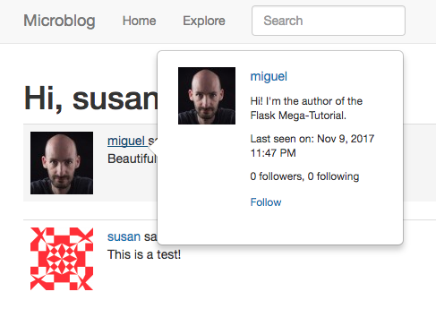

## Chapter 20: Some JavaScript Magic

> Posted by on [Miguel Grinberg](https://blog.miguelgrinberg.com/author/Miguel%20Grinberg)

這是 Flask Mega-Tutorial 系列的第二十篇，我將在這篇中新增一個當你將滑鼠懸停在使用者暱稱上時會顯示的漂亮彈出視窗。

- [Chapter 1: Hello, World!](/python/flask-mega-tutorial/chapter_1_hello_world)
- [Chapter 2: Templates](/python/flask-mega-tutorial/chapter_2_templates)
- [Chapter 3: Web Forms](/python/flask-mega-tutorial/chapter_3_web_forms)
- [Chapter 4: Database](/python/flask-mega-tutorial/chapter_4_database)
- [Chapter 5: User Logins](/python/flask-mega-tutorial/chapter_5_user_logins)
- [Chapter 6: Profile Page and Avatars](/python/flask-mega-tutorial/chapter_6_profile_page_and_avatars)
- [Chapter 7: Error Handling](/python/flask-mega-tutorial/chapter_7_error_handling)
- [Chapter 8: Followers](/python/flask-mega-tutorial/chapter_8_followers)
- [Chapter 9: Pagination](/python/flask-mega-tutorial/chapter_9_pagination)
- [Chapter 10: Email Support](/python/flask-mega-tutorial/chapter_10_email_support)
- [Chapter 11: Facelift](/python/flask-mega-tutorial/chapter_11_facelift)
- [Chapter 12: Dates and Times](/python/flask-mega-tutorial/chapter_12_dates_and_times)
- [Chapter 13: I18n and L10n](/python/flask-mega-tutorial/chapter_13_i18n_and_l10n)
- [Chapter 14: Ajax](/python/flask-mega-tutorial/chapter_14_ajax)
- [Chapter 15: A Better Application Structure](/python/flask-mega-tutorial/chapter_15_a_better_application_structure)
- [Chapter 16: Full-Text Search](/python/flask-mega-tutorial/chapter_16_full_text_search)
- [Chapter 17: Deployment on Linux](/python/flask-mega-tutorial/chapter_17_deployment_on_linux)
- [Chapter 19: Deployment on Docker Containers](/python/flask-mega-tutorial/chapter_19_deployment_on_docker_containers)
- [Chapter 20: Some JavaScript Magic](/python/flask-mega-tutorial/chapter_20_some_javascript_magic)
- [Chapter 21: User Notifications](/python/flask-mega-tutorial/chapter_21_user_notifications)
- [Chapter 22: Background Jobs](/python/flask-mega-tutorial/chapter_22_background_jobs)
- [Chapter 23: Application Programming Interfaces （APIs）](/python/flask-mega-tutorial/chapter_23_application_programming_interfaces_apis)

> 你正在閱讀 Flask Mega-Tutorial 的 2024 年版本。完整的課程也可以在 [Amazon](https://amzn.to/3ahVnPN) 以電子書和平裝書的形式訂購。感謝你的支持！
> 如果你正在尋找 2018 年版本的課程，你可以在[這裡](https://blog.miguelgrinberg.com/post/the-flask-mega-tutorial-part-i-hello-world-2018)找到它。

如今，建立一個不使用至少一點點 JavaScript 的網頁應用程式已經是不可能的事了。我確信你知道，原因是 JavaScript 是唯一一種在網頁瀏覽器中原生運行的語言。在第十四章，你看到我在 Flask 範本中新增了一個簡單的 JavaScript 啟用連結，以提供部落格貼文的即時語言翻譯。在這一章，我將深入探討這個主題，並向你展示另一個有用的 JavaScript 技巧，讓應用程式對使用者來說更加有趣和吸引人。

在社交網站上，一個常見的使用者介面模式是當你將滑鼠懸停在使用者名稱上時，在頁面上的任何地方顯示使用者的快速摘要彈出面板。如果你從未注意過這一點，去 Twitter、Facebook、LinkedIn 或任何其他主要的社交網路，當你看到一個使用者名稱，只需將你的滑鼠指標放在它上方幾秒鐘，就會看到彈出視窗出現。這一章將致力於為 Microblog 建立該功能，下面是一個預覽：



這一章的 GitHub 連結為：瀏覽、壓縮檔、差異。

### 伺服器端支援
在我們深入客戶端之前，讓我們先完成支援這些使用者彈出視窗所必需的伺服器工作。使用者彈出視窗的內容將由一個新路由返回，這將是現有使用者個人檔案路由的簡化版。這裡是視圖函式：

```python
app/main/routes.py: 使用者彈出視窗視圖函式。

@bp.route('/user/<username>/popup')
@login_required
def user_popup(username):
    user = db.first_or_404(sa.select(User).where(User.username == username))
    form = EmptyForm()
    return render_template('user_popup.html', user=user, form=form)
```

這個路由將被附加到 `/user/<username>/popup` URL 上，並將簡單地載入所請求的使用者，然後用它渲染一個範本。範本是用於使用者個人檔案頁面的那個的短版本：

```html
app/templates/user_popup.html: 使用者彈出視窗範本。

<div>
  
  <p><a href="{{ url_for('main.user', username=user.username) }}">{{ user.username }}</a></p>
  <p>{{ user.about_me }}</p>
  <div class="clearfix"></div>
  
  <p>{{ _('Last seen on') }}: {{ moment(user.last_seen).format('lll') }}</p>
  
  <p>{{ _('%(count)d followers', count=user.followers_count()) }}, {{ _

('%(count)d following', count=user.following_count()) }}</p>
  
    
    <p>
      <form action="{{ url_for('main.follow', username=user.username) }}" method="post">
        {{form.hidden_tag() }}
        {{form.submit(value=_('Follow'), class_='btn btn-outline-primary btn-sm') }}
      </form>
    </p>
    
    <p>
      <form action="{{ url_for('main.unfollow', username=user.username) }}" method="post">
        {{form.hidden_tag() }}
        {{form.submit(value=_('Unfollow'), class_='btn btn-outline-primary btn-sm') }}
      </form>
    </p>
    
  
</div>
```
我將在後續部分新增的彈出視窗組件將在使用者將滑鼠指標懸停在使用者名稱上時調用此路由。作為回應，伺服器將返回彈出視窗的 HTML 內容，客戶端將顯示該內容。當使用者將滑鼠移開時，彈出視窗將被移除。


### 引入 Bootstrap 彈出視窗組件
在第十一章，我向你介紹了 Bootstrap 框架，作為建立精美網頁的遍歷方法。到目前為止，我只使用了這個框架的一小部分。Bootstrap 附帶了許多常見的使用者介面元素，所有這些元素都在 Bootstrap 文檔中有示範和範例，網址為 https://getbootstrap.com。其中一個組件是彈出視窗，文檔中描述為「用於容納次要資訊的小型覆蓋內容」。這正是我需要的！

大多數 Bootstrap 組件都是通過 HTML 標記定義的，這些標記引用了 Bootstrap CSS 定義，加入了精美的樣式。一些最先進的組件還需要 JavaScript。應用程式將這些組件包含在網頁中的標準方式是在適當的位置加入 HTML，然後對於需要腳本支援的組件，調用一個 JavaScript 函式來初始化或啟動它。彈出視窗組件確實需要 JavaScript 支援。

首先，我需要決定哪些頁面元素將觸發彈出視窗的顯示。為此，我將使用每篇貼文中出現的可點擊使用者名稱。app/templates/_post.html 子範本已經定義了使用者名稱：

```html
<a href="{{ url_for('main.user', username=post.author.username) }}">
    {{post.author.username}}
</a>
```

現在根據彈出視窗文檔，我需要為頁面上出現的像上面那樣的每個連結建立一個 bootstrap.Popover 類的物件，這將初始化彈出視窗。不幸的是，閱讀這個之後，我遇到了更多問題而不是答案，因為這個組件似乎並不是設計來按照我需要的方式工作。以下是我需要解決的問題列表，以實現這個功能：

1. 頁面中將有許多使用者名稱連結，每個顯示的部落格貼文一個。我需要有一種方法來找到所有這些連結，這樣我就可以在使用者有機會與頁面互動之前，通過一個 JavaScript 函式將它們初始化為彈出視窗。

2. Bootstrap 文檔中的彈出視窗範例都提供了作為加入到目標 HTML 元素的 data-bs-content 屬性的彈出視窗內容。這對我來說真的很不方便，因為我想要進行 Ajax 調用到伺服器，以獲得顯示在彈出視窗中的內容。

3. 使用「懸停」模式時，只要你將滑鼠指標保持在目標元素內，彈出視窗就會保持可見。當你將滑鼠移開時，彈出視窗會消失。這有一個不好的副作用，即如果使用者想要將滑鼠指標移入彈出視窗本身，彈出視窗將會消失。我需要找出一種

方法來擴展懸停行為，也包括彈出視窗，這樣使用者就可以移入彈出視窗並且，例如，點擊其中的連結。

在處理基於瀏覽器的應用程式時，事情實際上變得很快就很複雜，這並不罕見。你必須非常具體地考慮 DOM 元素如何相互作用，並使它們以一種為使用者提供良好體驗的方式行為。在接下來的部分，我將一一查看上述問題。

### 在頁面加載時執行函式
彈出視窗組件需要用 JavaScript 明確初始化，所以很明顯，我需要在每個頁面加載時立即運行一些程式碼，這將搜索頁面中所有到使用者名稱的連結，並在它們上面初始化 Bootstrap 的彈出視窗組件。

在現代瀏覽器中運行初始化程式碼的標準方法是為 DOMContentLoaded 事件定一個處理器。我可以在 app/templates/base.html 範本中加入這個處理器，這樣每個應用程式的頁面都會運行這個：

```html
app/templates/base.html: 在頁面加載後運行函式。

...
<script>
    // ...

    function initialize_popovers() {
      // 寫初始化程式碼在這裡
    }
    document.addEventListener('DOMContentLoaded', initialize_popovers);
</script>
```

如你所見，我在 `<script>` 元素內加入了我的初始化函式，我在第十四章中定義了 translate() 函式就在這裡。


### 使用選擇器查找 DOM 元素
我接下來的問題是編寫 JavaScript 邏輯，以找到頁面中所有的使用者連結。

如果你還記得第十四章，參與即時翻譯的 HTML 元素有唯一的 ID。例如，一個 ID=123 的貼文有一個 `id="post123"` 屬性加入。然後我可以使用 `document.getElementById()` 函式來定位 DOM 中的這個元素。這個函式是一組允許在瀏覽器中運行的應用程式根據其特性找到元素的函式之一。

對於翻譯功能，我需要找到一個具有 id 屬性的特定元素，該屬性在頁面上唯一識別元素。當尋找元素群組時，更適當的另一個搜索選項是給它們加入一個 CSS 類。不同於 id，class 屬性可以分配給多個元素，所以它非常適合找到所有需要彈出視窗的連結。我將做的是將所有使用者連結標記為 `class="user_popup"` 屬性，然後我將用 `document.getElementsByClassName('user_popup')` 從 JavaScript 獲取連結列表。在這種情況下，返回值將是具有該類的所有元素的集合。

```html
app/templates/base.html: 在頁面加載後運行函式。

...
<script>
    // ...

    function initialize_popovers() {
      const popups = document.getElementsByClassName('user_popup');
      for (let i = 0; i < popups.length; i++) {
        // 在這裡建立彈出視窗
      }
    }
    document.addEventListener('DOMContentLoaded', initialize_popovers);
</script>
```

### 彈出視窗與 DOM
在前一節中，我加入了初始化程式碼，尋找頁面中被分配了 user_popup 類的所有元素。這個類需要加入到 _post.html 範本頁面中定義的使用者名稱連結。

```html
app/templates/_post.html: 使用者彈出視窗範本。

...
        
            <a class="user_popup" href="{{ url_for('main.user', username=post.author.username) }}">
                {{post.author.username}}
            </a>
        
...
```

如果你想知道彈出視窗的 HTML 元素在哪裡定義，好消息是我不需要擔心這個。當我建立 Popover 物件時，Bootstrap 框架將為我動態插入與彈出視窗相關的元素。

### 建立彈出視窗組件
現在我準備好為頁面上找到的所有使用者名稱連結建立彈出視窗組件了。


app/templates/base.html: 懸停延遲。
```html
  <script>
      function initialize_popovers() {
        const popups = document.getElementsByClassName('user_popup');
        for (let i = 0; i < popups.length; i++) {
          const popover = new bootstrap.Popover(popups[i], {
            content: '加載中...',
            trigger: 'hover focus',
            placement: 'right',
            html: true,
            sanitize: false,
            delay: {show: 500, hide: 0},
            container: popups[i],
            customClass: 'd-inline',
          });
        }
      }
      document.addEventListener('DOMContentLoaded', initialize_popovers);
  </script>
```

bootstrap.Popover 構造函式將獲得彈出視窗的元素作為第一個參數，和一個包含選項的物件作為

第二個參數。選項包括將出現在彈出視窗中的內容，用什麼方法觸發彈出視窗出現或消失（點擊、懸停在元素上等），彈出視窗的放置位置，內容是純文本還是 HTML，以及更多選項。

我上面提到，這個彈出視窗實現的一個大問題是，需要顯示的 HTML 內容是通過向伺服器發出請求獲得的。因此，我用「加載中...」文本初始化內容，一旦從伺服器接收到使用者的 HTML 內容，這將被動態替換。為此，我將 html 選項設置為 true，並禁用一個選項來清理 HTML 內容。清理 HTML 是一個非常重要的安全功能，當內容來自使用者時應該使用。在這個使用案例中，HTML 內容由 Flask 伺服器通過 Jinja 範本生成，預設會對所有動態內容進行清理。

延遲選項配置彈出視窗組件在懸停半秒後出現。當彈出視窗因使用者移動滑鼠指標而移除時，不配置延遲。容器選項告訴 Bootstrap 將彈出視窗組件作為連結元素的子項插入。這是一個經常推薦的技巧，允許使用者將滑鼠指標移入彈出視窗而不會導致彈出視窗消失。customClass 選項給代表彈出視窗組件的 `<div>` 元素一個內聯顯示樣式。這確保當組件被插入時，由於 `<div>` 元素的預設顯示樣式是塊，不會間接在頁面中的那個位置加入換行。


### Ajax 請求
Ajax 請求不是一個新話題，因為我在第十四章作為即時語言翻譯功能的一部分介紹過這個話題。和之前一樣，我將使用 `fetch()` 函式發送一個異步請求到伺服器。

請求需要使用 `/user/<username>/popup` URL，這是我在本章開頭加入到應用程式的。這個請求的回應將包含我需要插入到彈出視窗組件中的 HTML，替換初始的「加載中...」訊息。

我的第一個問題是如何在使用者通過懸停在使用者連結上時請求彈出視窗的時候觸發請求。通過查看彈出視窗文檔，描述這個組件支援的事件的部分包括一個名為 `show.bs.popover` 的事件，當彈出視窗組件即將顯示時觸發。

```html
app/templates/base.html: 懸停延遲。

      function initialize_popovers() {
        const popups = document.getElementsByClassName('user_popup');
        for (let i = 0; i < popups.length; i++) {
          const popover = new bootstrap.Popover(popups[i], {
            ...
          });
          popups[i].addEventListener('show.bs.popover', async (ev) => {
            // 在這裡發送請求
          });
        }
      }
      document.addEventListener('DOMContentLoaded', initialize_popovers);
```

下一個問題是如何知道我需要在這個請求的 URL 中包含什麼使用者名稱。這個名稱在 `<a>` 連結的文本中。彈出視窗組件的 show 事件接收一個 `ev` 參數，帶有事件物件。觸發事件的元素可以用 `ev.target` 獲取，提取這個連結文本的表達式是：

```javascript
ev.target.innerText.trim()
```

頁面元素的 `innerText` 屬性返回節點的文本內容。文本返回時不進行任何修剪，所以例如，如果你有 `<a>` 在一行，文本在下一行，和關閉的 `</a>` 在另一行，`innerText` 將返回圍繞文本的換行符和額外的空白。為了消除所有那些空白，只留下文本，我使用了 JavaScript 函式 `trim()`。

這就是我需要能夠向伺服器發出請求的所有資訊：

```html
app/templates/base.html: XHR 請求。
<script>
      function initialize_popovers() {
        const popups = document.getElementsByClassName('user_popup');
        for (let i = 0; i < popups.length; i++) {
          const popover = new bootstrap.Popover(popups[i], {
            ...
          });
          popups[i].addEventListener('show.bs.popover', async (ev) => {
            const response = await fetch('/user/' + ev.target.innerText.trim() + '/popup');
            const data = await response.text();
            // 在這裡更新彈出視窗
          });
        }
      }
      document.addEventListener('DOMContentLoaded', initialize_popovers);
</script>
```

這裡我使用了 `fetch()` 函式請求連結元素代表的使用者的 `/popup` URL。不幸的是，當在 JavaScript 邊直接構建 URL 時，我不能使用 Flask 的 `url_for()`，所以在這種情況下我必須明確地連接 URL 部分。一旦我獲得了回應，我從中提取文本到 `data` 中。這是需要存儲在彈出視

窗組件中的 HTML。

### 更新彈出視窗
所以最後我現在可以用從伺服器接收到的、存儲在 `data` 常量中的 HTML 更新我的彈出視窗組件了：

app/templates/base.html: 顯示彈出視窗。
```html

  <script>
      function initialize_popovers() {
        const popups = document.getElementsByClassName('user_popup');
        for (let i = 0; i < popups.length; i++) {
          const popover = new bootstrap.Popover(popups[i], {
            ...
          });
          popups[i].addEventListener('show.bs.popover', async (ev) => {
            if (ev.target.popupLoaded) {
              return;
            }
            const response = await fetch('/user/' + ev.target.innerText.trim() + '/popup');
            const data = await response.text();
            const popover = bootstrap.Popover.getInstance(ev.target);
            if (popover && data) {
              ev.target.popupLoaded = true;
              popover.setContent({'.popover-body': data});
              flask_moment_render_all
            }
          });
        }
      }
      document.addEventListener('DOMContentLoaded', initialize_popovers);
  </script>
```

要進行這個更新，我首先獲得了彈出視窗組件，Bootstrap 通過 `getInstance()` 方法提供。如果我有一個彈出視窗組件和 HTML 內容，那麼我就調用彈出視窗的 `setContent()` 方法來更新它的主體。

作為一種優化，我還在連結元素中設置了一個 `popupLoaded` 屬性為 true。這樣做是為了不在彈出視窗第二次打開時重新發送相同的請求。注意我如何更新了 show 事件處理器的開頭，以檢查這個 `popupLoaded` 屬性，如果它被設置，那麼就直接返回，因為彈出視窗的內容已經更新了。

需要處理的最後一個細節是插入彈出視窗組件中的 HTML 內容中包含的日期和時間。這些時間戳是用 Jinja 範本中的 Flask-Moment 的 `moment()` 函式生成的。Flask-Moment 向頁面加入了 JavaScript 程式碼，當頁面加載時渲染所有的時間戳。當在頁面加載後動態加入新的時間戳時，需要手動調用 `flask_moment_render_all()` 函式來渲染它們，所以我在更新 HTML 內容後插入了對這個函式的調用。

