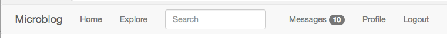

## Chapter 21: User Notifications

> Posted by on [Miguel Grinberg](https://blog.miguelgrinberg.com/author/Miguel%20Grinberg)

這是 Flask Mega-Tutorial 系列的第二十一篇，在這篇中，我將新增一個私人訊息功能，以及出現在導航欄中的使用者通知，無需刷新頁面即可看到。

- [Chapter 1: Hello, World!](/python/flask-mega-tutorial/chapter_1_hello_world)
- [Chapter 2: Templates](/python/flask-mega-tutorial/chapter_2_templates)
- [Chapter 3: Web Forms](/python/flask-mega-tutorial/chapter_3_web_forms)
- [Chapter 4: Database](/python/flask-mega-tutorial/chapter_4_database)
- [Chapter 5: User Logins](/python/flask-mega-tutorial/chapter_5_user_logins)
- [Chapter 6: Profile Page and Avatars](/python/flask-mega-tutorial/chapter_6_profile_page_and_avatars)
- [Chapter 7: Error Handling](/python/flask-mega-tutorial/chapter_7_error_handling)
- [Chapter 8: Followers](/python/flask-mega-tutorial/chapter_8_followers)
- [Chapter 9: Pagination](/python/flask-mega-tutorial/chapter_9_pagination)
- [Chapter 10: Email Support](/python/flask-mega-tutorial/chapter_10_email_support)
- [Chapter 11: Facelift](/python/flask-mega-tutorial/chapter_11_facelift)
- [Chapter 12: Dates and Times](/python/flask-mega-tutorial/chapter_12_dates_and_times)
- [Chapter 13: I18n and L10n](/python/flask-mega-tutorial/chapter_13_i18n_and_l10n)
- [Chapter 14: Ajax](/python/flask-mega-tutorial/chapter_14_ajax)
- [Chapter 15: A Better Application Structure](/python/flask-mega-tutorial/chapter_15_a_better_application_structure)
- [Chapter 16: Full-Text Search](/python/flask-mega-tutorial/chapter_16_full_text_search)
- [Chapter 17: Deployment on Linux](/python/flask-mega-tutorial/chapter_17_deployment_on_linux)
- [Chapter 19: Deployment on Docker Containers](/python/flask-mega-tutorial/chapter_19_deployment_on_docker_containers)
- [Chapter 20: Some JavaScript Magic](/python/flask-mega-tutorial/chapter_20_some_javascript_magic)
- [Chapter 21: User Notifications](/python/flask-mega-tutorial/chapter_21_user_notifications)
- [Chapter 22: Background Jobs](/python/flask-mega-tutorial/chapter_22_background_jobs)
- [Chapter 23: Application Programming Interfaces （APIs）](/python/flask-mega-tutorial/chapter_23_application_programming_interfaces_apis)

> 你正在閱讀 Flask Mega-Tutorial 的 2024 年版本。完整的課程也可以在 [Amazon](https://amzn.to/3ahVnPN) 以電子書和平裝書的形式訂購。感謝你的支持！
> 如果你正在尋找 2018 年版本的課程，你可以在[這裡](https://blog.miguelgrinberg.com/post/the-flask-mega-tutorial-part-i-hello-world-2018)找到它。

在這一章，我想繼續致力於提升我的 Microblog 應用的使用者體驗。許多應用都適用的一個方面是向使用者展示警告或通知。社交應用顯示這些通知，讓你知道你收到了新的提及或私人訊息，通常是通過在頂部導航欄中顯示一個帶有數字的小徽章。雖然這是最明顯的用法，通知模式可以應用於許多其他類型的應用，以通知使用者某事需要他們的注意。

但為了向你展示建立使用者通知所涉及的技術，我需要擴展 Microblog，增加一個可以從中受益的功能，所以在本章的第一部分，我將建立一個使用者訊息系統，允許任何使用者向另一位使用者發送私人訊息。這實際上比聽起來簡單，它將是對核心 Flask 實踐的一個很好的複習，以及如何精簡、高效和有趣地使用 Flask 的提醒。一旦訊息系統到位，我將討論一些實現顯示未讀訊息數量的通知徽章的選項。

這一章的 GitHub 連結為：瀏覽、壓縮檔、差異。

### 私人訊息
我將要實現的私人訊息功能將非常簡單。當你訪問一位使用者的個人檔案頁面時，將有一個發送私人訊息給該使用者的連結。該連結將帶你到一個新頁面，在那裡一個網頁表單接收訊息。要閱讀發送給你的訊息，頁面頂部的導航欄將有一個新的「訊息」連結，該連結將帶你到一個結構類似於索引或探索頁面的頁面，但顯示的是其他使用者發送給你的訊息，而不是部落格貼文。

以下部分描述了我實現此功能所採取的步驟。

### 為私人訊息提供數據庫支援
第一個任務是擴展數據庫以支援私人訊息。這裡是一個新的 Message 模型：

```python
app/models.py: 訊息模型。

class Message(db.Model):
    id: so.Mapped[int] = so.mapped_column(primary_key=True)
    sender_id: so.Mapped[int] = so.mapped_column(sa.ForeignKey(User.id),
                                                 index=True)
    recipient_id: so.Mapped[int] = so.mapped_column(sa.ForeignKey(User.id),
                                                    index=True)
    body: so.Mapped[str] = so.mapped_column(sa.String(140))
    timestamp: so.Mapped[datetime] = so.mapped_column(
        index=True, default=lambda: datetime.now(timezone.utc))

    def __repr__(self):
        return '<Message {}>'.format

(self.body)
```

這個模型類似於 Post 模型，唯一的區別是有兩個使用者外鍵，一個用於發送者，一個用於接收者。User 模型可以獲得兩個寫入關聯，用於發送和接收的訊息，加上一個新字段，表示每位使用者上次閱讀他們私人訊息的時間：

```python
app/models.py: User 模型中支援私人訊息。

class User(UserMixin, db.Model):
    ## ...
    last_message_read_time: so.Mapped[Optional[datetime]]

    ## ...
    messages_sent: so.WriteOnlyMapped['Message'] = so.relationship(
        foreign_keys='Message.sender_id', back_populates='author')
    messages_received: so.WriteOnlyMapped['Message'] = so.relationship(
        foreign_keys='Message.recipient_id', back_populates='recipient')

    ## ...

    def unread_message_count(self):
        last_read_time = self.last_message_read_time or datetime(1900, 1, 1)
        query = sa.select(Message).where(Message.recipient == self,
                                         Message.timestamp > last_read_time)
        return db.session.scalar(sa.select(sa.func.count()).select_from(
            query.subquery()))
```

`last_message_read_time` 字段將記錄使用者最後一次訪問訊息頁面的時間，並將用於確定是否有未讀訊息，所有這些訊息的時間戳都會比這個字段更新。`unread_message_count()` 輔助方法實際上使用這個字段返回使用者有多少未讀訊息。到本章結束時，我將在頁面頂部的導航欄中有這個數字作為一個漂亮的徽章。

這兩個關聯返回給定使用者發送和接收的訊息。在 Message 關聯的一側，我也包括了反向關聯，我稱之為 author 和 recipient：

```python
app/models.py: Message 模型中的私人訊息關係。

class Message(db.Model):
    ## ...

    author: so.Mapped[User] = so.relationship(
        foreign_keys='Message.sender_id',
        back_populates='messages_sent')
    recipient: so.Mapped[User] = so.relationship(
        foreign_keys='Message.recipient_id',
        back_populates='messages_received')
```

我使用 author 名稱作為關係而不是更預期的 sender 的原因是，使用 author 我可以用與部落格貼文相同的邏輯來渲染這些訊息，鑑於貼文和訊息的相似性。

這完成了數據庫的更改，現在是時候生成一個新的遷移並用它升級數據庫了：

```shell
(venv) $ flask db migrate -m "private messages"
(venv) $ flask db upgrade
```

### 發送私人訊息
接下來我將著手發送訊息。我需要一個簡單的網頁表單接受訊息：

```python
app/main/forms.py: 私人訊息表單類。

class MessageForm(FlaskForm):
    message = TextAreaField(_l('Message'), validators=[
        DataRequired(), Length(min=0, max=140)])
    submit = SubmitField(_l('Submit'))
```

我還需要 HTML 範本在網頁上渲染這個表單：

```html
app/templates/send_message.html: 發送私人訊息 HTML 範本。





    <h1>{{ _('Send Message to %(recipient)s', recipient=recipient) }}</h1>
    <div class="row">
        <div class="col-md-4">
            {{wtf.quick_form(form) }}


        </div>
    </div>

```

接下來我將新增一個 `/send_message/<recipient>` 路由來處理實際發送私人訊息：

```python
app/main/routes.py: 發送私人訊息路由。

from app.main.forms import MessageForm
from app.models import Message

## ...

@bp.route('/send_message/<recipient>', methods=['GET', 'POST'])
@login_required
def send_message(recipient):
    user = db.first_or_404(sa.select(User).where(User.username == recipient))
    form = MessageForm()
    if form.validate_on_submit():
        msg = Message(author=current_user, recipient=user,
                      body=form.message.data)
        db.session.add(msg)
        db.session.commit()
        flash(_('Your message has been sent.'))
        return redirect(url_for('main.user', username=recipient))
    return render_template('send_message.html', title=_('Send Message'),
                           form=form, recipient=recipient)
```

我認為這個視圖函式中的邏輯應該大部分是不言自明的。發送私人訊息的動作僅僅是通過向數據庫加入一個新的 Message 實例來實現的。

將所有內容綁定在一起的最後更改是在使用者個人檔案頁面中加入到上述路由的連結：

```html
app/templates/user.html: 使用者個人檔案頁面中發送私人訊息連結。

                
                <p>
                    <a href="{{ url_for('main.send_message',
                                        recipient=user.username) }}">
                        {{_('Send private message') }}
                    </a>
                </p>
                
```

### 查看私人訊息
這個功能的第二大部分是查看私人訊息。為此，我將新增一個 `/messages` 路由，其工作方式與索引和探索頁面相當類似，包括完整的分頁支援：

```python
app/main/routes.py: 查看訊息路由。

@bp.route('/messages')
@login_required
def messages():
    current_user.last_message_read_time = datetime.now(timezone.utc)
    db.session.commit()
    page = request.args.get('page', 1, type=int)
    query = current_user.messages_received.select().order_by(
        Message.timestamp.desc())
    messages = db.paginate(query, page=page,
                           per_page=current_app.config['POSTS_PER_PAGE'],
                           error_out=False)
    next_url = url_for('main.messages', page=messages.next_num) \
        if messages.has_next else None
    prev_url = url_for('main.messages', page=messages.prev_num) \
        if messages.has_prev else None
    return render_template('messages.html', messages=messages.items,
                           next_url=next_url, prev_url=prev_url)
```

這個視圖函式中的第一件事是將 `User.last_message_read_time` 字段更新為當前時間。這基本上標記了發送給該使用者的所有訊息為已讀。然後我查詢 Message 模型以獲取訊息列表，按時間戳從新到舊排序。我決定在這裡重用 `POSTS_PER_PAGE` 配置項，因為帶有貼文和訊息的頁面看起來會非常相似，但當然，如果頁面要分開，加入一個單獨的配置變數用於訊息可能是有意義的。分頁邏輯與我用於貼文的相同，所以這對你來說應該都是熟悉的。

上述視圖函式最後通過渲染一個新的 `/app/templates/messages.html` 範本檔案結束，如下所示：

```html
app/templates/messages.html: 查看訊息 HTML 範本。




    <h1>{{ _('Messages') }}</h1>
    
        
    
    <nav aria-label="...">
        <ul class="pager">
            <li class="previous disabled">
                <a href="{{ prev_url or'#'}}">
                    <span aria-hidden="true">&larr;</span> {{ _('Newer messages') }}
                </a>
            </li>
            <li class="next disabled">
                <a href="{{ next_url or'#'}}">
                    {{_('Older messages') }} <span aria-hidden="true">&rarr;</span>
                </a>
            </li>
        </ul>
    </nav>

```

這裡我使用了另一個小技巧。我注意到 Post 和 Message 實例的結構幾乎相同，除了 Message 獲得了一個額外的 recipient 關係（在訊息頁面中我不需要顯示，因為它始終是當前使用者）。所以我決定重用 `app/templates/_post.html` 子範本來渲染私人訊息。因此，這個範本使用了奇怪的 for-loop for post in messages，這樣子範本中對 post 的所有引用也適用於訊息。

為了讓使用者訪問新的視圖函式，導航頁面獲得了一個新的「訊息」連結：

```html
app/templates/base.html: 導航欄中的訊息連結。

                    
                    ...
                    


                    <li>
                        <a href="{{ url_for('main.messages') }}">
                            {{_('Messages') }}
                        </a>
                    </li>
                    ...
                    
```

功能現在已經完成，但作為所有這些變更的一部分，有一些新的文本被加入在幾個地方，這些需要被納入語言翻譯。第一步是更新所有語言目錄：

```shell
(venv) $ flask translate update
```

然後，app/translations 中的每種語言都需要更新其 messages.po 檔案以包含新的翻譯。你可以在這個項目的 GitHub 倉庫或下載的壓縮檔中找到西班牙語翻譯。

### 靜態訊息通知徽章
現在私人訊息功能已經實現了，但當然沒有任何東西告訴使用者有私人訊息在等待被讀取。最簡單的導航欄指示器實現可以作為基本範本的一部分渲染，使用 Bootstrap 徽章小部件：

```html
app/templates/base.html: 導航欄中的靜態訊息數量徽章。

                    ...
                    <li>
                        <a href="{{ url_for('main.messages') }}">
                            {{_('Messages') }}
                            
                            
                            <span class="badge">{{ unread_message_count }}</span>
                            
                        </a>
                    </li>
                    ...
```

這裡我直接從範本中調用了我之前加入到 User 模型的 `unread_message_count()` 方法，並將該數字存儲在一個同名的範本變數中。然後，如果該變數非零，我就在「訊息」連結旁邊加入徽章與數字。這是頁面上的外觀：



### 動態訊息通知徽章
上一節中提出的解決方案是顯示通知的一種體面且簡單的方法，但它的缺點是徽章只有在加載新頁面時才會出現。如果使用者花很長時間閱讀一頁上的內容而不點擊任何連結，那麼在這段時間內來的新訊息將不會顯示，直到使用者最終點擊連結並加載新頁面。

為了讓這個應用對我的使用者更有用，我希望徽章可以自己更新未讀訊息的數量，無需使用者點擊連結和加載新頁面。上一節解決方案的一個問題是，當頁面加載時訊息數量為非零時，徽章才會被渲染到頁面上。更方便的是，總是在導航欄中包含徽章，並在訊息數量為零時將其標記為隱藏。這樣使用 JavaScript 使徽章可見就很容易了：

```html
app/templates/base.html: 對 JavaScript 友好的未讀訊息徽章。

                    <li>
                        <a href="{{ url_for('main.messages') }}">
                            {{_('Messages') }}
                            
                            <span id="message_count" class="badge"
                                  style="visibility: visible
                                                     hidden ;">
                                {{unread_message_count}}
                            </span>
                        </a>
                    </li>
```

在這個徽章版本中，我總是包含它，但當 `unread_message_count` 非零時，CSS 的 visibility 屬性設置為 visible，如果是零則設為 hidden。我還給表示徽章的 `<span>` 元素加入了一個 id 屬性，以便使用 `document.getElementById('message_count')` 輕鬆定位這個元素。

接下來，我可以編寫一個簡短的 JavaScript 函式來更新這個徽章的數字：

```html
app/templates/base.html: 導航欄中的靜態訊息數量徽章。

...

  <script>
    // ...

    function set_message_count(n) {
      const count = document.getElementById('message_count');
      count.innerText = n;
      count.style.visibility = n ? 'visible' : 'hidden';
    }
  </script>

```

這個新的 `set_message_count()` 函式將設置徽章元素中的訊息數量，並調整可見性，使得當計數為 0 時徽章被隱藏，否則可見。

### 將通知傳遞給客戶端
現在剩下的是新增一個機制，使客戶端可以定期獲取使用者未讀訊息數量的更新。當其中一次更新發生時，客戶端將調用 `set_message_count()` 函式，以讓使用者知道更新。

實際上有兩種方法讓伺服器將這些更新傳遞給客戶端，你可能已經猜到了，兩者都有優缺點，所以選擇哪一個在很大程度上取決於項目。在第一種方法中，客戶端定期向伺服器請求更新，通過發送一個異步請求。這個請求的回應是一個更新列表，客戶端可以使用它來更新頁面的不同元素，例如未讀訊息數量徽章。第二種方法需要客戶端和伺服器之間的一種特殊連接，允許伺服器自由地將數據推送到客戶端。注意，無論選擇哪種方法，我都希望將通知視為通用實體，以便我可以擴展這個框架以支持未讀訊息徽章之外的其他類型事件。

第一種解決方案最大的優點是它易於實現。我所需要做的就是再新增一個路由到應用中，比如 `/notifications`，它返回一個 JSON 格式的通知列表。然後客戶端應用遍歷通知列表，並為每一個進行必要的頁面更改。這個解決方案的缺點是實際事件和通知之間會有延遲，因為客戶端將定期請求通知列表。例如，如果客戶端每 10 秒請求一次通知，則通知可能會延遲最多 10 秒收到。

第二種解決方案需要在協議層面進行更改，因為 HTTP 沒有任何規定允許伺服器在客戶端未請求的情況下向客戶端發送數據。目前最常見的實現伺服器主動發送訊息的方式是通過擴展伺服器以支持 WebSocket 連接以及 HTTP。WebSocket 是一種與 HTTP 不同的協議，它建立了伺服器和客戶端之間的永久連接。伺服器和客戶端都可以隨時向對方發送數據，無需對方請求。這種機制的優點是，每當發生客戶端感興趣的事件時，伺服器可以立即發送通知，無需任何延遲。缺點是，WebSocket 比 HTTP 需要更複雜的設置，因為伺服器需要與每個客戶端保持永久連接。想象一下，一個伺服器例如有四個工作進程，通常可以服務幾百個 HTTP 客戶端，因為 HTTP 中的連接是短暫的，並且不斷被回收。同一伺服器只能處理四個 WebSocket 客戶端，在絕大多數情

況下這將是不夠的。正是由於這個限制，WebSocket 應用通常圍繞異步伺服器設計，因為這些伺服器在管理大量工作人員和活動連接方面更有效率。

好消息是，無論你使用哪種方法，在客戶端你都會有一個回調函式，將被更新列表調用。所以我可以從第一種解決方案開始，這種方法更容易實現，然後，如果我發現它不夠用，遷移到 WebSocket 伺服器，它可以配置為調用相同的客戶端回調。在我看來，對於這類應用，第一種解決方案實際上是可以接受的。基於 WebSocket 的實現對於需要將更新以接近零延遲的方式交付的應用程式會很有用。

如果你好奇的話，Twitter 也使用第一種方法來處理他們導航欄的通知。Facebook 使用它的一種變體稱為長輪詢，這在一定程度上解決了直接輪詢的一些限制，同時仍然使用 HTTP 請求。Stack Overflow 和 Trello 是兩個實現 WebSocket 用於他們通知的網站。你可以通過查看瀏覽器的網絡調試器中的網絡標籤來找出任何網站上發生的背景活動類型。

那麼，讓我們繼續實施輪詢解決方案。首先，我將新增一個新模型來跟踪所有使用者的通知，以及在使用者模型中新增一個關係。

```python
app/models.py: 通知模型。

import json
from time import time

## ...

class User(UserMixin, db.Model):
    ## ...
    notifications: so.WriteOnlyMapped['Notification'] = so.relationship(
        back_populates='user')

    ## ...

class Notification(db.Model):
    id: so.Mapped[int] = so.mapped_column(primary_key=True)
    name: so.Mapped[str] = so.mapped_column(sa.String(128), index=True)
    user_id: so.Mapped[int] = so.mapped_column(sa.ForeignKey(User.id),
                                               index=True)
    timestamp: so.Mapped[float] = so.mapped_column(index=True, default=time)
    payload_json: so.Mapped[str] = so.mapped_column(sa.Text)

    user: so.Mapped[User] = so.relationship(back_populates='notifications')

    def get_data(self):
        return json.loads(str(self.payload_json))
```

一個通知將會有一個名稱、一個關聯的使用者、一個 Unix 時間戳和一個有效負載。時間戳的默認值來自 `time.time()` 函式。有效負載對於每種類型的通知來說將會不同，所以我將其寫為 JSON 字符串，這將允許我寫入列表、字典或單個值，如數字或字符串。我加入了 `get_data()` 方法作為一種遍歷，這樣調用者不必擔心 JSON 反序列化。

這些更改需要包含在一個新的數據庫遷移中：

```shell
(venv) $ flask db migrate -m "notifications"
(venv) $ flask db upgrade
```

為了方便起見，我將把新的 Message 和 Notification 模型加入到 shell 上下文中，這樣當我使用 `fl

ask shell` 命令啟動一個 shell 時，模型類自動為我導入：

```python
microblog.py: 將 Message 模型加入到 shell 上下文。

## ...
from app.models import User, Post, Message, Notification

## ...

@app.shell_context_processor
def make_shell_context():
    return {'sa': sa, 'so': so, 'db': db, 'User': User, 'Post': Post,
            'Message': Message, 'Notification': Notification}
```

我還將在使用者模型中新增一個 `add_notification()` 輔助方法，以便更容易地使用這些對象：

```python
app/models.py: 通知模型。

class User(UserMixin, db.Model):
    ## ...

    def add_notification(self, name, data):
        db.session.execute(self.notifications.delete().where(
            Notification.name == name))
        n = Notification(name=name, payload_json=json.dumps(data), user=self)
        db.session.add(n)
        return n
```

這個方法不僅為使用者新增了一個通知到數據庫，還確保如果已經存在同名的通知，首先將其刪除。你之前已經看到，可以通過調用 `select()` 方法來查詢僅寫入關係。`delete()` 方法返回一個刪除查詢，用於關係，它可以刪除所有元素而不加載它們。通過加入 `where()` 子句，我指定了我想刪除關係中的哪些元素。我將要處理的通知將被稱為 `unread_message_count`。如果數據庫已經有一個名為此的通知，例如，具有 3 的值，每當使用者收到一條新訊息且訊息計數增加到 4 時，我想替換舊的通知。

在未讀訊息計數變化的任何地方，我需要調用 `add_notification()`，以便我為使用者更新我的通知。有兩個地方這個變化。首先，當使用者收到一條新的私人訊息時，在 `send_message()` 視圖函式中：

```python
app/main/routes.py: 更新使用者通知。

@bp.route('/send_message/<recipient>', methods=['GET', 'POST'])
@login_required
def send_message(recipient):
    ## ...
    if form.validate_on_submit():
        ## ...
        user.add_notification('unread_message_count',
                              user.unread_message_count())
        db.session.commit()
        ## ...
    ## ...
```

我需要通知使用者的第二個地方是當使用者訪問訊息頁面時，此時未讀計數回歸零：

```python
app/main/routes.py: 查看訊息路由。

@bp.route('/messages')
@login_required
def messages():
    current_user.last_message_read_time = datetime.utcnow()
    current_user.add_notification('unread_message_count', 0)
    db.session.commit()
    ## ...
```

現在所有使用者的通知都在數據庫中維護好了，我可以新增一個新路由，客戶端可以用它來檢索已登入使用者的通知：

```python
app/main/routes.py: 通知視圖函式。

from app.models import Notification

## ...

@bp.route('/notifications')
@login_required
def notifications():
    since = request.args.get('since', 0.0, type=float)
    query = current_user.notifications.select().where(
        Notification.timestamp > since).order_by(Notification.timestamp.asc())
    notifications = db.session.scalars(query)
    return [{
        'name': n.name,
        'data': n.get_data(),
        'timestamp': n.timestamp
    } for n in notifications]
```

這是一個相當簡單的函式，返回一個 JSON 負載，包含使用者的通知列表。每個通知以一個字典形式給出，

有三個元素，通知名稱、與通知相關的附加數據（如訊息計數），以及時間戳。通知按它們建立的順序交付，從最舊到最新。

我不希望客戶端獲得重複的通知，所以我給他們提供了一個選項，僅請求給定時間之後的通知。`since` 選項可以包含在請求 URL 的查詢字符串中，使用起始時間的 Unix 時間戳，作為一個浮點數。如果包含此參數，則僅返回此時間之後發生的通知。

完成這個功能的最後一步是在客戶端實現實際的輪詢。最好的地方是在基本範本中進行，這樣所有頁面自動繼承該行為：

```html
app/templates/base.html: 輪詢通知。

...

  <script>
    // ...

    
    function initialize_notifications() {
      let since = 0;
      setInterval(async function() {
        const response = await fetch('{{ url_for('main.notifications') }}?since=' + since);
        const notifications = await response.json();
        for (let i = 0; i < notifications.length; i++) {
          if (notifications[i].name == 'unread_message_count')
            set_message_count(notifications[i].data);
          since = notifications[i].timestamp;
        }
      }, 10000);
    }
    document.addEventListener('DOMContentLoaded', initialize_notifications);
    
  </script>
```

這個函式被包含在一個範本條件中，因為我只想在使用者登入時進行新訊息的輪詢。對於未登入的使用者，這個函式不會被包含，因為他們不能接收通知。

你已經在第 20 章看到了 `DOMContentLoaded` 事件。這是你註冊一個在頁面加載後執行的函式的方式。對於這個功能，我需要在頁面加載時做的是設置一個定時器，獲取使用者的通知。你也看到了 JavaScript 函式 `setTimeout()`，它在指定時間過後運行給定的函式。`setInterval()` 函式使用與 `setTimeout()` 相同的參數，但不是只觸發一次計時器，它會定期調用回調函式。在這種情況下，我的間隔設置為 10 秒（以毫秒為單位），所以我將以每分鐘大約六次的頻率看到徽章更新。

與間隔計時器相關的函式使用 `fetch()` 發出一個 Ajax 請求到新的通知路由。當這個調用返回時，它遍歷通知列表。當收到名稱為 `unread_message_count` 的通知時，通過調用上面定義的函式並給出通知中的計數來調整訊息計數徽章。

我處理 `since` 參數的方式可能會讓人感到困惑。我開始時將這個參數初始化為 0。這個參數總是包含在請求 URL 中，但我不能使用 Flask 的 `url_for()` 來生成查詢字符串，就像我之前做的那樣，因為 `url_for()` 在伺服器上運行一次，我需要 `since` 參數動態更新。第

一次，請求將被發送到 `/notifications?since=0`，但一旦我收到一個通知，我就將 `since` 更新為它的時間戳。這確保了我不會收到重複的通知，因為我總是要求接收自我看到的最後一個通知以來發生的通知。同樣重要的是要注意，我在間隔函式外聲明了 `since` 變數，因為我不希望這是一個局部變數，我希望在所有調用中使用同一個變數。

試用這個功能的最簡單方法是使用兩個不同的瀏覽器。在兩個瀏覽器中使用不同的使用者登入 Microblog。然後從其中一個瀏覽器向另一個使用者發送一條或多條訊息。另一個瀏覽器的導航欄應該在不到 10 秒內更新以顯示你發送的訊息數量。當你點擊「訊息」連結時，未讀訊息計數重置回零。

