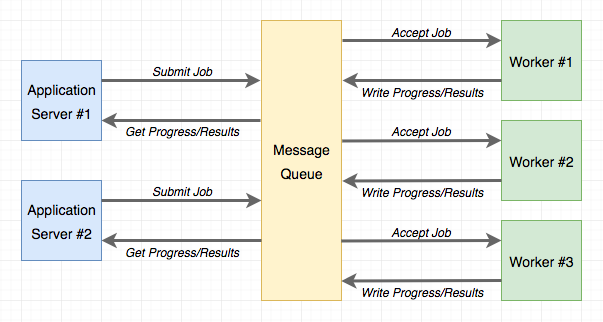
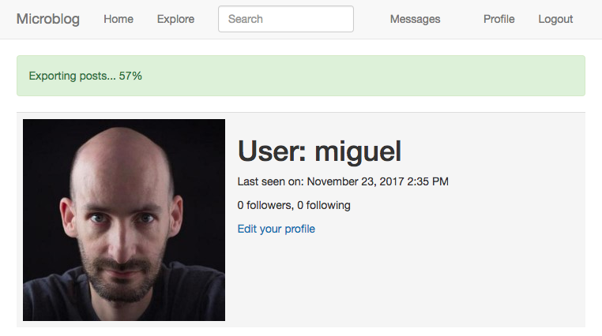

## Chapter 22: Background Jobs

> Posted by on [Miguel Grinberg](https://blog.miguelgrinberg.com/author/Miguel%20Grinberg)

這是  Flask Mega-Tutorial 系列的第二十二篇，在這篇中，我將告訴你如何建立獨立於網頁伺服器運行的背景任務。

- [Chapter 1: Hello, World!](/python/flask-mega-tutorial/chapter_1_hello_world)
- [Chapter 2: Templates](/python/flask-mega-tutorial/chapter_2_templates)
- [Chapter 3: Web Forms](/python/flask-mega-tutorial/chapter_3_web_forms)
- [Chapter 4: Database](/python/flask-mega-tutorial/chapter_4_database)
- [Chapter 5: User Logins](/python/flask-mega-tutorial/chapter_5_user_logins)
- [Chapter 6: Profile Page and Avatars](/python/flask-mega-tutorial/chapter_6_profile_page_and_avatars)
- [Chapter 7: Error Handling](/python/flask-mega-tutorial/chapter_7_error_handling)
- [Chapter 8: Followers](/python/flask-mega-tutorial/chapter_8_followers)
- [Chapter 9: Pagination](/python/flask-mega-tutorial/chapter_9_pagination)
- [Chapter 10: Email Support](/python/flask-mega-tutorial/chapter_10_email_support)
- [Chapter 11: Facelift](/python/flask-mega-tutorial/chapter_11_facelift)
- [Chapter 12: Dates and Times](/python/flask-mega-tutorial/chapter_12_dates_and_times)
- [Chapter 13: I18n and L10n](/python/flask-mega-tutorial/chapter_13_i18n_and_l10n)
- [Chapter 14: Ajax](/python/flask-mega-tutorial/chapter_14_ajax)
- [Chapter 15: A Better Application Structure](/python/flask-mega-tutorial/chapter_15_a_better_application_structure)
- [Chapter 16: Full-Text Search](/python/flask-mega-tutorial/chapter_16_full_text_search)
- [Chapter 17: Deployment on Linux](/python/flask-mega-tutorial/chapter_17_deployment_on_linux)
- [Chapter 19: Deployment on Docker Containers](/python/flask-mega-tutorial/chapter_19_deployment_on_docker_containers)
- [Chapter 20: Some JavaScript Magic](/python/flask-mega-tutorial/chapter_20_some_javascript_magic)
- [Chapter 21: User Notifications](/python/flask-mega-tutorial/chapter_21_user_notifications)
- [Chapter 22: Background Jobs](/python/flask-mega-tutorial/chapter_22_background_jobs)
- [Chapter 23: Application Programming Interfaces （APIs）](/python/flask-mega-tutorial/chapter_23_application_programming_interfaces_apis)

> 你正在閱讀 Flask Mega-Tutorial 的 2024 年版本。完整的課程也可以在 [Amazon](https://amzn.to/3ahVnPN) 以電子書和平裝書的形式訂購。感謝你的支持！
> 如果你正在尋找 2018 年版本的課程，你可以在[這裡](https://blog.miguelgrinberg.com/post/the-flask-mega-tutorial-part-i-hello-world-2018)找到它。

這一章專門介紹需要作為應用程式一部分運行的長時間或複雜過程。這些過程不能在請求的上下文中同步執行，因為那會在任務執行期間阻塞對客戶端的響應。我在第十章簡要提到了這個話題，當時我將發送電子郵件的工作移至背景執行緒中，以防止客戶端在發送電子郵件所需的那 3-4 秒內需要等待。雖然對於電子郵件使用執行緒是可接受的，但當問題中的過程更長時，這種解決方案並不適合擴展。公認的做法是將長時間任務卸載給工作進程，或更可能是給它們的一個池。

為了證明需要長時間運行任務的必要性，我將向 Microblog 引入一個匯出功能，通過該功能使用者將能夠請求一個包含他們所有部落格貼文的數據檔案。當使用者使用這個選項時，應用程式將啟動一個匯出任務，該任務將生成一個包含所有使用者貼文的 JSON 檔案，然後通過電子郵件將其發送給使用者。所有這些活動都將在一個工作進程中發生，而在此期間，使用者將看到顯示完成百分比的通知。

這一章的 GitHub 連結為：瀏覽、壓縮檔、差異。

### 任務隊列簡介
任務隊列為應用程式提供了一個方便的解決方案，以請求工作進程執行任務。工作進程獨立於應用程式運行，甚至可以位於不同的系統上。應用程式和工作進程之間的通信是通過消息隊列完成的。應用程式提交一個任務，然後通過與隊列互動來監控其進度。下面的圖示顯示了一個典型的實現：



對於 Python 來說，最受歡迎的任務隊列是 Celery。這是一個相當複雜的包，有許多選項，支持幾種消息隊列。另一個受歡迎的 Python 任務隊列是 Redis Queue 或僅 RQ，它犧牲了一些靈活性，如只支援 Redis 消息隊列，但相應地設置起來要比 Celery 簡單得多。

Celery 和 RQ 都非常適合支援 Flask 應用程式中的背景任務，所以我對這

個應用程式的選擇將偏向於 RQ 的簡單性。然而，用 Celery 實現相同的功能應該相對容易。如果你對 Celery 比 RQ 更感興趣，你可以閱讀我在我的部落格上的文章 [《使用 Flask 與 Celery》](https://blog.miguelgrinberg.com/post/using-celery-with-flask)。

使用 RQ
RQ 是一個標準的 Python 套件，可以透過 pip 安裝：

```bash
(venv) $ pip install rq
(venv) $ pip freeze > requirements.txt
```

如我先前提到的，應用程式與 RQ 工作者之間的通訊將透過 Redis 訊息隊列進行，所以你需要有一個運行中的 Redis 伺服器。有很多選項可以安裝並啟動 Redis 伺服器，從一鍵安裝程式到直接在你的系統上下載原始碼並編譯。如果你使用 Windows，微軟在這裡維護安裝程式。在 Linux 上，你可能可以透過作業系統的套件管理器獲得它，macOS 使用者可以執行 `brew install redis` 然後手動用 `redis-server` 命令啟動服務。

你根本不需要與 Redis 互動，只需確保服務正在運行且 RQ 可以訪問即可。

注意，RQ 不運行在 Windows 原生的 Python 解譯器上。如果你使用 Windows 平台，你只能在 Unix 模擬層下運行 RQ。我推薦給 Windows 使用者的兩個 Unix 模擬層是 Cygwin 和 Windows 子系統 for Linux (WSL)，它們都與 RQ 兼容。

### 建立一個任務
我將向你展示如何透過 RQ 執行一個簡單的任務，讓你熟悉它。一個任務，不過就是一個 Python 函式。這裡是一個範例任務，我將把它放在一個新的 `app/tasks.py` 模組中：

```python
## app/tasks.py: 範例背景任務。

import time

def example(seconds):
    print('Starting task')
    for i in range(seconds):
        print(i)
        time.sleep(1)
    print('Task completed')
```

這個任務接受一個秒數作為參數，然後等待那麼長的時間，每秒打印一次計數器。

### 運行 RQ 工作者
現在任務準備好了，可以啟動一個工作者。這是用 `rq worker` 命令完成的：

```bash
(venv) $ rq worker microblog-tasks
18:55:06 RQ worker 'rq:worker:miguelsmac.90369' started, version 0.9.1
18:55:06 Cleaning registries for queue: microblog-tasks
18:55:06
18:55:06 *** Listening on microblog-tasks...
```

工作者進程現在連接到 Redis，並等待在名為 microblog-tasks 的隊列上分配給它的任何工作。如果你想要擁有更多的工作者以提高吞吐量，你需要做的就是運行更多的 `rq worker` 實例，所有這些都連接到同一個隊列。然後當隊列中出現一個工作時，任何一個可用的工作進程都會接手它。在生產環境中，你可能會想要至少擁有和可用 CPU 一樣多的工作者。

### 執行任務
現在打開第二個終端窗口並啟動虛擬環境。我將使用一個 shell 會話來啟動工作者中的 `example()`

 任務：

```python
>>> from redis import Redis
>>> import rq
>>> queue = rq.Queue('microblog-tasks', connection=Redis.from_url('redis://'))
>>> job = queue.enqueue('app.tasks.example', 23)
>>> job.get_id()
'c651de7f-21a8-4068-afd5-8b982a6f6d32'
```

RQ 的 Queue 類別代表從應用程式側看到的任務隊列。它接受的參數是隊列名稱和一個 Redis 連接物件，在這個案例中我用一個預設的 URL 來初始化它。如果你的 Redis 伺服器運行在不同的主機或端口號上，你將需要使用不同的 URL。

隊列上的 `enqueue()` 方法用於加入一個工作到隊列中。第一個參數是你想要執行的任務名稱，直接作為一個函式物件給出，或作為一個導入字串。我發現字串選項更方便，因為這樣就不需要在應用程式的側導入函式了。給 `enqueue()` 的任何剩餘參數都將被傳遞給在工作者中運行的函式。

當你進行 `enqueue()` 調用時，你將會注意到你的第一個終端窗口，運行 RQ 工作者的那個，出現了一些活動。你會看到 `example()` 函式現在正在運行，並且每秒打印一次計數器。同時，你的另一個終端不會被阻塞，你可以繼續在 shell 中評估表達式。在上面的例子中，我調用了 `job.get_id()` 方法來獲取分配給任務的唯一標識符。你可以嘗試的另一個有趣的表達式是檢查工作者上的函式是否已經完成：

```python
>>> job.is_finished
False
```

如果你像我在我的例子上傳遞了一個 23，那麼函式將運行大約 23 秒。之後，`job.is_finished` 表達式將變為 True。這不是很酷嗎？我真的很喜歡 RQ 的簡單性。

一旦函式完成，工作者就會回到等待新工作的狀態，所以如果你想要進一步實驗，可以重複 `enqueue()` 調用並給出不同的參數。關於任務在隊列中存儲的資料將會保留一段時間（預設是 500 秒），但最終會被移除。這很重要，任務隊列不保留已執行工作的歷史記錄。

### 報告任務進度

我上面使用的範例任務過於簡單了。通常，對於一個長時間運行的任務，你會希望有某種進度資訊可以提供給應用程式，進而顯示給使用者。RQ 通過使用工作物件的 meta 屬性來支持這一點。讓我重寫 `example()` 任務來寫進度報告：

```python
## app/tasks.py: 帶進度的範例背景任務。

import time
from rq import get_current_job

def example(seconds):
    job = get_current_job()
    print('開始任務')
    for i in range(seconds):
        job.meta['progress'] = 100.0 * i / seconds
        job.save_meta()
        print(i)
        time.sleep(1)
    job.meta['progress'] = 100
    job.save_meta()
    print('任務完成')
```

這個新版本的 `example()` 使用 RQ 的 `get_current_job()` 函式來獲取一個工作實例，這與應用程式提交任務時返回的實例相似。工作物件的 meta 屬性是一個字典，任務可以在其中寫入它想要通訊給應用程式的任何自定義資料。在這個範例中，我寫入了一個表示任務完成百分比的進度項目。每次更新進度時我都呼叫 `job.save_meta()`，指示 RQ 將資料寫入 Redis，應用程式可以在那裡找到它。

在應用程式側（目前僅是一個 Python shell），我可以運行這個任務然後如下監控進度：

```python
>>> job = queue.enqueue('app.tasks.example', 23)
>>> job.meta
{}
>>> job.refresh()
>>> job.meta
{'progress': 13.043478260869565}
>>> job.refresh()
>>> job.meta
{'progress': 69.56521739130434}
>>> job.refresh()
>>> job.meta
{'progress': 100}
>>> job.is_finished
True
```

如你所見，在這邊，meta 屬性可以讀取。需要呼叫 `refresh()` 方法來從 Redis 更新內容。

### 任務的資料庫表示

對於上述範例，啟動一個任務並觀看它運行已經足夠。對於一個網頁應用程式來說，事情會變得更複雜一些，因為一旦這些任務作為請求的一部分啟動，那個請求將會結束，並且所有關於該任務的上下文將會丟失。因為我希望應用程式能夠跟踪每個使用者正在運行什麼任務，我需要使用一個資料庫表來維持一些狀態。下面你可以看到新的 Task 模型實現：

```python
## app/models.py: Task 模型。

## ...
import redis
import rq

class User(UserMixin, db.Model):
    ## ...
    tasks: so.WriteOnlyMapped['Task'] = so.relationship(back_populates='user')

## ...

class Task(db.Model):
    id: so.Mapped[str] = so.mapped_column(sa.String(36), primary_key=True)
    name: so.Mapped[str] = so.mapped_column(sa.String(128), index=True)
    description: so.Mapped[Optional[str]] = so.mapped_column(sa.String(128))
    user_id: so.Mapped[int] = so.mapped_column(sa.ForeignKey(User.id))
    complete: so.Mapped[bool] =

 so.mapped_column(default=False)

    user: so.Mapped[User] = so.relationship(back_populates='tasks')

    def get_rq_job(self):
        try:
            rq_job = rq.job.Job.fetch(self.id, connection=current_app.redis)
        except (redis.exceptions.RedisError, rq.exceptions.NoSuchJobError):
            return None
        return rq_job

    def get_progress(self):
        job = self.get_rq_job()
        return job.meta.get('progress', 0) if job is not None else 100
```

這個模型與先前的模型之間一個有趣的區別是，id 主鍵欄位是一個字串，而不是一個整數。這是因為對於這個模型，我不會依賴資料庫自己的主鍵生成，而是將使用 RQ 生成的工作識別符。

這個模型將儲存任務的完全限定名（如傳給 RQ 的），一個適合顯示給使用者的任務描述，一個與請求任務的使用者的關聯，以及一個指示任務是否完成的布林值。complete 欄位的目的是為了將結束的任務與正在積極運行的任務分開，因為運行中的任務需要特殊處理以顯示進度更新。

`get_rq_job()` 方法是一個輔助方法，它從給定的任務 id 加載 RQ Job 實例，我可以從模型獲得這個 id。這是通過 `Job.fetch()` 完成的，它從 Redis 中關於它的數據加載 Job 實例。`get_progress()` 方法建立在 `get_rq_job()` 之上，返回任務的進度百分比。這個方法有一些有趣的假設。如果模型中的工作 id 不存在於 RQ 隊列中，那意味著該工作已經完成，數據過期並且從隊列中移除了，所以在那種情況下返回的百分比是 100。在另一個極端，如果工作存在，但沒有與 meta 屬性關聯的資訊，那麼可以安全地假設該工作已經排程運行，但還沒有機會開始，所以在那種情況下進度返回為 0。

要應用對資料庫架構的更改，需要生成一個新的遷移，然後升級資料庫：

```bash
(venv) $ flask db migrate -m "tasks"
(venv) $ flask db upgrade
```

新模型也可以加入到 shell 上下文中，使其在 shell 會話中無需導入即可訪問：

```python
## microblog.py: 將 Task 模型加入到 shell 上下文。

import sqlalchemy as sa
import sqlalchemy.orm as so
from app import create_app, db
from app.models import User, Post, Message, Notification, Task

app = create_app()

@app.shell_context_processor
def make_shell_context():
    return {'sa': sa, 'so': so, 'db': db, 'User': User, 'Post': Post,
            'Message': Message, 'Notification': Notification, 'Task': Task}
```

### 整合 RQ 與 Flask 應用程式

需要將 Redis 服務的連線 URL 加入到配置中：

```python
class Config(object):
    ## ...
    REDIS_URL = os.environ.get('REDIS_URL') or 'redis://'
```

一如既往，Redis 連線 URL 將從環境變數中獲取，如果變數未定義，將使用一個預設 URL，假設服務運行在同一主機上並使用預設端口。

應用程式工廠函式將負責初始化 Redis 和 RQ：

```python
## app/__init__.py: RQ 整合。

## ...
from redis import Redis
import rq

## ...

def create_app(config_class=Config):
    ## ...
    app.redis = Redis.from_url(app.config['REDIS_URL'])
    app.task_queue = rq.Queue('microblog-tasks', connection=app.redis)

    ## ...
```

`app.task_queue` 將是提交任務的隊列。將隊列附加到應用程式上很方便，因為在應用程式的任何地方我都可以使用 `current_app.task_queue` 來訪問它。為了讓應用程式的任何部分都能輕鬆地提交或檢查任務，我可以在 User 模型中建立一些輔助方法：

```python
## app/models.py: User 模型中的任務輔助方法。

## ...

class User(UserMixin, db.Model):
    ## ...

    def launch_task(self, name, description, *args, **kwargs):
        rq_job = current_app.task_queue.enqueue(f'app.tasks.{name}', self.id,
                                                *args, **kwargs)
        task = Task(id=rq_job.get_id(), name=name, description=description,
                    user=self)
        db.session.add(task)
        return task

    def get_tasks_in_progress(self):
        query = self.tasks.select().where(Task.complete == False)
        return db.session.scalars(query)

    def get_task_in_progress(self, name):
        query = self.tasks.select().where(Task.name == name,
                                          Task.complete == False)
        return db.session.scalar(query)
```

`launch_task()` 方法負責將任務提交到 RQ 隊列，同時將其加入到資料庫中。`name` 參數是函式名稱，如在 `app/tasks.py` 中定義的。提交到 RQ 時，函式將 `app.tasks.` 預置於此名稱之前，以構建完全限定的函式名稱。`description` 參數是可以呈現給使用者的任務友好描述。對於將要導出博客帖子的函式，我將設定名稱為 `export_posts`，描述為 “導出帖子...”。剩餘的參數是位置和關鍵字參數，將傳遞給任務。函式首先呼叫隊列的 `enqueue()` 方法提交工作。返回的工作物件包含 RQ 分配的任務 id，因此我可以使用它來在我的資料庫中建立一個對應的 Task 物件。

注意，`launch_task()` 將新的任務物件加入到會話中，但它不發出提交。一般來說，最好在更高層函式中操作資料庫會話，這樣可以將由低層函式所做的幾個更新結合在一個事務中。這不是一條嚴格的規則，事實上，你將在本章後面看到一個例外，其中在子函式中發出了提交。

`get_tasks_in_progress()` 方法返回對於使用者來說尚未

完成的所有函式的完整列表。你將看到我稍後使用這個方法在渲染給使用者的頁面中包括關於運行中任務的資訊。

最後，`get_task_in_progress()` 是前一個的簡化版本，返回一個特定任務。我阻止使用者同時啟動兩個或更多同類型的任務，因此在我啟動任務之前，我可以使用這個方法來找出是否有之前的任務正在運行。

### 從 RQ 任務發送電子郵件

這可能看起來像是偏離主題，但我上面提到，當背景導出任務完成時，將向使用者發送包含所有帖子的 JSON 文件的電子郵件。我在第 11 章構建的電子郵件功能需要以兩種方式擴展。首先，我需要加入對文件附件的支持，以便我可以附加一個 JSON 文件。其次，`send_email()` 函式總是異步發送電子郵件，使用一個背景執行緒。當我要從一個背景任務發送電子郵件時，這已經是異步的，基於執行緒的第二層背景任務就顯得沒有多大意義，所以我需要支持同步和異步發送電子郵件。

幸運的是，Flask-Mail 支持附件，所以我所需要做的就是擴展 `send_email()` 函式以在額外的參數中接受它們，然後在 Message 物件中配置它們。而要選擇性地在前台發送電子郵件，我只需要加入一個布林型的 `sync` 參數：

```python
## app/email.py: 帶附件發送電子郵件。

## ...

def send_email(subject, sender, recipients, text_body, html_body,
               attachments=None, sync=False):
    msg = Message(subject, sender=sender, recipients=recipients)
    msg.body = text_body
    msg.html = html_body
    if attachments:
        for attachment in attachments:
            msg.attach(*attachment)
    if sync:
        mail.send(msg)
    else:
        Thread(target=send_async_email,
               args=(current_app._get_current_object(), msg)).start()
```

Message 類的 `attach()` 方法接受三個定義附件的參數：文件名、媒體類型和實際的文件數據。文件名只是收件人看到的與附件相關的名稱，它不需要是一個真實的文件。媒體類型定義了這是什麼類型的附件，這有助於電子郵件閱讀器適當地渲染它。例如，如果你發送 `image/png` 作為媒體類型，電子郵件閱讀器會知道附件是一張圖片，在這種情況下它可以這樣顯示。對於博客帖子數據文件，我將使用 JSON 格式，使用 `application/json` 媒體類型。第三個也是最後一個參數是帶有附件內容的字串或字節序列。

為了簡化，`send_email()` 的 attachments 參數將是一個元組列表，每個元組將有三個元素，對應於 `attach()` 的三

個參數。因此，對於這個列表中的每個元素，我需要將元組作為參數發送給 `attach()`。在 Python 中，如果你有一個列表或元組帶有你想要發送給一個函式的參數，你可以使用 `func(*args)` 來將該列表展開為實際的參數列表，而不是使用更繁瑣的語法如 `func(args[0], args[1], args[2])`。所以例如，如果你有 `args = [1, 'foo']`，調用將發送兩個參數，就像你調用 `func(1, 'foo')` 一樣。沒有 `*`，調用將有一個參數，將是列表。

至於同步發送電子郵件，我需要做的就是當 `sync` 為 True 時直接回退到調用 `mail.send(msg)`。

### 任務輔助函式

雖然我上面使用的 `example()` 任務是一個簡單的獨立函式，導出博客帖子的函式將需要我在應用程式中的一些功能，如訪問資料庫和發送電子郵件的函式。因為這將在一個獨立的進程中運行，我需要初始化 Flask-SQLAlchemy 和 Flask-Mail，這又需要一個 Flask 應用實例來獲取它們的配置。所以我將在 `app/tasks.py` 模組的頂部加入一個 Flask 應用實例和應用上下文：

```python
## app/tasks.py: 建立應用和上下文。

from app import create_app

app = create_app()
app.app_context().push()
```

這個模組建立應用是因為這是 RQ 工作者將要導入的唯一模組。當你使用 flask 命令時，根目錄中的 `microblog.py` 模組建立應用，但 RQ 工作者對此一無所知，所以如果任務函式需要它，它需要建立自己的應用實例。你已經在一些地方看到了 `app.app_context()` 方法，推送一個上下文使應用成為 “當前” 應用實例，這使得擴展如 Flask-SQLAlchemy 能夠使用 `current_app.config` 來獲取它們的配置。沒有上下文，`current_app` 表達式將返回一個錯誤。

然後我開始思考我將如何在這個函式運行時報告進度。除了通過 `job.meta` 字典傳遞進度資訊，我還想將通知推送給客戶端，使得完成百分比可以動態更新，而不需要使用者刷新頁面。為此，我將使用我在第 21 章構建的通知機制。更新將以非常類似於未讀消息徽章的方式工作。當伺服器渲染一個模板時，它將包括從 `job.meta` 獲得的 “靜態” 進度資訊，但一旦頁面在客戶端的瀏覽器上，通知將通過通知動態更新百分比。因為通知的存在，更新運行中任務

的進度將比我在前一個範例中所做的更複雜，所以我將建立一個專門用於更新進度的封裝函式：

```python
## app/tasks.py: 設置任務進度。

from rq import get_current_job
from app import db
from app.models import Task

## ...

def _set_task_progress(progress):
    job = get_current_job()
    if job:
        job.meta['progress'] = progress
        job.save_meta()
        task = db.session.get(Task, job.get_id())
        task.user.add_notification('task_progress', {'task_id': job.get_id(),
                                                     'progress': progress})
        if progress >= 100:
            task.complete = True
        db.session.commit()
```

導出任務可以呼叫 `_set_task_progress()` 來記錄進度百分比。該函式首先將百分比寫入 `job.meta` 字典並保存到 Redis，然後從資料庫加載相應的任務物件，並使用 `task.user` 向請求任務的使用者推送一個通知，使用現有的 `add_notification()` 方法。通知將被命名為 `task_progress`，與之關聯的資料將是一個包含兩項內容的字典，任務標識符和進度數字。稍後我將加入 JavaScript 程式碼來對這種新的通知類型進行操作。

該函式檢查進度是否表明函式已完成，並在該情況下還將更新資料庫中任務物件的 `complete` 屬性。資料庫提交呼叫確保立即將任務和由 `add_notification()` 加入的通知物件一起保存到資料庫。我需要非常小心地設計父任務，以免做出任何資料庫更改，因為這次提交呼叫會寫入那些更改。

### 實作導出任務

現在所有必要的部分都準備就緒，我可以編寫導出函式了。這個函式的高層結構將如下所示：

```python
## app/tasks.py: 導出帖子的一般結構。

def export_posts(user_id):
    try:
        ## 從資料庫讀取使用者帖子
        ## 將數據透過電子郵件發送給使用者
    except Exception:
        ## 處理意外錯誤
    finally:
        ## 處理清理工作
```

為什麼要將整個任務包裝在一個 try/except 塊中？存在於請求處理器中的應用程式碼是受到保護的，因為 Flask 本身會捕獲異常，然後根據我為應用程式設置的任何錯誤處理器和日誌配置來處理它們。然而，這個函式將在一個由 RQ 控制、而不是 Flask 控制的獨立進程中運行，所以如果發生任何意外錯誤，任務將中止，RQ 將把錯誤顯示在控制台上，然後回到等待新工作的狀態。所以基本上，除非你正在觀看 RQ 工作者的輸出或將其記錄到文件中，否則你永遠不會發現有錯誤發生。

讓我們從上面帶有注釋的部分開始，處理錯誤處理和最後的清理，這些是最簡單的部分：

```python
## app/tasks.py: 導出帖子的錯誤處理。

import sys
## ...

def export_posts(user_id):
    try:
        ## ...
    except Exception:
        _set_task_progress(100)
        app.logger.error('未處理的異常', exc_info=sys.exc_info())
    finally:
        _set_task_progress(100)
```

每當發生意外錯誤時，我將使用 Flask 應用程式的 logger 物件來記錄錯誤，以及由 sys.exc_info() 調用提供的堆棧跟踪資訊。在這裡使用 Flask 應用程式的 logger 記錄錯誤的好處是，你為 Flask 應用程式實現的任何日誌機制都會被遵守。例如，在第 7 章中，我配置了錯誤發送到管理員電子郵件地址。僅僅通過使用 app.logger，我也獲得了這些錯誤的行為。在 finally 子句中，無論是錯誤還是成功運行，我都將任務標記為完成，進度設置為 100%。

接下來，我將編碼實際的導出操作，它簡單地發出一個資料庫查詢並在循環中遍歷結果，將它們累積在一個字典中：

```python
## app/tasks.py: 從資料庫讀取使用者帖子。

import time
from app.models import User, Post

## ...

def export_posts(user_id):
    try:
        user = db.session.get(User, user_id)
        _set_task_progress(0)
        data = []
        i = 0
        total_posts = db.session.scalar(sa.select(sa.func.count()).

select_from(
            user.posts.select().subquery()))
        for post in db.session.scalars(user.posts.select().order_by(
                Post.timestamp.asc())):
            data.append({'body': post.body,
                         'timestamp': post.timestamp.isoformat() + 'Z'})
            time.sleep(5)
            i += 1
            _set_task_progress(100 * i // total_posts)

        ## 將數據透過電子郵件發送給使用者
    except Exception:
        ## ...
    finally:
        ## ...
```

對於每個帖子，函式將包括一個帶有兩個元素的字典，帖子正文和帖子編寫的時間。時間將按照 ISO 8601 標準寫入。我使用的 Python datetime 物件不存儲時區，所以在我將時間導出為 ISO 格式後，我加入了'Z'，表示 UTC。

由於需要跟踪進度，程式碼變得稍微複雜。我維護計數器 i，並且需要在進入循環之前發出一個額外的資料庫查詢以獲得 total_posts 的數量。使用 i 和 total_posts，每個循環迭代都可以用 0 到 100 的數字更新任務進度。

你可能已經注意到我在每次循環迭代中也加入了一個 time.sleep(5) 調用。我加入 sleep 的主要原因是讓導出任務持續更長時間，即使導出僅涵蓋少量博客帖子時也能看到進度上升。

下面你可以看到函式的最後部分，它將所有在 data 中收集的資訊作為附件通過電子郵件發送給使用者：

```python
## app/tasks.py: 透過電子郵件將帖子發送給使用者。

import json
from flask import render_template
from app.email import send_email

## ...

def export_posts(user_id):
    try:
        ## ...

        send_email(
            '[Microblog] 你的博客帖子',
            sender=app.config['ADMINS'][0], recipients=[user.email],
            text_body=render_template('email/export_posts.txt', user=user),
            html_body=render_template('email/export_posts.html', user=user),
            attachments=[('posts.json', 'application/json',
                          json.dumps({'posts': data}, indent=4))],
            sync=True)
    except Exception:
        ## ...
    finally:
        ## ...
```

這純粹是對 `send_email()` 函式的調用。附件被定義為一個元組，帶有三個元素，然後傳遞給 Flask-Mail 的 Message 物件的 `attach()` 方法。元組中的第三個元素是附件內容，使用 Python 的 json.dumps() 函式生成。

這裡引用了一對新模板，它們提供了純文本和 HTML 形式的電子郵件正文內容。這是文本模板：

```html
<!-- app/templates/email/export_posts.txt: 導出帖子的文本電子郵件模板。 -->

親愛的 {{user.username}}，

請查找附件中你要求的帖子存檔。

誠摯地，

Microblog 團隊
```

這是電子郵件的 HTML 版本：

```html
<!-- app/templates/email/export_posts.html: 導出帖子的 HTML 電子郵件模板。 -->

<p> 親愛的 {{ user.username }}，</p>
<p> 請查找附件中你要求的帖子存檔。</p>
<p> 誠摯地，</p>
<p>Microblog 團隊 </p>
```

### 應用程式中的導

出功能

所有支持背景導出任務的核心部分現在都就位了。剩下的是將這個功能連接到應用程式，以便使用者可以請求將他們的帖子通過電子郵件發送給他們。

下面你可以看到一個新的 `export_posts` 視圖函式：

```python
## app/main/routes.py: 導出帖子的路由和視圖函式。

@bp.route('/export_posts')
@login_required
def export_posts():
    if current_user.get_task_in_progress('export_posts'):
        flash(_('正在進行的導出任務'))
    else:
        current_user.launch_task('export_posts', _('導出帖子...'))
        db.session.commit()
    return redirect(url_for('main.user', username=current_user.username))
```

函式首先檢查使用者是否有未完成的導出任務，如果是，則只顯示一條消息。同時為同一使用者進行兩次導出任務真的沒有意義，因此這是被防止的。我可以使用之前實現的 `get_task_in_progress()` 方法檢查這個條件。

如果使用者沒有正在進行的導出，則調用 `launch_task()` 開始一個。第一個參數是將傳遞給 RQ 工作者的函式名稱，前綴為 `app.tasks.`。第二個參數僅是將顯示給使用者的友好文本描述。這兩個值都被寫入資料庫中的 Task 物件。函式以重定向到使用者個人頁面結束。

現在我需要暴露一個連結到這個路由，使用者可以訪問以請求導出。我認為最合適的地方是在使用者個人頁面，當使用者查看自己的頁面時，可以在 “編輯你的個人資料” 連結下方顯示連結：

```html
<!-- app/templates/user.html: 使用者個人頁面中的導出連結。 -->

                ...
                <p>
                    <a href="{{ url_for('main.edit_profile') }}">
                        {{_('編輯你的個人資料') }}
                    </a>
                </p>
                
                <p>
                    <a href="{{ url_for('main.export_posts') }}">
                        {{_('導出你的帖子') }}
                    </a>
                </p>
                ...
                
```

這個連結與一個條件綁定，因為我不想在使用者已經有一個進行中的導出時顯示它。

此時，背景工作應該是功能性的，但沒有給使用者任何反饋。如果你想試試，可以如下啟動應用程式和 RQ 工作者：

- 確保你有運行中的 Redis
- 在第一個終端窗口，啟動一個或多個 RQ 工作者實例。對此你必須使用命令 `rq worker microblog-tasks`
- 在第二個終端窗口，使用 `flask run` 啟動 Flask 應用程式（記得先設置 `FLASK_APP`）

### 進度通知

為了完善這個功能，我想在背景任務運行時，包括完成百分比，通知使用者。查看 Bootstrap 組件選項時，我決定在導航欄下方使用一個警告來實現這一點。警告是這些顯示給使用者資訊的彩色水平條。我用藍色警告框來顯示閃現消息。現在我將加入一個綠色的警告框來顯示進度狀態。下面你可以看到它將如何顯示：



```html
<!-- app/templates/base.html: 基礎模板中的導出進度警告。 -->

...

    <div class="container">
        
        
        
            
            <div class="alert alert-success" role="alert">
                {{task.description}}
                <span id="{{ task.id}}-progress">{{ task.get_progress() }}</span>%
            </div>
            
        
        
        
        ...

...
```

渲染任務警告的方法幾乎與閃現消息一樣。當使用者未登錄時，外部條件跳過所有與警告相關的標記。對於已登錄的使用者，我通過調用我之前建立的 `get_tasks_in_progress()` 方法來獲取當前進行中的任務列表。在應用程式的當前版本中，我最多只會獲得一個結果，因為我不允許同一時間有多個活動的導出，但未來我可能想要支持可以共存的其他類型的任務，所以以泛化的方式編寫這些程式碼可能以後會節省我時間。

對於每個任務，我在頁面上寫了一個警告元素。警告的顏色由第二個 CSS 樣式控制，在這個案例中是 `alert-success`，而在閃現消息的案例中是 `alert-info`。Bootstrap 文件包含了警告的 HTML 結構細節。警告的文本包括存儲在 Task 模型中的描述欄位，後面跟著完成百分比。

百分比被包裹在一個具有 id 屬性的 `<span>` 元素中。這樣做的原因是我將在收到通知時通過 JavaScript 刷新百分比。我用於給定任務的 id 是構造為任務 id 加上 `-progress` 結尾。當通知到達時，它將包含任務 id，所以我可以輕鬆地定位正確的 `<span>` 元素以使用 `#<task.id>-progress` 選擇器進行更新。

如果此時你嘗試應用程式，你將看到每次你導航到一個新頁面時的 “靜態” 進度更新。你會注意到，在你啟動一個導出任務後，你可以自由地導航到應用程式的不同頁面，並且運行中的任務的狀態總是被回憶起來。

為了準備對百分比 `<span>` 元素進行動

態更新，我將在 JavaScript 邊編寫一個小幫助函式：

```html
<!-- app/templates/base.html: 動態更新任務進度的幫助函式。 -->

...

    ...
    <script>
        ...
        function set_task_progress(task_id, progress) {
            const progressElement = document.getElementById(task_id + '-progress');
            if (progressElement) {
                progressElement.innerText = progress;
            }
        }
    </script>
    ...

```

這個函式接受一個任務 id 和一個進度值，使用瀏覽器中的 DOM API 定位任務的 `<span>` 元素，如果該元素存在，則將新的進度作為其新內容寫入。

通知已經到達瀏覽器，因為 `app/tasks.py` 中的 `_set_task_progress()` 函式在每次更新進度時都會調用 `add_notification()`。如果你對這些通知如何到達瀏覽器感到困惑，沒有我做任何事情，那是因為在第 21 章中，我明智地以完全泛化的方式實現了通知功能。任何通過 `add_notification()` 方法加入的通知，當瀏覽器定期向伺服器請求通知更新時，都會被瀏覽器看到。

但處理這些通知的 JavaScript 程式碼只識別具有 `unread_message_count` 名稱的通知，並忽略其餘的。現在我需要做的是擴展該函式，也處理 `task_progress` 通知，通過調用我上面定義的 `set_task_progress()` 函式。這裡是處理 JavaScript 通知的循環的更新版本：

```html
          for (let i = 0; i < notifications.length; i++) {
            switch (notifications[i].name) {
              case 'unread_message_count':
                set_message_count(notifications[i].data);
                break;
              case 'task_progress':
                set_task_progress(notifications[i].data.task_id,
                                  notifications[i].data.progress);
                break;
            }
            since = notifications[i].timestamp;
          }
```

現在我需要處理兩種不同的通知，我決定用一個 switch 語句替換檢查 `unread_message_count` 通知名稱的 if 語句，該語句包含我現在需要支持的每種通知的一個部分。如果你對 “C” 語言家族不是很熟悉，你可能以前沒有看到過 switch 語句。這些提供了一種方便的語法，替代了長鏈的 if/elseif 語句。這很好，因為當我需要支持更多通知時，我可以簡單地繼續加入它們作為額外的 case 塊。

回憶一下，RQ 任務附加到 `task_progress` 通知的資料是一個包含兩個元素的字典，`task_id` 和 `progress`，這是我需要用來調用 `set_task_progress()` 的兩個參數。

如果你現在運行應用程式，綠色警告框中的進度指示器將每 10 秒刷新一次，隨著通知被送達到客戶端。

由於我在這章引入了新的可翻譯字串，翻譯文件需要被更新。如果你正在維護一個非英語語言文件，你需要使用 Flask-Babel 刷新你

的翻譯文件，然後加入新的翻譯：

```bash
(venv) $ flask translate update
```

如果你正在使用西班牙語翻譯，那麼我已經為你完成了翻譯工作，所以你只需要從這章的下載包中提取 `app/translations/es/LC_MESSAGES/messages.po` 文件並將其加入到你的項目中。

翻譯完成後，你必須編譯翻譯文件：

```bash
(venv) $ flask translate compile
```

### 部署考量

為了完成這一章節，我想討論應用程式部署的變化。為了支持背景任務，我在技術棧中增加了兩個新組件，一個 Redis 伺服器和一個或多個 RQ 工作者。顯然，這些需要被納入你的部署策略中，所以我將簡要回顧我在前幾章中涵蓋的不同部署選項以及它們如何受到這些變化的影響。

#### 在 Linux 伺服器上部署

如果你在一個 Linux 伺服器上運行你的應用程式，加入 Redis 應該和從你的作業系統安裝這個套件一樣簡單。對於 Ubuntu Linux，你需要執行 `sudo apt-get install redis-server`。

要運行 RQ 工作者進程，你可以按照第 17 章中的 “設置 Gunicorn 和 Supervisor” 部分建立第二個 Supervisor 配置，在其中運行 `rq worker microblog-tasks` 而不是 gunicorn。如果你想運行多個工作者（而你在生產環境中可能應該這麼做），你可以使用 Supervisor 的 `numprocs` 指令來指示你想要同時運行多少個實例。

#### 在 Heroku 上部署

要在 Heroku 上部署應用程式，你需要為你的帳戶加入一個 Redis 服務。這類似於我用來加入 Postgres 資料庫的過程。Redis 也有一個免費層，可以用以下命令加入：

```bash
$ heroku addons:create heroku-redis:hobby-dev
```

你的新 Redis 服務的訪問 URL 將被加入到你的 Heroku 環境中作為一個 REDIS_URL 變數，這正是應用程式所期望的。

Heroku 的免費計劃允許一個 web dyno 和一個 worker dyno，所以你可以在不產生任何費用的情況下，與你的應用程式一起託管一個 RQ 工作者。為此，你需要在你的 procfile 中另外一行聲明工作者：

```plaintext
web: flask db upgrade; flask translate compile; gunicorn microblog:app
worker: rq worker -u $REDIS_URL microblog-tasks
```

部署這些更改後，你可以用以下命令啟動工作者：

```bash
$ heroku ps:scale worker=1
```

#### 在 Docker 上部署

如果你將應用程式部署到 Docker 容器中，那麼首先需要在應用程式使用的相同網絡上建立一個 Redis 容器。對此，你可以使用 Docker 註冊表中的官方 Redis 映像之一：

```bash
$ docker run --name redis -d -p 6379:6379 --network microblog-network redis:latest
```

當你運行你的應用程式時，你將需要設置 REDIS_URL 環境變數，類似於處理 MySQL 容器的方式。這裡是包括 Redis 連結的啟動應用程式的完整命令：

```bash
$ docker run --name microblog -d -p 8000:5000 --rm -e SECRET_KEY=my-secret-key \
    -e MAIL_SERVER=smtp.googlemail.com -e MAIL_PORT=587 -e MAIL_USE_TLS=true \
    -e MAIL_USERNAME=<your-g

mail-username> -e MAIL_PASSWORD=<your-gmail-password> \
    --network microblog-network \
    -e DATABASE_URL=mysql+pymysql://microblog:<database-password>@mysql/microblog \
    -e REDIS_URL=redis://redis:6379/0 \
    microblog:latest
```

最後，你需要為 RQ 工作者運行一個或多個容器。因為工作者是基於與主應用程式相同的程式碼，所以你可以使用與你的應用程式相同的容器映像，覆蓋啟動命令，以便啟動工作者而不是網頁應用程式。這裡是一個啟動工作者的範例 docker run 命令：

```bash
$ docker run --name rq-worker -d --rm -e SECRET_KEY=my-secret-key \
    -e MAIL_SERVER=smtp.googlemail.com -e MAIL_PORT=587 -e MAIL_USE_TLS=true \
    -e MAIL_USERNAME=<your-gmail-username> -e MAIL_PASSWORD=<your-gmail-password> \
    --network microblog-network \
    -e DATABASE_URL=mysql+pymysql://microblog:<database-password>@mysql/microblog \
    -e REDIS_URL=redis://redis:6379/0 \
    --entrypoint venv/bin/rq \
    microblog:latest worker -u redis://redis:6379/0 microblog-tasks
```

覆蓋 Docker 映像的默認啟動命令有點棘手，因為命令需要分成兩部分給出。`--entrypoint` 參數僅接受可執行名稱，但參數（如果有的話）需要在命令行的末尾、在映像和標籤之後給出。注意，rq 需要作為 `venv/bin/rq` 給出，以便在不啟動虛擬環境的情況下工作。
