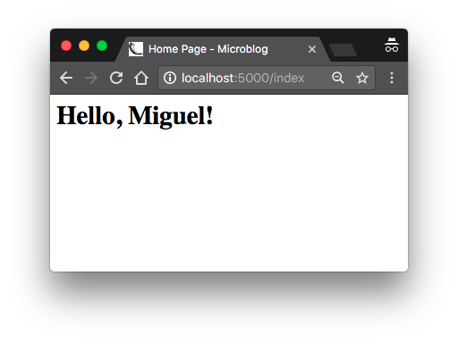
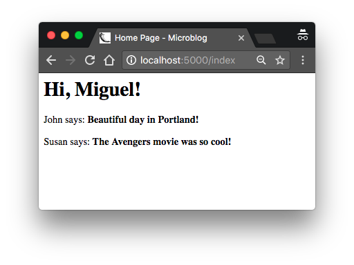
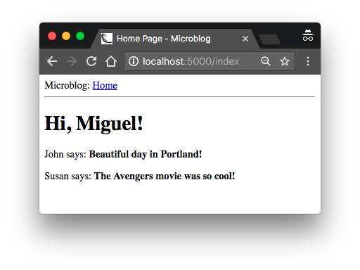

## Chapter 2: Templates

> Posted by on [Miguel Grinberg](https://blog.miguelgrinberg.com/author/Miguel%20Grinberg)

在 Flask Mega-Tutorial 系列的第二部分，我將討論如何使用模板。

### 目錄

- [Chapter 1: Hello, World!](/python/flask-mega-tutorial/chapter_1_hello_world)
- [Chapter 2: Templates](/python/flask-mega-tutorial/chapter_2_templates)
- [Chapter 3: Web Forms](/python/flask-mega-tutorial/chapter_3_web_forms)
- [Chapter 4: Database](/python/flask-mega-tutorial/chapter_4_database)
- [Chapter 5: User Logins](/python/flask-mega-tutorial/chapter_5_user_logins)
- [Chapter 6: Profile Page and Avatars](/python/flask-mega-tutorial/chapter_6_profile_page_and_avatars)
- [Chapter 7: Error Handling](/python/flask-mega-tutorial/chapter_7_error_handling)
- [Chapter 8: Followers](/python/flask-mega-tutorial/chapter_8_followers)
- [Chapter 9: Pagination](/python/flask-mega-tutorial/chapter_9_pagination)
- [Chapter 10: Email Support](/python/flask-mega-tutorial/chapter_10_email_support)
- [Chapter 11: Facelift](/python/flask-mega-tutorial/chapter_11_facelift)
- [Chapter 12: Dates and Times](/python/flask-mega-tutorial/chapter_12_dates_and_times)
- [Chapter 13: I18n and L10n](/python/flask-mega-tutorial/chapter_13_i18n_and_l10n)
- [Chapter 14: Ajax](/python/flask-mega-tutorial/chapter_14_ajax)
- [Chapter 15: A Better Application Structure](/python/flask-mega-tutorial/chapter_15_a_better_application_structure)
- [Chapter 16: Full-Text Search](/python/flask-mega-tutorial/chapter_16_full_text_search)
- [Chapter 17: Deployment on Linux](/python/flask-mega-tutorial/chapter_17_deployment_on_linux)
- [Chapter 19: Deployment on Docker Containers](/python/flask-mega-tutorial/chapter_19_deployment_on_docker_containers)
- [Chapter 20: Some JavaScript Magic](/python/flask-mega-tutorial/chapter_20_some_javascript_magic)
- [Chapter 21: User Notifications](/python/flask-mega-tutorial/chapter_21_user_notifications)
- [Chapter 22: Background Jobs](/python/flask-mega-tutorial/chapter_22_background_jobs)
- [Chapter 23: Application Programming Interfaces （APIs）](/python/flask-mega-tutorial/chapter_23_application_programming_interfaces_apis)

> 你正在閱讀 Flask Mega-Tutorial 的 2024 年版本。完整的課程也可以在 [Amazon](https://amzn.to/3ahVnPN) 以電子書和平裝書的形式訂購。感謝你的支持！
> 如果你正在尋找 2018 年版本的課程，你可以在[這裡](https://blog.miguelgrinberg.com/post/the-flask-mega-tutorial-part-i-hello-world-2018)找到它。

完成第一章後，你應該有一個簡單但功能性的網頁應用程式，檔案結構如下：

```
microblog\
  venv\
  app\
    __init__.py
    routes.py
  microblog.py
```

要執行應用程式，你需要在終端會話中設置 `FLASK_APP=microblog.py`（或更好的方法是，加入一個含有此變數的 .flaskenv 檔案），然後執行 `flask run`。這會啟動一個帶有應用程式的網頁伺服器，你可以透過在網頁瀏覽器的地址欄輸入 http://localhost:5000/ URL 來打開它。

在本章中，你將繼續在同一應用程式上工作，特別是，你將學習如何生成更精緻的網頁，這些網頁具有複雜的結構和許多動態組件。如果到目前為止，應用程式或開發流程有任何不清楚的地方，請在繼續之前再次複習第一章。

本章的 GitHub 連結是：[Browse](https://github.com/miguelgrinberg/microblog/tree/v0.2)、[Zip](https://github.com/miguelgrinberg/microblog/archive/v0.2.zip)、[Diff](https://github.com/miguelgrinberg/microblog/compare/v0.1...v0.2)。


### 什麼是模板？
我希望我的微型部落格應用程式的首頁有一個歡迎使用者的標題。目前，我將忽略應用程式尚未有使用者概念的事實，因為這將在之後出現。相反，我將使用一個模擬使用者，我將其實作為一個 Python 字典，如下所示：

```python
user = {'username': 'Miguel'}
```

建立模擬物件是一種有用的技術，允許你專注於應用程式的一部分，而不必擔心尚未存在的系統其他部分。我想設計我的應用程式的首頁，我不想因為我還沒有使用者系統而分心，所以我就編造了一個使用者物件，這樣我就可以繼續前進。

應用程式中的視圖函式返回一個簡單的字串。我現在想做的是將返回的字串擴展成一個完整的 HTML 頁面，也許像這樣：

```python
## app/routes.py: 從視圖函式返回完整的 HTML 頁面

from app import app

@app.route('/')
@app.route('/index')
def index():
    user = {'username': 'Miguel'}
    return '''
<html>
    <head>
        <title> 首頁 - 微型部落格 </title>
    </head>
    <body>
        <h1>Hello, '''+ user['username'] +'''!</h1>
    </body>
</html>'''
```

如果你不熟悉 HTML，我建議你閱讀維基百科上的 HTML 標記，以獲得一個簡短的介紹。

如上所示更新視圖函式，然後再次運行應用程式，看看它在瀏覽器中的外觀。



我希望你同意我，上面用來向瀏覽器傳遞 HTML 的解決方案並不好。想像當你加入來自使用者的部落格文章時，這個視圖函式中的程式碼將變得多麼複雜，而且這些文章會不斷變化。應用程式還會有更多與其他 URL 關聯的視圖函式，所以想像如果有一天我決定改變這個應用程式的布局，我必須更新每個視圖函式中的 HTML。顯然，這不是一個隨著應用程式增長而能夠擴展的選項。

如果你能將應用程式的邏輯與網頁的佈局或呈現分開，那麼事情將會更好組織，你不這麼認為嗎？你甚至可以聘請網頁設計師來建立一個很棒的網站，而你則用 Python 程式碼應用程式邏輯。

模板有助於實現呈現與業務邏輯之間的分離。在 Flask 中，模板是作為單獨的檔案編寫的，存儲在應用程式包內的 templates 資料夾中。確保你在 microblog 目錄中後，建立存儲模板的目錄：

```bash
(venv) $ mkdir app/templates
```

下面你可以看到你的第一個模板，其功能類似

於上面 index() 視圖函式返回的 HTML 頁面。在 app/templates/index.html 中寫下這個檔案：

```html
## app/templates/index.html: 主頁模板

<!doctype html>
<html>
    <head>
        <title>{{ title }} - 微型部落格 </title>
    </head>
    <body>
        <h1>Hello, {{ user.username }}!</h1>
    </body>
</html>
```

這是一個標準的簡短 HTML 頁面。這個頁面唯一有趣的是有一對用於動態內容的佔位符，包裹在 `{{...}}` 部分中。這些佔位符代表頁面的可變部分，只有在運行時才會知道。

現在頁面的呈現已經轉移到 HTML 模板上，視圖函式可以簡化為：

```python
## app/routes.py: 使用 render_template() 函式

from flask import render_template
from app import app

@app.route('/')
@app.route('/index')
def index():
    user = {'username': 'Miguel'}
    return render_template('index.html', title='首頁', user=user)
```

這看起來好多了，對吧？試試這個應用程式的新版本，看看模板如何工作。一旦你在瀏覽器中加載了頁面，你可能會想查看源 HTML 並將其與原始模板進行比較。

將模板轉換為完整 HTML 頁面的操作稱為渲染。為了渲染模板，我必須導入 Flask 框架附帶的一個函式，稱為 render_template()。這個函式接受一個模板檔案名稱和一個變數列表的模板參數，並返回相同的模板，但所有佔位符都被實際值替換。

render_template() 函式調用了與 Flask 框架捆綁的 Jinja 模板引擎。Jinja 會用 `render_template()` 調用中提供的參數替換 `{{ ... }}` 區塊。


### 條件語句
在 Jinja 模板引擎中，你已經看到了如何在渲染過程中用實際值替換佔位符，但這只是 Jinja 在模板檔案中支援的許多強大操作之一。例如，模板還支援在 `` 區塊內給出的控制語句。接下來的 index.html 模板版本增加了一個條件語句：

```html
## app/templates/index.html: 模板中的條件語句

<!doctype html>
<html>
    <head>
        
        <title>{{ title }} - 微型部落格 </title>
        
        <title> 歡迎來到微型部落格！</title>
        
    </head>
    <body>
        <h1>Hello, {{ user.username }}!</h1>
    </body>
</html>
```

現在這個模板更聰明了。如果視圖函式忘記傳遞一個值給 title 佔位符變數，那麼模板將提供一個預設的標題，而不是顯示一個空的標題。你可以通過在視圖函式的 `render_template()` 調用中移除 title 參數來嘗試這個條件如何工作。

### 迴圈 (Conditional Statements)

已登入的使用者可能希望在首頁上看到與他們有聯繫的使用者最近的貼文，所以我現在要做的是擴展應用程式以支援這一點。

再一次，我將依賴方便的模擬物件技巧來建立一些使用者和一些要展示的貼文：

```python
## app/routes.py: 視圖函式中的假貼文

from flask import render_template
from app import app

@app.route('/')
@app.route('/index')
def index():
    user = {'username': 'Miguel'}
    posts = [
        {
            'author': {'username': 'John'},
            'body': 'Portland 的天氣真好！'
        },
        {
            'author': {'username': 'Susan'},
            'body': '復仇者聯盟電影真的很酷！'
        }
    ]
    return render_template('index.html', title='首頁', user=user, posts=posts)
```

為了表示使用者貼文，我使用了一個列表，其中每個元素都是一個有著作者和內容字段的字典。當我真正實現使用者和部落格貼文時，我將嘗試盡可能保留這些字段名稱，這樣我現在使用這些假物件來設計和測試首頁模板的所有工作，在我引入真正的使用者和貼文時仍然有效。

在模板方面，我需要解決一個新問題。貼文列表可以有任何數量的元素，這取決於視圖函式決定要在頁面上呈現多少貼文。模板不能對有多少貼文做任何假設，所以它需要準備好以一種通用的方式渲染視圖傳入的任何數量的貼文。

對於這種類型的問題，Jinja 提供了一個 for 控制結構：

```html
## app/templates/index.html: 模板中的 for 迴圈

<!doctype html>
<html>
    <head>
        
        <title>{{ title }} - 微型部落格 </title>
        
        <title> 歡迎來到微型部落格 </title>
        
    </head>
    <body>
        <h1> 嗨, {{ user.username }}!</h1>
        
        <div><p>{{ post.author.username }} 說： <b>{{ post.body }}</b></p></div>
        
    </body>
</html>
```

簡單吧？試試這個應用程式的新版本，並確保在貼文列表中加入更多內容以查看模板如何適應並始終呈現視圖函式傳送的所有貼文。



### 模板繼承
如今，大多數網頁應用程式在頁面頂部都有一個導航欄，其中包含一些經常使用的連結，例如編輯個人資料、登入、登出等的連結。我可以很容易地通過加入更多 HTML 向 index.html 模板加入一個導航欄，但隨著應用程式的增長，我將需要在其他頁面中使用這個相同的導航欄。我真的不想在許多 HTML 模板中維護多個導航欄的副本，如果可能的話，最好不要重複自己。

Jinja 有一個模板繼承功能，專門解決這個問題。本質上，你可以做的是將所有模板共有的頁面佈局部分移動到一個基礎模板中，所有其他模板都從這個基礎模板衍生。

所以我現在

要做的是定一個名為 base.html 的基礎模板，其中包括一個簡單的導航欄和我之前實現的標題邏輯。你需要在 app/templates/base.html 檔案中編寫以下模板：

```html
## app/templates/base.html: 包含導航欄的基礎模板

<!doctype html>
<html>
    <head>
      
      <title>{{ title }} - 微型部落格 </title>
      
      <title> 歡迎來到微型部落格 </title>
      
    </head>
    <body>
        <div> 微型部落格： <a href="/index"> 首頁 </a></div>
        <hr>
        
    </body>
</html>
```

在這個模板中，我使用了 block 控制語句來定義衍生模板可以插入自己的地方。區塊被賦予了一個獨特的名稱，衍生模板可以在提供其內容時引用這個名稱。

有了基礎模板後，我現在可以通過讓 index.html 繼承 base.html 來簡化它：

```html
## app/templates/index.html: 從基礎模板繼承




    <h1> 嗨, {{ user.username }}!</h1>
    
    <div><p>{{ post.author.username }} 說： <b>{{ post.body }}</b></p></div>
    

```

由於 base.html 模板現在將負責一般頁面結構，我已從 index.html 中刪除了所有這些元素，只留下了內容部分。extends 語句建立了兩個模板之間的繼承連結，以便 Jinja 知道當要求它渲染 index.html 時，需要將它嵌入 base.html 中。兩個模板都有匹配名為 content 的 block 語句，這是 Jinja 知道如何將兩個模板組合成一個的方式。現在如果我需要為應用程式建立額外的頁面，我可以將它們作為從相同的 base.html 模板衍生的模板來建立，這就是我如何讓應用程式的所有頁面共享相同的外觀和感覺而不重複。



