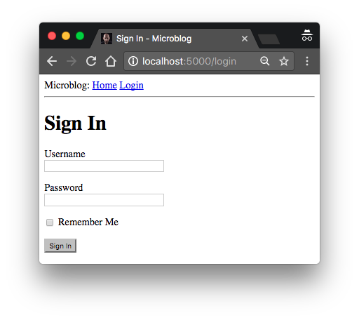
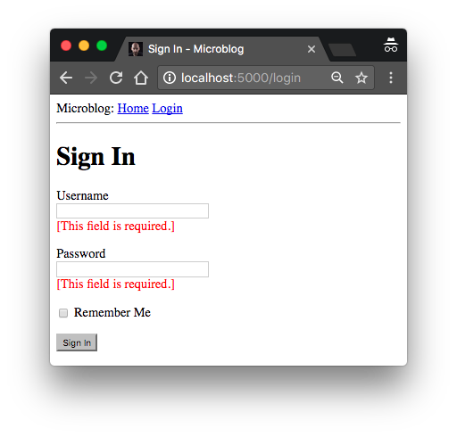

## Chapter 3 Web Forms

Posted by on [Miguel Grinberg](https://blog.miguelgrinberg.com/author/Miguel%20Grinberg)

### 目錄

- [Chapter 1: Hello, World!](/python/flask-mega-tutorial/chapter_1_hello_world)
- [Chapter 2: Templates](/python/flask-mega-tutorial/chapter_2_templates)
- [Chapter 3: Web Forms](/python/flask-mega-tutorial/chapter_3_web_forms)
- [Chapter 4: Database](/python/flask-mega-tutorial/chapter_4_database)
- [Chapter 5: User Logins](/python/flask-mega-tutorial/chapter_5_user_logins)
- [Chapter 6: Profile Page and Avatars](/python/flask-mega-tutorial/chapter_6_profile_page_and_avatars)
- [Chapter 7: Error Handling](/python/flask-mega-tutorial/chapter_7_error_handling)
- [Chapter 8: Followers](/python/flask-mega-tutorial/chapter_8_followers)
- [Chapter 9: Pagination](/python/flask-mega-tutorial/chapter_9_pagination)
- [Chapter 10: Email Support](/python/flask-mega-tutorial/chapter_10_email_support)
- [Chapter 11: Facelift](/python/flask-mega-tutorial/chapter_11_facelift)
- [Chapter 12: Dates and Times](/python/flask-mega-tutorial/chapter_12_dates_and_times)
- [Chapter 13: I18n and L10n](/python/flask-mega-tutorial/chapter_13_i18n_and_l10n)
- [Chapter 14: Ajax](/python/flask-mega-tutorial/chapter_14_ajax)
- [Chapter 15: A Better Application Structure](/python/flask-mega-tutorial/chapter_15_a_better_application_structure)
- [Chapter 16: Full-Text Search](/python/flask-mega-tutorial/chapter_16_full_text_search)
- [Chapter 17: Deployment on Linux](/python/flask-mega-tutorial/chapter_17_deployment_on_linux)
- [Chapter 19: Deployment on Docker Containers](/python/flask-mega-tutorial/chapter_19_deployment_on_docker_containers)
- [Chapter 20: Some JavaScript Magic](/python/flask-mega-tutorial/chapter_20_some_javascript_magic)
- [Chapter 21: User Notifications](/python/flask-mega-tutorial/chapter_21_user_notifications)
- [Chapter 22: Background Jobs](/python/flask-mega-tutorial/chapter_22_background_jobs)
- [Chapter 23: Application Programming Interfaces （APIs）](/python/flask-mega-tutorial/chapter_23_application_programming_interfaces_apis)

在第 2 章中，我為應用程式的首頁建立了一個簡單的模板，並使用假物件作為尚未擁有的東西（如使用者和部落格貼文）的佔位符。在這一章中，我將處理這個應用程式中仍然存在的許多問題之一，特別是如何通過網頁表單接收使用者輸入。

> 你正在閱讀 Flask Mega-Tutorial 的 2024 年版本。完整的課程也可以在 [Amazon](https://amzn.to/3ahVnPN) 以電子書和平裝書的形式訂購。感謝你的支持！
> 如果你正在尋找 2018 年版本的課程，你可以在[這裡](https://blog.miguelgrinberg.com/post/the-flask-mega-tutorial-part-i-hello-world-2018)找到它。

網頁表單是任何網頁應用程式中最基本的構建塊之一。我將使用表單來允許使用者提交部落格貼文，以及用於登入應用程式。

在你繼續這一章之前，確保你已經安裝了上一章中的微型部落格應用程式，並且可以毫無錯誤地運行它。

本章的 GitHub 連結是：[Browse](https://github.com/miguelgrinberg/microblog/tree/v0.3) [Zip](https://github.com/miguelgrinberg/microblog/archive/v0.3.zip) [Diff](https://github.com/miguelgrinberg/microblog/compare/v0.2...v0.3)


### Flask-WTF 簡介
要處理這個應用程式中的網頁表單，我將使用 Flask-WTF 擴充功能，這是 WTForms 套件的一個薄包裝層，可以很好地將它與 Flask 整合。這是我向你介紹的第一個 Flask 擴充功能，但它不會是最後一個。擴充功能是 Flask 生態系統中非常重要的一部分，因為它們為 Flask 故意不提出意見的問題提供解決方案。

Flask 擴充功能是用 pip 安裝的普通 Python 套件。你可以繼續在你的虛擬環境中安裝 Flask-WTF：

```bash
(venv) $ pip install flask-wtf
```

到目前為止，應用程式非常簡單，因此我不需要擔心其配置。但對於除了最簡單的應用程式以外，你會發現 Flask（以及你使用的可能的 Flask 擴充功能）提供了在如何做事情上的一些自由度，你需要做出一些決定，這些決定以配置變數列表的形式傳遞給框架。

有幾種格式可以讓應用程式指定配置選項。最基本的解決方案是將你的變數定義為 app.config 中的鍵，它使用字典風格來處理變數。例如，你可以這樣做：

```python
app = Flask(__name__)
app.config['SECRET_KEY'] = 'you-will-never-guess'
## ... 根據需要加入更多變數
```

雖然上述語法足以為 Flask 建立配置選項，但我喜歡強調關注點分離的原則，所以我不會把我的配置放在建立應用程式的同一個地方，而是使用一個稍微複雜一些的結構，讓我可以將我的配置保存在一個單獨的檔案中。

我非常喜歡的一個解決方案，因為它非常可擴展，是使用 Python 類別來存儲配置變數。為了保持事物的整齊有序，我將在一個單獨的 Python 模組中建立配置類別。下面你可以看到這個應用程式的新配置類別，存儲在頂層目錄中的 config.py 模組中。

```python
## config.py: 密鑰配置

import os

class Config:
    SECRET_KEY = os.environ.get('SECRET_KEY') or 'you-will-never-guess'
```

很簡單，對吧？配置設置被定義為 Config 類別內的類別變數。隨著應用程式需要更多配置項目，它們可以被加入到這個類別中，稍後如果我發現我需要有不止一套配置，我可以建立它的子類別。但現在不用擔心這個。

我加入的唯一配置項目 SECRET_KEY 在大多數 Flask 應用程式中都是重要的部分。Flask 和一些它的擴充功能使用密鑰的值作為加密鑰匙，用於生成簽名或令牌。Flask-WTF 擴充功能使用它來保護網頁表單免受一種名為跨站請求偽造（CSRF，發音為 "seasurf"）的惡意攻擊。正如其名所暗示的，密鑰應該保持秘密，因為用它生成的令牌和簽名的強度取決於應用程式的信任維護者之外沒有人知道它。

密鑰的值設置為一個有

兩個條款的表達式，由 or 運算符連接。第一個條款尋找一個環境變數的值，也叫做 SECRET_KEY。第二個條款，只是一個硬編碼的字串。這是一個你會經常看到我重複用於配置變數的模式。這個想法是，優先使用來自環境變數的值，但如果環境沒有定義該變數，則使用硬編碼的字串作為默認值。當你正在開發這個應用程式時，安全要求較低，所以你可以忽略這個設置，讓硬編碼的字串被使用。但當這個應用程式部署在生產伺服器上時，我將在環境中設置一個獨特且難以猜測的值，以便伺服器擁有一個沒有其他人知道的安全密鑰。

現在我有了一個配置檔案，我需要告訴 Flask 讀取它並應用它。這可以在 Flask 應用程式實例建立後使用 app.config.from_object() 方法完成：

```python
## app/__init__.py: Flask 配置

from flask import Flask
from config import Config

app = Flask(__name__)
app.config.from_object(Config)

from app import routes
```

我導入 Config 類別的方式起初可能看起來令人困惑，但如果你看看如何從 flask 套件（小寫 "f"）導入 Flask 類別（大寫 "F"），你會注意到我對配置做的是同樣的事情。小寫的 "config" 是 Python 模組 config.py 的名稱，顯然大寫的 "C" 是實際的類別。

正如我上面提到的，配置項目可以用字典語法從 app.config 訪問。這裡你可以看到一個快速的 Python 解釋器會話，我檢查了密鑰的值：

```python
>>> from microblog import app
>>> app.config['SECRET_KEY']
'you-will-never-guess'
```

### 使用者登入表單
Flask-WTF 擴充功能使用 Python 類別來表示網頁表單。表單類別只是將表單的字段定義為類別變數。

再次考慮到關注點分離，我將使用一個新的 app/forms.py 模組來存儲我的網頁表單類別。首先，讓我們定一個使用者登入表單，該表單要求使用者輸入使用者名和密碼。表單還將包括一個「記住我」複選框和一個提交按鈕：

```python
## app/forms.py: 登入表單

from flask_wtf import FlaskForm
from wtforms import StringField, PasswordField, BooleanField, SubmitField
from wtforms.validators import DataRequired

class LoginForm(FlaskForm):
    username = StringField('使用者名', validators=[DataRequired()])
    password = PasswordField('密碼', validators=[DataRequired()])
    remember_me = BooleanField('記住我')
    submit = SubmitField('登入')
```

大多數 Flask 擴充功能使用 flask_<name> 的命名慣例作為其頂層匯入符號。在這種情況下，Flask-WTF 的所有符號都位於 flask_wtf 下。這是從 app/forms.py 頂部導入 FlaskForm 基類的地方。

代表我用於此表單的字段類型的四個類別直接從 WTForms 套件導入，因為 Flask-WTF 擴充功能沒有提供自定義版本。對於每個字段，都在 LoginForm 類中建立了一個作為類別變數的物件。每個字段都給出了作為第一個參數的描述或標籤。

你在某些字段中看到的可選 validators 參數用於將驗證行為附加到字段。DataRequired 驗證器僅檢查字段是否未空白提交。還有許多更多的驗證器可用，其中一些將用於其他表單。


### 表單模板
下一步是將表單加入到 HTML 模板中，以便在網頁上呈現。好消息是，LoginForm 類別中定義的字段知道如何將自己渲染為 HTML，因此這項任務相當簡單。以下是我將存儲在 app/templates/login.html 檔案中的登入模板：

```html
## app/templates/login.html: 登入表單模板




    <h1> 登入 </h1>
    <form action=""method="post" novalidate>
        {{form.hidden_tag() }}
        <p>
            {{form.username.label}}<br>
            {{form.username(size=32) }}
        </p>
        <p>
            {{form.password.label}}<br>
            {{form.password(size=32) }}
        </p>
        <p>{{ form.remember_me() }} {{ form.remember_me.label }}</p>
        <p>{{ form.submit() }}</p>
    </form>

```

對於這個模板，我重用了第 2 章中顯示的 base.html 模板，通過 extends 模板繼承語句。實際上，我將對所有模板這樣做，以確保包含頂部導航欄的一致佈局貫穿應用程式的所有頁面。

這個模板期望給予一個從 LoginForm 類實例化的 form 物件作為參數，你可以看到引用為 form。這個參數將由我還沒有編寫的登入視圖函式發送。

HTML 的 `<form>` 元素用作網頁表單的容器。表單的 action 屬性用於告訴瀏覽器在提交使用者在表單中輸入的訊息時應該使用的 URL。當 action 設置為空字串時，表單會提交到當前地址欄中的 URL，即在頁面上呈現表單的 URL。method 屬性指定提交表單到伺服器時應使用的 HTTP 請求方法。預設是通過 GET 請求發送，但在幾乎所有情況下，使用 POST 請求會提供更好的使用者體驗，因為這種類型的請求可以在請求的正文中提交表單數據，而 GET 請求則將表單字段加入到 URL 中，使瀏覽器地址欄變得雜亂。novalidate 屬性用於告訴網頁瀏覽器不對此表單中的字段進行驗證，這實際上將這項任務留給在伺服器中運行的 Flask 應用程式。使用 novalidate 是完全可選的，但對於這個第一個表單來說，設置它很重要，因為這將允許你稍後在本章中測試伺服器端驗證。

`form.hidden_tag()` 模板參數生成一個隱藏字段，包含用於防止 CSRF 攻擊的令牌。為了保護表單，你所需要做的就是包含這個隱藏字段並在 Flask 配置中定義 SECRET_KEY 變數。如果你處理好這兩件事，Flask-WTF 會為你完成其餘工作。

如果你以前編寫過 HTML 網頁表單，你可能會發現這個模板中沒有 HTML 字段很奇怪。這是因為表單物件中的字段知道如何將自己渲染為 HTML。我所需要做的就是在我想要字段標籤的地方包含 `{{form.<field_name>.label }}`，並在我想要字段的地方包含 `{{ form.<field_name>() }}`。對於需要額外 HTML 屬性的字段，這些可以作為參數傳遞。這個模板中的 username 和 password 字段將大小作為參數加入到 `<input>` HTML 元素作為屬性。這就是你也可以將 CSS 類別或 ID 附加到表單字段的方式。

### 表單視圖
在你能在瀏覽器中看到這個表單之前的最後一步是在應用程式中編寫一個新的視圖函式來渲染上一節中的模板。

那麼，讓我們編寫一個映射到 /login URL 的新視圖函式，建立一個表單，並將其傳遞給模板進行渲染。這個視圖函式也可以與前一個一起放在 app/routes.py 模組中：

```python
## app/routes.py: 登入視圖函式

from flask import render_template
from app import app
from app.forms import LoginForm

## ...

@app.route('/login')
def login():
    form = LoginForm()
    return render_template('login.html', title='登入', form=form)
```

這裡我做的是從 forms.py 中導入 LoginForm 類，實例化一個物件，並將其發送到模板中。


### 表單模板
這裡所做的是從 forms.py 導入 LoginForm 類別，實例化一個物件並將其傳遞給模板。`form=form` 語法看起來可能有些奇怪，但它僅僅是將在上面一行建立的 form 物件（顯示在右側）傳遞給模板，模板中的名稱為 form（顯示在左側）。這就是所有需要做的，以便渲染表單字段。

為了方便訪問登入表單，基礎模板可以擴展 base.html 中的 `<div>` 元素，以在導航欄中包含一個連結：

```html
## app/templates/base.html: 導航欄中的登入連結

<div>
    微部落格：
    <a href="/index"> 首頁 </a>
    <a href="/login"> 登入 </a>
</div>
```

此時，你可以運行應用程式並在網頁瀏覽器中看到表單。應用程式運行時，在瀏覽器的地址欄中輸入 http://localhost:5000/，然後點擊頂部導航欄中的「登入」連結以查看新的登入表單。很酷，對吧？



### 接收表單數據

如果你嘗試按下提交按鈕，瀏覽器將顯示「方法不允許」的錯誤。這是因為上一節中的登入視圖函式到目前為止只完成了一半工作。它可以在網頁上顯示表單，但尚未具備處理使用者提交的數據的邏輯。這是 Flask-WTF 使工作變得非常簡單的另一個領域。這裡是更新後的視圖函式，接受並驗證使用者提交的數據：

```python
## app/routes.py: 接收登入憑證

from flask import render_template, flash, redirect

@app.route('/login', methods=['GET', 'POST'])
def login():
    form = LoginForm()
    if form.validate_on_submit():
        flash('使用者 {} 的登入請求，記住我 ={}'.format(
            form.username.data, form.remember_me.data))
        return redirect('/index')
    return render_template('login.html', title='登入', form=form)
```

這個版本中的第一個新內容是路由裝飾器中的 methods 參數。這告訴 Flask 此視圖函式接受 GET 和 POST 請求，覆蓋了默認僅接受 GET 請求的設置。HTTP 協議規定 GET 請求是那些向客戶端（在這種情況下是網頁瀏覽器）返回訊息的請求。到目前為止，應用程式中的所有請求都是這種類型的。POST 請求通常在瀏覽器向伺服器提交表單數據時使用（實際上也可以使用 GET 請求來執行此操作，但這不是推薦的做法）。瀏覽器之前顯示的「方法不允許」錯誤是因為瀏覽器試圖發送 POST 請求，而應用程式未配置為接受它。通過提供 methods 參數，你正在告訴 Flask 應該接受哪些請求方法。

`form.validate_on_submit()` 方法完成所有表單處理工作。當瀏覽器發送 GET 請求以接收帶有表單的網頁時，這個方法將返回 False，所以在這種情況下，函式將跳過 if 語句，直接渲染函式最後一行的模板。

當瀏覽器發送 POST 請求作為使用者按下提交按鈕的結果時，`form.validate_on_submit()` 將收集所有數據，運行附加到字段上的所有驗證器，如果一切都沒問題，它將返回 True，表示數據有效並可以由應用程式處理。但如果至少有一個字段驗證失敗，則函式將返回 False，這將導致表單被重新渲染回使用者，就像 GET 請求的情況一樣。稍後我將在驗證失敗時加入錯誤消息。

當 `form.validate_on_submit()` 返回 True 時，登入視圖函式調用了兩個從 Flask 導入的新函式。`flash()` 函式是向使用者顯示消息的一種有用方式。許多應用程式使用這種技術來讓使用者知道某些操作是否成功。在這種情況下，我將使用這種機制作為臨時解決方案，因為我還沒有所有必要的基礎設施來真正登錄使用者。目前我所能做的最好的事情就是顯示一條確

認應用程式已接收到憑證的消息。

登入視圖函式中使用的第二個新函式是 `redirect()`。這個函式指示客戶端網頁瀏覽器自動導航到作為參數給出的不同頁面。這個視圖函式使用它將使用者重定向到應用程式的首頁。

當你調用 `flash()` 函式時，Flask 會存儲消息，但閃現的消息不會神奇地出現在網頁中。應用程式的模板需要以適合網站佈局的方式渲染這些閃現消息。我將把這些消息加入到基礎模板中，以便所有模板繼承此功能。這是更新後的基礎模板：

```html
## app/templates/base.html: 基礎模板中的閃現消息

<html>
    <head>
        
        <title>{{ title }} - 微部落格 </title>
        
        <title> 微部落格 </title>
        
    </head>
    <body>
        <div>
            微部落格：
            <a href="/index"> 首頁 </a>
            <a href="/login"> 登入 </a>
        </div>
        <hr>
        
        
        <ul>
            
            <li>{{ message }}</li>
            
        </ul>
        
        
        
    </body>
</html>
```

這裡我使用 with 構造將調用 `get_flashed_messages()` 的結果分配給模板上下文中的 messages 變數。`get_flashed_messages()` 函式來自 Flask，返回之前使用 `flash()` 註冊的所有消息的列表。接下來的條件語句檢查 messages 是否有內容，如果有，則渲染一個 `<ul>` 元素，每個消息作為 `<li>` 列表項。這種渲染方式對於狀態消息來說看起來並不太好，但稍後將討論網頁應用程式的樣式。

這些閃現消息的一個有趣特性是，一旦它們通過 `get_flashed_messages` 函式被請求一次，它們就會從消息列表中被移除，因此在調用 `flash()` 函式後它們只會出現一次。

這是再次嘗試應用程式並測試表單如何工作的絕佳時機。請確保嘗試提交表單時使用者名或密碼字段為空，以查看 DataRequired 驗證器如何阻止提交過程。

### 改進字段驗證
附加到表單字段的驗證器可防止接受無效數據到應用程式。應用程式處理無效表單輸入的方式是重新顯示表單，讓使用者進行必要的更正。

如果你嘗試提交無效數據，我相信你會注意到，儘管驗證機制工作得很好，但使用者並沒有收到有關表單出錯的任何指示，使用者只是簡單地再次收到表單。下一個任務是通過在每個驗證失敗的字段旁加入有意義的錯誤消息來改善使用者體驗。

事實上，表單驗證器已經生成了這些描述性錯誤消息，所以只缺少模板中的一些額外邏輯來渲染它們。

這是帶有使用者名和密碼字段中的驗證錯誤消息的登入模板：

```html
## app/templates/login.html: 登入表單模板中的驗證錯誤




    <h1> 登入 </h1>
    <form action=""method="post" novalidate>
        {{form.hidden_tag() }}
        <p>
            {{form.username.label}}<br>
            {{form.username(size=32) }}<br>
            
            <span style="color: red;">[{{ error }}]</span>
            
        </p>
        <p>
            {{form.password.label}}<br>
            {{form.password(size=32) }}<br>
            
            <span style="color: red;">[{{ error }}]</span>
            
        </p>
        <p>{{ form.remember_me() }} {{ form.remember_me.label }}</p>
        <p>{{ form.submit() }}</p>
    </form>

```

我唯一做的改變是在使用者名稱和密碼欄位後面新增了迴圈，這些迴圈會以紅色顯示驗證器加入的錯誤訊息。一般來說，任何附加了驗證器的欄位都會在表單.<欄位名>. 錯誤下新增由驗證產生的錯誤訊息。這會是一個列表，因為欄位可能附加了多個驗證器，並且可能有不止一個提供顯示給使用者的錯誤訊息。

如果你嘗試提交一個空的使用者名稱或密碼，你現在會得到一個漂亮的紅色錯誤訊息。



登入表單現在已經相當完整了，但在結束這章之前，我想討論在範本和重導中包含連結的正確方式。到目前為止，你已經看到幾個定義連結的實例。例如，這是目前基礎範本中的導航列：

```html
<div>
    微博客：
    <a href="/index"> 首頁 </a>
    <a href="/login"> 登入 </a>
</div>
```

登入檢視函式也定義了一個傳遞給 redirect() 函式的連結：

```python
@app.route('/login', methods=['GET', 'POST'])
def login():
    form = LoginForm()
    if form.validate_on_submit():
        ## ...
        return redirect('/index')
    ## ...
```

直接在範本和源文件中寫入連結的一個問題是，如果有一天你決定重新組織你的連結，那麼你將不得不在整個應用程式中搜尋和替換這些連結。

為了更好地控制這些連結，Flask 提供了一個名為 url_for() 的函式，它使用其內部的 URL 到檢視函式的映射來產生 URL。例如，表達式 url_for('login') 返回 /login，而 url_for('index') 返回 '/index。url_for() 的參數是端點名稱，即檢視函式的名稱。

你可能會問，為什麼使用函式名稱而不是 URL 更好。事實是，URL 更有可能改變，而檢視函式名稱是完全內部的。一個次要原因是，如你稍後將學習到的，有些 URL 中有動態組件，所以手動產生這些 URL 需要連接多個元素，這既繁瑣又容易出錯。url_for() 函式還能以更優雅的語法產生這些複雜的 URL。

所以從現在起，每當我需要產生一個應用程式 URL 時，我將使用 url_for()。基礎範本中的導航列則變成：

app/templates/base.html: 使用 url_for() 函式產生連結

```html
<div>
    微博客：
    <a href="{{ url_for('index') }}"> 首頁 </a>
    <a href="{{ url_for('login') }}"> 登入 </a>
</div>
```

這裡是更新後的 login() 檢視函式：

app/routes.py: 使用 url_for() 函式產生連結

```python
from flask import render_template, flash, redirect, url_for

## ...

@app.route('/login', methods=['GET', 'POST'])
def login():
    form = LoginForm()
    if form.validate_on_submit():
        ## ...
        return redirect(url_for('index'))
    ## ...
```
