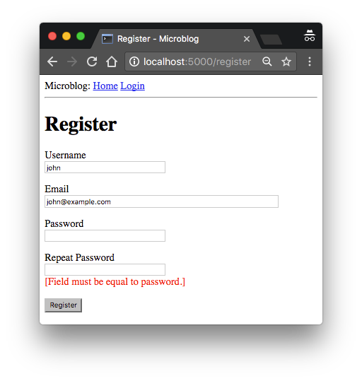

## Chapter 5: User Logins

> Posted by on [Miguel Grinberg](https://blog.miguelgrinberg.com/author/Miguel%20Grinberg)

這是 Flask Mega-Tutorial 系列的第五部分，我將告訴你如何建立一個使用者登入子系統。

### 目錄

- [Chapter 1: Hello, World!](/python/flask-mega-tutorial/chapter_1_hello_world)
- [Chapter 2: Templates](/python/flask-mega-tutorial/chapter_2_templates)
- [Chapter 3: Web Forms](/python/flask-mega-tutorial/chapter_3_web_forms)
- [Chapter 4: Database](/python/flask-mega-tutorial/chapter_4_database)
- [Chapter 5: User Logins](/python/flask-mega-tutorial/chapter_5_user_logins)
- [Chapter 6: Profile Page and Avatars](/python/flask-mega-tutorial/chapter_6_profile_page_and_avatars)
- [Chapter 7: Error Handling](/python/flask-mega-tutorial/chapter_7_error_handling)
- [Chapter 8: Followers](/python/flask-mega-tutorial/chapter_8_followers)
- [Chapter 9: Pagination](/python/flask-mega-tutorial/chapter_9_pagination)
- [Chapter 10: Email Support](/python/flask-mega-tutorial/chapter_10_email_support)
- [Chapter 11: Facelift](/python/flask-mega-tutorial/chapter_11_facelift)
- [Chapter 12: Dates and Times](/python/flask-mega-tutorial/chapter_12_dates_and_times)
- [Chapter 13: I18n and L10n](/python/flask-mega-tutorial/chapter_13_i18n_and_l10n)
- [Chapter 14: Ajax](/python/flask-mega-tutorial/chapter_14_ajax)
- [Chapter 15: A Better Application Structure](/python/flask-mega-tutorial/chapter_15_a_better_application_structure)
- [Chapter 16: Full-Text Search](/python/flask-mega-tutorial/chapter_16_full_text_search)
- [Chapter 17: Deployment on Linux](/python/flask-mega-tutorial/chapter_17_deployment_on_linux)
- [Chapter 19: Deployment on Docker Containers](/python/flask-mega-tutorial/chapter_19_deployment_on_docker_containers)
- [Chapter 20: Some JavaScript Magic](/python/flask-mega-tutorial/chapter_20_some_javascript_magic)
- [Chapter 21: User Notifications](/python/flask-mega-tutorial/chapter_21_user_notifications)
- [Chapter 22: Background Jobs](/python/flask-mega-tutorial/chapter_22_background_jobs)
- [Chapter 23: Application Programming Interfaces （APIs）](/python/flask-mega-tutorial/chapter_23_application_programming_interfaces_apis)

> 你正在閱讀 Flask Mega-Tutorial 的 2024 年版本。完整的課程也可以在 [Amazon](https://amzn.to/3ahVnPN) 以電子書和平裝書的形式訂購。感謝你的支持！
> 如果你正在尋找 2018 年版本的課程，你可以在[這裡](https://blog.miguelgrinberg.com/post/the-flask-mega-tutorial-part-i-hello-world-2018)找到它。

第三章中，你學會了如何建立使用者登入表單，第四章中，你學會了如何與資料庫互動。本章將教你如何結合這兩章的主題，建立一個簡單的使用者登入系統。

本章的 GitHub 連結為：[Browse](https://github.com/miguelgrinberg/microblog/tree/v0.5) [Zip](https://github.com/miguelgrinberg/microblog/archive/v0.5.zip) [Diff](https://github.com/miguelgrinberg/microblog/compare/v0.4...v0.5)

### 密碼雜湊 (Password Hashing)

在第四章中，使用者模型被賦予了一個 password_hash 欄位，目前尚未使用。這個欄位的目的是保存使用者密碼的雜湊值，該值將用於在登錄過程中驗證使用者輸入的密碼。密碼雜湊是一個複雜的主題，應該交給安全專家處理，但有一些易於使用的庫可以實現所有邏輯，並可以簡單地從應用程式中調用。

其中一個實現密碼雜湊的套件是 Werkzeug，你可能在安裝 Flask 時看到它作為其核心依賴項之一的參考。由於它是一個依賴項，Werkzeug 已經安裝在你的虛擬環境中。以下的 Python shell 會話演示了如何使用這個套件來雜湊密碼：

```python
>>> from werkzeug.security import generate_password_hash
>>> hash = generate_password_hash('foobar')
>>> hash
'scrypt:32768:8:1$DdbIPADqKg2nniws$4ab051ebb6767a...'
```

在這個範例中，密碼 foobar 通過一系列加密操作轉換為一個長的編碼字符串，這些操作沒有已知的反向操作，這意味著獲得雜湊密碼的人將無法使用它來恢復原始密碼。作為額外的措施，如果你多次對相同的密碼進行雜湊，你將獲得不同的結果，因為所有雜湊密碼都獲得不同的加密鹽，所以這使得無法通過查看它們的雜湊來識別兩個使用者是否具有相同的密碼。

驗證過程使用 Werkzeug 的第二個函式完成，如下所示：

```python
>>> from werkzeug.security import check_password_hash
>>> check_password_hash(hash, 'foobar')
True
>>> check_password_hash(hash, 'barfoo')
False
```

驗證函式接受先前生成的密碼雜湊以及使用者在登錄時輸入的密碼。如果使用者提供的密碼與雜湊匹配，函式將返回 True，否則返回 False。

整個密碼雜湊邏輯可以實現為使用者模型中的兩個新方法：

```python
app/models.py: 密碼雜湊和驗證

from werkzeug.security import generate_password_hash, check_password_hash

## ...

class User(db.Model):
    ## ...

    def set_password(self, password):
        self.password_hash = generate_password_hash(password)

    def check_password(self, password):
        return check_password_hash(self.password_hash, password)
```

有了這兩個方法，使用者對象現在能夠執行安全的密碼驗證，無需存儲原始密碼。以下是這些新方法的範例用法：

```python
>>> u = User(username='susan', email='susan@example.com')
>>> u.set_password('mypassword')
>>> u.check_password('anotherpassword')
False
>>> u.check_password('mypassword')
True
```

### 介紹 Flask-Login
在這一章中，我將向你介紹一個非常受歡迎的 Flask 擴充功能：Flask-Login。這個擴充功能管理著使用者的登入狀態，使得使用者可以登入應用程式並在不同頁面間導覽，同時應用程式會「記住」使用者的登入狀態。它還提供了「記住我」的功能，允許使用者即使關閉瀏覽器窗口後也能保持登入狀態。為了準備好這一章的內容，你可以先在你的虛擬環境中安裝 Flask-Login：

```
(venv) $ pip install flask-login
```

就像其他擴充功能一樣，Flask-Login 需要在 app/__init__.py 中的應用程式實例建立後立即初始化。以下是這個擴充功能的初始化方式：

app/__init__.py：Flask-Login 初始化

```python
## ...
from flask_login import LoginManager

app = Flask(__name__)
## ...
login = LoginManager(app)

## ...
```

### 為 Flask-Login 準備使用者模型

Flask-Login 擴充功能與應用程式的使用者模型協同工作，並期望在其中實現特定的屬性和方法。這種方式很好，因為只要這些必需的項目被加入到模型中，Flask-Login 就不會有其他要求，例如，它可以與基於任何資料庫系統的使用者模型合作。

以下列出了四個必需的項目：

- is_authenticated：一個屬性，如果使用者擁有有效的憑證則為 True，否則為 False。
- is_active：一個屬性，如果使用者的帳戶是活躍的則為 True，否則為 False。
- is_anonymous：一個屬性，對於普通使用者為 False，只對特殊的匿名使用者為 True。
- get_id()：一個方法，返回使用者的唯一標識符，為一個字符串。

這四項我可以輕易實現，但由於實現相當通用，Flask-Login 提供了一個混入類（mixin class）叫 UserMixin，其中包含了適用於大多數使用者模型類的安全實現。以下是將混入類加入到模型的方式：

app/models.py：Flask-Login 使用者混入類

```python
## ...
from flask_login import UserMixin

class User(UserMixin, db.Model):
    ## ...
```


### 使用者加載函式
Flask-Login 透過在 Flask 的使用者會話中儲存其唯一標識符來追蹤已登入的使用者，這是指派給連接到應用程式的每位使用者的儲存空間。每當已登入的使用者導航到新頁面時，Flask-Login 會從會話中檢索使用者的 ID，然後將該使用者加載到內存中。

由於 Flask-Login 對資料庫一無所知，它需要應用程式的協助來加載使用者。出於這個原因，擴充功能期望應用程式將配置一個使用者加載函式，可以在給定 ID 的情況下呼叫來加載使用者。這個函式可以在 app/models.py 模組中加入：

app/models.py: Flask-Login 使用者加載函式

```python
from app import login
## ...

@login.user_loader
def load_user(id):
    return db.session.get(User, int(id))
```

使用者加載函式使用 @login.user_loader 裝飾器註冊到 Flask-Login。Flask-Login 傳遞給函式的 id 將是一個字串，所以使用數字 ID 的資料庫需要將字串轉換為整數，正如你在上面所見。


### 登入使用者

讓我們重新審視登入視圖函式，您可能記得，它實作了一個假的登入，只發出了一個 flash() 訊息。現在應用程式可以存取使用者資料庫並知道如何產生及驗證密碼雜湊，這個視圖函式可以完成了。

app/routes.py：登入視圖函式邏輯

```python
## ...
from flask_login import current_user, login_user
import sqlalchemy as sa
from app import db
from app.models import User

## ...

@app.route('/login', methods=['GET', 'POST'])
def login():
    if current_user.is_authenticated:
        return redirect(url_for('index'))
    form = LoginForm()
    if form.validate_on_submit():
        user = db.session.scalar(
            sa.select(User).where(User.username == form.username.data))
        if user is None or not user.check_password(form.password.data):
            flash('無效的使用者名稱或密碼')
            return redirect(url_for('login'))
        login_user(user, remember=form.remember_me.data)
        return redirect(url_for('index'))
    return render_template('login.html', title='登入', form=form)
```

login() 函式的前兩行處理了一個奇怪的情況。想像您有一位已登入的使用者，而該使用者導航到應用程式的 /login 網址。顯然這是個錯誤，所以我想要阻止這種情況。current_user 變數來自 Flask-Login，在處理請求時的任何時間都可以用來獲取代表該請求客戶端的使用者物件。這個變數的值可以是資料庫中的使用者物件（透過我上面提供的使用者載入回呼由 Flask-Login 讀取），或者是特殊的匿名使用者物件（如果該使用者還未登入）。記得 Flask-Login 在使用者物件中要求的那些屬性嗎？其中之一就是 is_authenticated，這很方便用來檢查使用者是否已登入。當使用者已經登入時，我只是重導到首頁。

取代我之前使用的 flash() 呼叫，現在我可以真正地讓使用者登入。第一步是從資料庫載入使用者。使用者名稱隨表單提交而來，所以我可以用它來查詢資料庫以找到該使用者。為此我使用了 where() 子句，來找到具有給定使用者名稱的使用者。因為我知道只會有一個或零個結果，所以我透過呼叫 db.session.scalar() 來執行查詢，這將返回存在的使用者物件，或者如果不存在則返回 None。在第四章您已經看到，當您呼叫 all() 方法時，查詢執行並且您獲得符合該查詢的所有結果的列表。first() 方法是另一種常用的執行查詢的方式，當您只需要一個結果時。

如果我獲得了提供的使用者名稱的匹配，我接下來可以檢查隨表單一起來的密碼是否有效。這是通過調用我上面定義的 check_password() 方法來完成的。這將取用與使用者存儲的密碼雜湊並確定表單中輸入的密碼是否與雜湊匹配。所以現在我有兩個可能的錯誤條

件：使用者名稱可以無效，或者密碼對於該使用者來說可能不正確。在這些情況中的任何一種，我都會發出訊息，並重導回登入提示，以便使用者可以再次嘗試。

如果使用者名稱和密碼都正確，那麼我就調用 Flask-Login 的 login_user() 函式。這個函式將註冊使用者為已登入，這意味著任何未來使用者導航到的頁面都將將 current_user 變數設置為該使用者。

為了完成登入過程，我只是將新登入的使用者重導到首頁。


### 讓使用者登出

我知道我還需要為使用者提供從應用程式登出的選項。這可以透過 Flask-Login 的 logout_user() 函式來完成。這裡是登出視圖函式：

```python
app/routes.py: 登出視圖函式

## ...
from flask_login import logout_user

## ...

@app.route('/logout')
def logout():
    logout_user()
    return redirect(url_for('index'))
要讓使用者看到這個連結，我可以讓導航列上的登入連結在使用者登入後自動切換成登出連結。這可以透過在 base.html 模板中使用條件判斷來達成：

app/templates/base.html: 條件判斷的登入和登出連結

        <div>
            微網誌：
            <a href="{{ url_for('index') }}"> 首頁 </a>
            
            <a href="{{ url_for('login') }}"> 登入 </a>
            
            <a href="{{ url_for('logout') }}"> 登出 </a>
            
        </div>
is_anonymous 屬性是 Flask-Login 透過 UserMixin 類別新增給使用者物件的其中一個屬性。current_user.is_anonymous 表達式只有在使用者未登入時才會是 True。
```

#### 要求使用者登入

Flask-Login 提供了一個非常實用的功能，強制使用者在查看應用程式的某些頁面前必須登入。如果一個未登入的使用者嘗試查看受保護的頁面，Flask-Login 會自動將使用者重定向到登入表單，並且只有在登入程式完成後才重定向回使用者想要查看的頁面。

要實現此功能，Flask-Login 需要知道處理登入的視圖函式是哪一個。這可以在 app/__init__.py 中加入：

```python
## ...
login = LoginManager(app)
login.login_view = 'login'
```
上面的'login' 值是登入視圖的函式（或端點）名稱。換句話說，就是你會在 url_for() 呼叫中使用的名稱來獲取 URL。

Flask-Login 保護視圖函式免受匿名使用者訪問的方式是使用一個叫做 @login_required 的裝飾器。當你在 Flask 的 @app.route 裝飾器下面的視圖函式中加入這個裝飾器時，該函式變得受保護，不會允許未經認證的使用者訪問。以下是如何將裝飾器應用於應用程式的 index 視圖函式：

app/routes.py: @login_required 裝飾器

```python
from flask_login import login_required

@app.route('/')
@app.route('/index')
@login_required
def index():
    ## ...
```
接下來是實現從成功登入後重定向回使用者想要訪問的頁面。當一個未登入的使用者訪問用 @login_required 裝飾器保護的視圖函式時，裝飾器會重定向到登入頁面，但它會在這個重定向中包含一些額外資訊，以便應用程式可以隨後返回原始頁面。例如，如果使用者導航到 /index，@login_required 裝飾器會攔截請求，並回應重定向到 /login，但它會向這個 URL 加入一個查詢字串參數，使完整的重定向 URL 為 /login?next=/index。next 查詢字串參數設置為原始 URL，因此應用程式可以使用它在登入後重定向回來。

以下是一段程式碼片段，顯示如何讀取和處理 next 查詢字串參數。更改在 login_user() 呼叫下面的四行中。

app/routes.py: 重定向到 "next" 頁面

```python
from flask import request
from urllib.parse import urlsplit

@app.route('/login', methods=['GET', 'POST'])
def login():
    ## ...
    if form.validate_on_submit():
        user = db.session.scalar(
            sa.select(User).where(User.username == form.username.data))
        if user is None or not user.check_password(form.password.data):
            flash('Invalid username or password')
            return redirect(url_for('login'))
        login_user(user, remember=form.remember_me.data)
        next_page = request.args.get('next')
        if not next_page or urlsplit(next_page).netloc != '':
            next_page = url_for('index')
        return redirect(next_page)
    ## ...
```
在呼叫 Flask-Login 的 login_user() 函式登入使用者後，立即獲取 next 查詢字串參數的值。Flask 提供了一個 request 變數，其中包含客戶端隨

請求發送的所有資訊。特別是，request.args 屬性以友好的字典格式暴露了查詢字串的內容。實際上，需要考慮三種可能的情況來確定成功登入後重定向到哪裡：

- 如果登入 URL 沒有 next 參數，則使用者將被重定向到 index 頁面。
- 如果登入 URL 包含一個設置為相對路徑的 next 參數（或換句話說，一個沒有域部分的 URL），則使用者將被重定向到該 URL。
- 如果登入 URL 包含一個設置為包含域名的完整 URL 的 next 參數，則將忽略此 URL，使用者將被重定向到 index 頁面。

第一種和第二種情況是不言自明的。第三種情況是為了使應用程式更安全而設置的。攻擊者可以在 next 參數中插入一個惡意網站的 URL，所以應用程式只在 URL 是相對的時候重定向，這確保了重定向保持在與應用程式相同的網站內。為了確定 URL 是絕對還是相對的，我用 Python 的 urlsplit() 函式解析它，然後檢查 netloc 組件是否設置。

### 在模板中顯示已登入的使用者

還記得在第二章，我建立了一個假使用者來幫助我設計應用程式的首頁，那時候使用者子系統還沒有建立嗎？現在，應用程式有了真正的使用者，所以我可以移除假使用者，開始使用真實使用者了。現在可以在 index.html 模板中使用 Flask-Login 的 current_user 替代假使用者：

app/templates/index.html: 傳遞當前使用者到模板

```html



    <h1> 嗨, {{ current_user.username }}!</h1>
    
    <div><p>{{ post.author.username }} 說: <b>{{ post.body }}</b></p></div>
    

```

我可以在視圖函式中移除使用者模板參數：

app/routes.py: 不再傳遞使用者到模板

```python
@app.route('/')
@app.route('/index')
@login_required
def index():
    ## ...
    return render_template("index.html", title='首頁', posts=posts)
```

這是測試登入和登出功能的好時機。由於還沒有使用者註冊功能，加入使用者到資料庫的唯一方法是通過 Python shell，所以運行 flask shell 並輸入以下指令來註冊一個使用者：

```python
>>> u = User(username='susan', email='susan@example.com')
>>> u.set_password('cat')
>>> db.session.add(u)
>>> db.session.commit()
```

如果你現在啟動應用程式並訪問應用程式的 / 或 /index URL，你將立即被重定向到登入頁面，使用你加入到資料庫的使用者憑證登入後，你將返回到原始頁面，在那裡你會看到個性化的問候和模擬博客帖子。如果你然後點擊頂部導航欄中的登出連結，你將作為匿名使用者被送回索引頁面，並立即被 Flask-Login 重定向到登入頁面。

### 使用者註冊

本章最後要構建的功能是註冊表單，以便使用者能透過網頁表單進行註冊。讓我們從在 app/forms.py 中建立網頁表單類別開始：

```python
app/forms.py: User registration form

from flask_wtf import FlaskForm
from wtforms import StringField, PasswordField, BooleanField, SubmitField
from wtforms.validators import ValidationError, DataRequired, Email, EqualTo
import sqlalchemy as sa
from app import db
from app.models import User

## ...

class RegistrationForm(FlaskForm):
    username = StringField('Username', validators=[DataRequired()])
    email = StringField('Email', validators=[DataRequired(), Email()])
    password = PasswordField('Password', validators=[DataRequired()])
    password2 = PasswordField(
        'Repeat Password', validators=[DataRequired(), EqualTo('password')])
    submit = SubmitField('Register')

    def validate_username(self, username):
        user = db.session.scalar(sa.select(User).where(
            User.username == username.data))
        if user is not None:
            raise ValidationError('Please use a different username.')

    def validate_email(self, email):
        user = db.session.scalar(sa.select(User).where(
            User.email == email.data))
        if user is not None:
            raise ValidationError('Please use a different email address.')
```

在這個新表單中有幾個與驗證相關的有趣之處。首先，對於電子郵件欄位，我在 DataRequired 後增加了另一個驗證器，名為 Email。這是 WTForms 內建的另一個驗證器，將確保使用者在此欄位中輸入的內容符合電子郵件地址的結構。

WTForms 的 Email() 驗證器需要安裝一個外部依賴：

```python
(venv) $ pip install email-validator
```

由於這是一個註冊表單，通常會要求使用者輸入兩次密碼，以減少打字錯誤的風險。出於這個原因，我有 password 和 password2 兩個欄位。第二個密碼欄位使用了另一個內建的驗證器，名為 EqualTo，它將確保其值與第一個密碼欄位的值相同。

當你加入任何符合 validate_<field_name> 模式的方法時，WTForms 將這些視為自訂驗證器，並在內建驗證器之外調用它們。我為此類加入了兩個這樣的方法，用於使用者名稱和電子郵件欄位。在這種情況下，我想確保使用者輸入的使用者名稱和電子郵件地址尚未在資料庫中，因此這兩個方法發出資料庫查詢，期望沒有結果。如果存在結果，則通過引發 ValidationError 類型的異常來觸發驗證錯誤。異常中作為參數的訊息將是顯示在欄位旁供使用者查看的訊息。

注意這兩個驗證查詢是如何發出的。這些查詢永遠不會找到多於一個結果，所以我不是用 db.session.scalars() 運行它們，而是用 db.session.scalar() 以單數形式，如果沒有結果，則返回 None，否則返回第一個結果。

為了在網頁上顯示這個表單，我需要有一個 HTML 模板，我將把它儲存在 app/templates/register.html 檔案中。這個模板的構建與登入表單的模板類似：

app/templates/register.html: 註冊模板

```html



    <h1>Register</h1>
    <form action=""method="post">
        {{form.hidden_tag() }}
        <p>
            {{form.username.label}}<br>
            {{form.username(size=32) }}<br>
            
            <span style="color: red;">[{{ error }}]</span>
            
        </p>
        <p>
            {{form.email.label}}<br>
            {{form.email(size=64) }}<br>
            
            <span style="color: red;">[{{ error }}]</span>
            
        </p>
        <p>
            {{form.password.label}}<br>
            {{ form

.password(size=32) }}<br>
            
            <span style="color: red;">[{{ error }}]</span>
            
        </p>
        <p>
            {{form.password2.label}}<br>
            {{form.password2(size=32) }}<br>
            
            <span style="color: red;">[{{ error }}]</span>
            
        </p>
        <p>{{ form.submit() }}</p>
    </form>

```

登入表單模板需要一個連結，將新使用者發送到註冊表單，就在表單下方：

app/templates/login.html: 連結到註冊頁面

```html
    <p> 新使用者？ <a href="{{ url_for('register') }}"> 點擊註冊！</a></p>
```

最後，我需要寫一個視圖函式來處理 app/routes.py 中的使用者註冊：

app/routes.py: 使用者註冊視圖函式

```python
from app import db
from app.forms import RegistrationForm

## ...

@app.route('/register', methods=['GET', 'POST'])
def register():
    if current_user.is_authenticated:
        return redirect(url_for('index'))
    form = RegistrationForm()
    if form.validate_on_submit():
        user = User(username=form.username.data, email=form.email.data)
        user.set_password(form.password.data)
        db.session.add(user)
        db.session.commit()
        flash('恭喜，你現在是一名註冊使用者！')
        return redirect(url_for('login'))
    return render_template('register.html', title='Register', form=form)
```

這個視圖函式也應該大致自解。我首先確保調用此路由的使用者沒有登錄。表單的處理方式與登錄表單相同。在 `if validate_on_submit()` 條件內部完成的邏輯是使用提供的使用者名稱、電子郵件和密碼建立一個新使用者，將其寫入資料庫，然後重定向到登入提示，以便使用者可以登入。



有了這些變更，使用者應該能夠在此應用程式上建立帳戶，並且登入和登出。一定要嘗試我在註冊表單中加入的所有驗證功能，以更好地了解它們的運作方式。我將在未來的章節中重新訪問使用者驗證子系統，以加入額外的功能，如允許使用者重置密碼（如果忘記）。但現在，這已足以繼續構建應用程式的其他領域。
