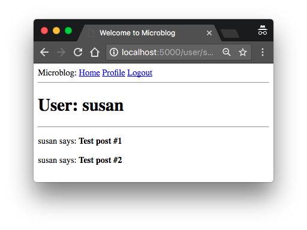
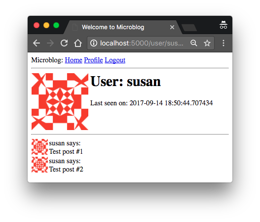
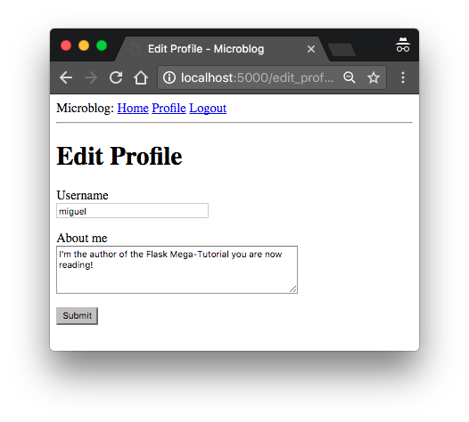
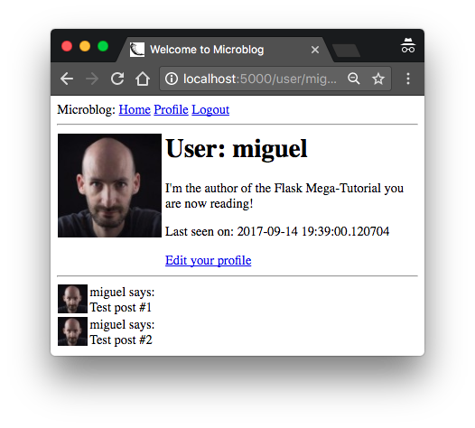

## Chapter 6：個人資料頁面與頭像

> Posted by on [Miguel Grinberg](https://blog.miguelgrinberg.com/author/Miguel%20Grinberg)

這是 Flask Mega-Tutorial 系列的第六篇文章，在這篇文章中，我將告訴你如何建立使用者個人資料頁面。

### 目錄

- [Chapter 1: Hello, World!](/python/flask-mega-tutorial/chapter_1_hello_world)
- [Chapter 2: Templates](/python/flask-mega-tutorial/chapter_2_templates)
- [Chapter 3: Web Forms](/python/flask-mega-tutorial/chapter_3_web_forms)
- [Chapter 4: Database](/python/flask-mega-tutorial/chapter_4_database)
- [Chapter 5: User Logins](/python/flask-mega-tutorial/chapter_5_user_logins)
- [Chapter 6: Profile Page and Avatars](/python/flask-mega-tutorial/chapter_6_profile_page_and_avatars)
- [Chapter 7: Error Handling](/python/flask-mega-tutorial/chapter_7_error_handling)
- [Chapter 8: Followers](/python/flask-mega-tutorial/chapter_8_followers)
- [Chapter 9: Pagination](/python/flask-mega-tutorial/chapter_9_pagination)
- [Chapter 10: Email Support](/python/flask-mega-tutorial/chapter_10_email_support)
- [Chapter 11: Facelift](/python/flask-mega-tutorial/chapter_11_facelift)
- [Chapter 12: Dates and Times](/python/flask-mega-tutorial/chapter_12_dates_and_times)
- [Chapter 13: I18n and L10n](/python/flask-mega-tutorial/chapter_13_i18n_and_l10n)
- [Chapter 14: Ajax](/python/flask-mega-tutorial/chapter_14_ajax)
- [Chapter 15: A Better Application Structure](/python/flask-mega-tutorial/chapter_15_a_better_application_structure)
- [Chapter 16: Full-Text Search](/python/flask-mega-tutorial/chapter_16_full_text_search)
- [Chapter 17: Deployment on Linux](/python/flask-mega-tutorial/chapter_17_deployment_on_linux)
- [Chapter 19: Deployment on Docker Containers](/python/flask-mega-tutorial/chapter_19_deployment_on_docker_containers)
- [Chapter 20: Some JavaScript Magic](/python/flask-mega-tutorial/chapter_20_some_javascript_magic)
- [Chapter 21: User Notifications](/python/flask-mega-tutorial/chapter_21_user_notifications)
- [Chapter 22: Background Jobs](/python/flask-mega-tutorial/chapter_22_background_jobs)
- [Chapter 23: Application Programming Interfaces （APIs）](/python/flask-mega-tutorial/chapter_23_application_programming_interfaces_apis)

> 你正在閱讀 Flask Mega-Tutorial 的 2024 年版本。完整的課程也可以在 [Amazon](https://amzn.to/3ahVnPN) 以電子書和平裝書的形式訂購。感謝你的支持！
> 如果你正在尋找 2018 年版本的課程，你可以在[這裡](https://blog.miguelgrinberg.com/post/the-flask-mega-tutorial-part-i-hello-world-2018)找到它。

這一章節將專門介紹如何向應用程式加入使用者個人資料頁面。使用者個人資料頁面是展示使用者資訊的頁面，通常包含使用者自己輸入的資訊。我將向你展示如何為所有使用者動態生成個人資料頁面，然後我會加入一個小型個人資料編輯器，供使用者輸入他們的資訊。

這一章的 GitHub 連結是：[Browse](https://github.com/miguelgrinberg/microblog/tree/v0.6) [Zip](https://github.com/miguelgrinberg/microblog/archive/v0.6.zip) [Diff](https://github.com/miguelgrinberg/microblog/compare/v0.5...v0.6)


### 使用者個人資料頁面
要建立一個使用者個人資料頁面，我們來加入一個 `/user/<username>` 路由到應用程式中。

app/routes.py: 使用者個人資料視圖函式

```python
@app.route('/user/<username>')
@login_required
def user(username):
    user = db.first_or_404(sa.select(User).where(User.username == username))
    posts = [
        {'author': user, 'body': '測試貼文 #1'},
        {'author': user, 'body': '測試貼文 #2'}
    ]
    return render_template('user.html', user=user, posts=posts)
```

我用來宣告這個視圖函式的 `@app.route` 裝飾器看起來與之前的有些不同。在這種情況下，它有一個動態組件，即被 `<` 和 `>` 包圍的 `<username>` URL 組件。當路由有一個動態組件時，Flask 會接受該 URL 部分的任何文字，並將實際的文字作為參數調用視圖函式。例如，如果客戶端瀏覽器請求 URL `/user/susan`，視圖函式將被調用，參數 `username` 設為 `'susan'`。這個視圖函式只對登入的使用者開放，所以我加入了來自 Flask-Login 的 `@login_required` 裝飾器。

這個視圖函式的實現相當簡單。我首先嘗試使用使用者名稱進行查詢來從資料庫加載使用者。你之前已經看到，資料庫查詢可以使用 `db.session.scalars()` 執行，如果你想獲得所有結果，或者使用 `db.session.scalar()` 如果你只想獲得第一個結果或者在沒有結果時獲得 None。在這個視圖函式中，我使用了 Flask-SQLAlchemy 提供的 `scalar()` 的一種變體 `db.first_or_404()`，當有結果時它像 `scalar()` 一樣工作，但在沒有結果的情況下，它會自動向客戶端發送一個 404 錯誤。通過這種方式執行查詢，我節省

了檢查查詢是否返回了一個使用者的步驟，因為當資料庫中不存在該使用者名稱時，函式將不會返回，而是會引發一個 404 異常。

如果資料庫查詢沒有觸發 404 錯誤，則表示找到了具有給定使用者名稱的使用者。接下來我為這個使用者初始化了一個假的貼文列表，並渲染一個新的 `user.html` 模板，向其傳遞使用者物件和貼文列表。

`user.html` 模板如下所示：

app/templates/user.html: 使用者個人資料模板

```html



    <h1> 使用者: {{ user.username }}</h1>
    <hr>
    
    <p>
    {{post.author.username}} 說：<b>{{ post.body }}</b>
    </p>
    

```

個人資料頁面現在完成了，但網站上任何地方都不存在指向它的連結。為了讓使用者更容易檢查他們自己的個人資料，我將在頂部導航欄中加入一個連結：

app/templates/base.html: 使用者個人資料模板

```html
        <div>
            Microblog:
            <a href="{{ url_for('index') }}"> 首頁 </a>
            
            <a href="{{ url_for('login') }}"> 登入 </a>
            
            <a href="{{ url_for('user', username=current_user.username) }}"> 個人資料 </a>
            <a href="{{ url_for('logout') }}"> 登出 </a>
            
        </div>
```

這裡唯一有趣的變化是使用 `url_for()` 函式來生成指向個人資料頁面的連結。由於使用者個人資料視圖函式接受一個動態參數，`url_for()` 函式將該 URL 部分的值作為關鍵字參數接收。因為這是指向登入使用者個人資料的連結，我可以使用 Flask-Login 的 `current_user` 來生成正確的 URL。



現在嘗試運行應用程式。點擊頂部的個人資料連結應該會帶你到你自己的使用者頁面。目前沒有連結可以帶你到其他使用者的個人資料頁面，但如果你想訪問這些頁面，你可以在瀏覽器的地址欄中手動輸入 URL。例如，如果你在應用程式上註冊了一個名為 "john" 的使用者，你可以通過輸入 http://localhost:5000/user/john 在地址欄中查看相應的使用者個人資料。

### 大頭貼 Avatars
我相信你會同意，我剛剛建立的個人資料頁面還蠻單調的。為了讓它們更有趣一些，我打算新增使用者大頭貼，但為了避免在伺服器上處理可能龐大的上傳圖片集，我打算使用 Gravatar 服務為所有使用者提供圖片。

Gravatar 服務非常簡單好用。要為特定使用者請求圖片，必須使用格式為 `https://www.gravatar.com/avatar/<hash>` 的網址，其中 `<hash>` 是使用者電子郵件地址的 MD5 雜湊。下面你可以看到如何為電子郵件為 john@example.com 的使用者獲得 Gravatar 網址：

```python
>>> from hashlib import md5
>>> 'https://www.gravatar.com/avatar/' + md5(b'john@example.com').hexdigest()
'https://www.gravatar.com/avatar/d4c74594d841139328695756648b6bd6'
```

如果你想看一個實際的例子，我的 Gravatar 網址是：

`https://www.gravatar.com/avatar/729e26a2a2c7ff24a71958d4aa4e5f35`

在瀏覽器的地址欄輸入這個網址，Gravatar 返回的會是這樣的：


預設情況下，返回的圖片大小是 80x80 像素，但可以通過在網址的查詢字串中增加 `s` 參數來請求不同的大小。例如，要獲得我自己的大頭貼為 128x128 像素的圖片，網址是：


另一個可以傳給 Gravatar 作為查詢字串參數的有趣參數是 `d`，它決定了 Gravatar 為那些沒有在服務上註冊大頭貼的使用者提供什麼圖片。我最喜歡的叫做 "identicon"，它返回一個對於每個電子郵件都不同的漂亮幾何設計。例如：

Identicon Gravatar

請注意，一些隱私網頁瀏覽器擴充功能，如 Ghostery，會阻擋 Gravatar 圖片，因為它們認為 Automattic（Gravatar 服務的擁有者）可以根據他們為你的大頭貼所獲得的請求，判斷你訪問了哪些網站。如果你在瀏覽器中看不到大頭貼，請考慮問題可能是由於你在瀏覽器中安裝的擴充功能所導致。

由於大頭貼與使用者相關，將生成大頭貼網址的邏輯新增到使用者模型中是有意義的。

app/models.py: 使用者大頭貼網址

```python
from hashlib import md5
# ...

class User(UserMixin, db.Model):
    # ...
    def avatar(self, size):
        digest = md5(self.email.lower().

encode('utf-8')).hexdigest()
        return f'https://www.gravatar.com/avatar/{digest}?d=identicon&s={size}'
```

User 類別的新 avatar() 方法返回使用者大頭貼圖片的網址，按請求的像素大小縮放。對於沒有註冊大頭貼的使用者，將生成一個 "identicon" 圖片。為了生成 MD5 雜湊，我首先將電子郵件轉換為小寫，因為 Gravatar 服務需要這樣做。然後，因為 Python 中的 MD5 支援是在位元組上而不是在字串上工作，我在傳遞給雜湊函式之前將字串編碼為位元組。

如果你有興趣了解 Gravatar 服務提供的其他選項，請訪問他們的文檔網站。

下一步是將大頭貼圖片插入到使用者個人資料模板中：

app/templates/user.html: 模板中的使用者大頭貼

```html



    <table>
        <tr valign="top">
            <td></td>
            <td><h1 > 使用者: {{ user.username }}</h1></td>
        </tr>
    </table>
    <hr>
    
    <p>
    {{post.author.username}} 說: <b>{{ post.body }}</b>
    </p>
    

```

讓 User 類別負責返回大頭貼網址的好處是，如果有一天我決定不想要 Gravatar 的大頭貼，我只需重寫 avatar() 方法以返回不同的網址，所有的模板就會自動開始顯示新的大頭貼。

我現在在使用者個人資料頁面的頂部有一個漂亮的大大頭貼，但真的沒有理由就此止步。我在底部有一些使用者的貼文，每個貼文也可以有一個小大頭貼。當然，對於使用者個人資料頁面，所有貼文將擁有相同的大頭貼，但後來我可以在主頁面上實施相同的功能，然後每個貼文都將用作者的大頭貼裝飾，那會看起來非常漂亮。

要為個別貼文顯示大頭貼，我只需要在模板中再做一個小改變：

app/templates/user.html: 貼文中的使用者大頭貼

```html



    <table>
        <tr valign="top">
            <td></td>
            <td><h1 > 使用者: {{ user.username }}</h1></td>
        </tr>
    </table>
    <hr>
    
    <table>
        <tr valign="top">
            <td></td>
            <td>{{ post.author.username }} 說:<br>{{ post.body }}</td>
        </tr>
    </table>
    

```


### 使用 Jinja 子模板

我設計了使用者檔案頁面，以顯示使用者撰寫的文章和他們的頭像。現在，我想要索引頁面也以類似的佈局顯示文章。我可以複製 / 貼上處理文章呈現的範本部分，但這並不理想，因為如果我稍後決定對這個佈局進行更改，我就必須記得更新這兩個範本。

因此，我將建立一個只渲染一篇文章的子範本，然後從 user.html 和 index.html 範本中引用它。首先，我可以建立只包含單個文章 HTML 標記的子範本。我將這個範本命名為 app/templates/_post.html。下劃線前綴只是一種命名慣例，幫助我識別哪些範本檔案是子範本。

app/templates/_post.html：文章子範本

```html
<table>
    <tr valign="top">
        <td></td>
        <td>{{ post.author.username }} 說：<br>{{ post.body }}</td>
    </tr>
</table>
```
要從 user.html 範本調用這個子範本，我使用 Jinja 的 include 語句：

app/templates/user.html：文章中的使用者頭像

```html



    <table>
        <tr valign="top">
            <td></td>
            <td><h1 > 使用者：{{ user.username }}</h1></td>
        </tr>
    </table>
    <hr>
    
        
    

```
目前應用程式的索引頁面還沒有完全制定，所以我還不會在那裡加入這個功能。

更有趣的使用者檔案
新的使用者檔案頁面存在的一個問題是，它們並沒有真正展示太多內容。使用者喜歡在這些頁面上談論一些關於他們自己的事情，所以我將允許他們寫一些關於自己的內容顯示在這裡。我還將追踪每個使用者最後訪問網站的時間，並在他們的檔案頁面上顯示。

為了支援所有這些額外的資訊，我需要做的第一件事就是在資料庫中的使用者表擴展兩個新欄位：

app/models.py：使用者模型中的新欄位

```python
class User(UserMixin, db.Model):
    # ...
    about_me: so.Mapped[Optional[str]] = so.mapped_column(sa.String(140))
    last_seen: so.Mapped[Optional[datetime]] = so.mapped_column(
        default=lambda: datetime.now(timezone.utc))
```
每次資料庫被修改時，都需要生成資料庫遷移。在第 4 章中，我向你展示了如何設定應用程式來追踪資料庫更改，通過遷移腳本。現在我有兩個新欄位想要加入到資料庫，所以第一步是生成遷移腳本：

```bash
(venv) $ flask db migrate -m "new fields in user model"
INFO  [alembic.runtime.migration] Context impl SQLiteImpl.
INFO  [alembic.runtime.migration] Will assume non-transactional

 DDL.
INFO  [alembic.autogenerate.compare] Detected added column 'user.about_me'
INFO  [alembic.autogenerate.compare] Detected added column 'user.last_seen'
  Generating migrations/versions/37f06a334dbf_new_fields_in_user_model.py ... done
```
遷移命令的輸出看起來不錯，因為它顯示出 User 類中的兩個新欄位被檢測到了。現在我可以將這個更改應用到資料庫：

```bash
(venv) $ flask db upgrade
INFO  [alembic.runtime.migration] Context impl SQLiteImpl.
INFO  [alembic.runtime.migration] Will assume non-transactional DDL.
INFO  [alembic.runtime.migration] Running upgrade 780739b227a7 -> 37f06a334dbf, new fields in user model
```
我希望你意識到使用遷移框架是多麼有用。資料庫中的任何使用者仍然在那裡，遷移框架將遷移腳本中的更改精確應用，而不會破壞任何資料。

對於下一步，我將在使用者檔案範本中加入這兩個新欄位：

app/templates/user.html：在使用者檔案範本中顯示使用者資訊

```html



    <table>
        <tr valign="top">
            <td></td>
            <td>
                <h1> 使用者：{{ user.username }}</h1>
                <p>{{ user.about_me }}</p>
                <p > 最後出現於：{{ user.last_seen }}</p>
            </td>
        </tr>
    </table>
    ...

```
注意我使用 Jinja 的條件語句來包裝這兩個欄位，因為我只想在它們設定的情況下才顯示它們。此時，這兩個新欄位對於所有使用者來說都是空的，所以你還不會看到這些欄位。

### 記錄使用者的最後訪問時間
讓我們從 last_seen 欄位開始，這是兩者中較為簡單的一個。我想做的是在給定使用者發送請求給伺服器時，將當前時間寫入這個欄位。

在每個可能從瀏覽器請求的視圖函式中加入登入以設定此欄位顯然是不切實際的，但在視圖函式被派送之前執行一些通用邏輯是 web 應用程式中如此常見的任務，以至於 Flask 將其作為原生功能提供。看看解決方案：

app/routes.py：記錄最後訪問時間

```python
from datetime import datetime, timezone

@app.before_request
def before_request():
    if current_user.is_authenticated:
        current_user.last_seen = datetime.now(timezone.utc)
        db.session.commit()
```

在 Flask 中，@before_request 裝飾器用來註冊函式，讓它在視圖函式之前執行。這非常有用，因為我可以在應用程式的任何視圖函式之前執行程式碼，且只需寫在一個地方。這個實作簡單檢查 current_user 是否已登入，若是，則將 last_seen 欄位設為目前時間。我之前提到過，伺服器應用程式需要在一致的時間單位下運作，標準做法是使用 UTC 時區。使用系統的本地時間並不是個好主意，因為這樣資料庫中的時間將依你的地點而異。

最後一步是提交資料庫階段，以便將上述變更寫入資料庫。如果你好奇為什麼在提交之前沒有 db.session.add()，請考慮當你引用 current_user 時，Flask-Login 會呼叫使用者載入回呼函式，這會執行一個資料庫查詢，並將目標使用者放入資料庫階段。所以你可以在這個函式中再次加入使用者，但這不是必要的，因為它已經在那裡了。

如果你在進行這項更改後查看你的個人資料頁面，你會看到 “最後上線於” 一行，時間與目前時間非常接近。如果你離開個人資料頁面然後再返回，你會看到時間不斷更新。

我將這些時間戳記儲存在 UTC 時區，這使得個人資料頁面上顯示的時間也是 UTC。除此之外，時間的格式並不是你所期望的，因為它實際上是 Python datetime 物件的內部表示。目前，我不打算擔心這兩個問題，因為我會在後續章節中討論處理網頁應用程式中的日期和時間。



### 個人資料編輯器

我還需要為使用者提供一個表單，讓他們可以輸入一些關於自己的資訊。表單將允許使用者更改他們的使用者名，並寫一些關於他們自己的內容，儲存在新的 about_me 欄位中。讓我們開始寫一個表單類別：

app/forms.py：個人資料編輯器表單

```python
from wtforms import TextAreaField
from wtforms.validators import Length

# ...

class EditProfileForm(FlaskForm):
    username = StringField('Username', validators=[DataRequired()])
    about_me = TextAreaField('About me', validators=[Length(min=0, max=140)])
    submit = SubmitField('Submit')
```

我在這個表單中使用了一種新的欄位類型和一個新的驗證器。對於 “關於” 欄位，我使用 TextAreaField，這是一個多行框，使用者可以在其中輸入文字。為了驗證這個欄位，我使用 Length，確保輸入的文字在 0 到 140 字元之間，這是我為資料庫中對應欄位分配的空間。

下面顯示了渲染此表單的範本：

app/templates/edit_profile.html：個人資料編輯器表單

```html



    <h1>Edit Profile</h1>
    <form action=""method="post">
        {{form.hidden_tag() }}
        <p>
            {{form.username.label}}<br>
            {{form.username(size=32) }}<br>
            
            <span style="color: red;">[{{ error }}]</span>
            
        </p>
        <p>
            {{form.about_me.label}}<br>
            {{form.about_me(cols=50, rows=4) }}<br>
            
            <span style="color: red;">[{{ error }}]</span>
            
        </p>
        <p>{{ form.submit() }}</p>
    </form>

```

最後，這是將一切綁在一起的視圖函式：

app/routes.py：編輯個人資料視圖函式

```python
from app.forms import EditProfileForm

@app.route('/edit_profile', methods=['GET', 'POST'])
@login_required
def edit_profile():
    form = EditProfileForm()
    if form.validate_on_submit():
        current_user.username = form.username.data
        current_user.about_me = form.about_me.data
        db.session.commit()
        flash('Your changes have been saved.')
        return redirect(url_for('edit_profile'))
    elif request.method == 'GET':
        form.username.data = current_user.username
        form.about_me.data = current_user.about_me
    return render_template('edit_profile.html', title='Edit Profile',
                           form=form)
```

這個視圖函式以略微不同的方式處理表單。如果 validate_on_submit() 返回 True，我會將表單中的資料複製到使用者物件中，然後將物件寫入資料庫。但當 validate_on_submit() 返回 False 時，可能是由於兩個不同的原因。首先，可能是因為瀏覽器剛剛發送了一個 GET 請求，我需要通過提供表單範本的初始版本來回應。當瀏覽器發送帶有表單資料的 POST 請求，但該資料中有些東西無效時，也會發生這種情況。對於這個表單，我需要分別處理這兩種情況。當表單第一次被 GET 請求請求時，我想用資料庫中儲存的資料預填欄位，所以我需要做的恰恰相反，將使用者欄位中儲存的資料移動到表單中，這將確保這些表單欄位擁有使用者目前儲存的資料。但在驗證錯誤的情況下，我不想向表單欄位寫入任何內容，因為它們已經被 WTForms 填充。為了區分這兩種情況，我檢查 request.method，它將是初始請求的 GET，和未通過驗證的提交的 POST。



為了讓使用者更容易進入個人資料編輯頁面，我可以在他們的個人資料頁面中加入一個連結：

app/templates/user.html：編輯個人資料連結

```python

<p><a href="{{ url_for('edit_profile') }}"> 編輯你的個人資料 </a></p>

```

請留意我使用的巧妙條件，以確保在查看自己的個人資料時出現編輯連結，但在查看其他人的個人資料時則不會出現。



