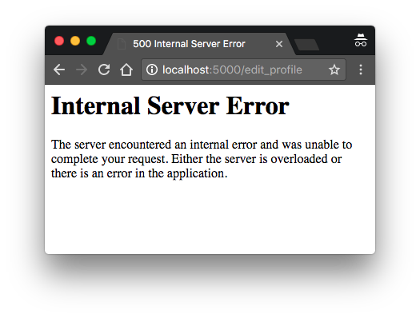
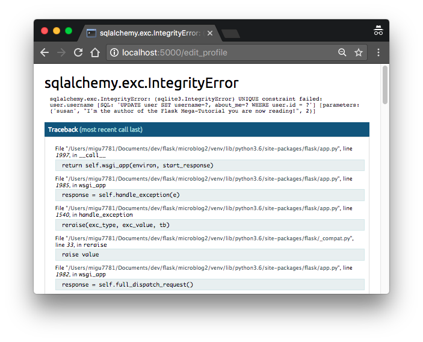
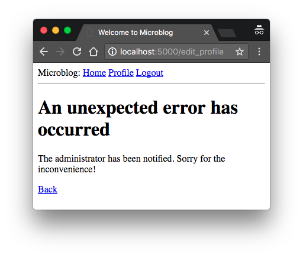

## Chapter 7: Error Handling

> Posted by on [Miguel Grinberg](https://blog.miguelgrinberg.com/author/Miguel%20Grinberg)

這是 Flask Mega-Tutorial系列的第七部分，在這裡我要告訴你如何在 Flask 程式中處理錯誤。

### 目錄

- [Chapter 1: Hello, World!](/python/flask-mega-tutorial/chapter_1_hello_world)
- [Chapter 2: Templates](/python/flask-mega-tutorial/chapter_2_templates)
- [Chapter 3: Web Forms](/python/flask-mega-tutorial/chapter_3_web_forms)
- [Chapter 4: Database](/python/flask-mega-tutorial/chapter_4_database)
- [Chapter 5: User Logins](/python/flask-mega-tutorial/chapter_5_user_logins)
- [Chapter 6: Profile Page and Avatars](/python/flask-mega-tutorial/chapter_6_profile_page_and_avatars)
- [Chapter 7: Error Handling](/python/flask-mega-tutorial/chapter_7_error_handling)
- [Chapter 8: Followers](/python/flask-mega-tutorial/chapter_8_followers)
- [Chapter 9: Pagination](/python/flask-mega-tutorial/chapter_9_pagination)
- [Chapter 10: Email Support](/python/flask-mega-tutorial/chapter_10_email_support)
- [Chapter 11: Facelift](/python/flask-mega-tutorial/chapter_11_facelift)
- [Chapter 12: Dates and Times](/python/flask-mega-tutorial/chapter_12_dates_and_times)
- [Chapter 13: I18n and L10n](/python/flask-mega-tutorial/chapter_13_i18n_and_l10n)
- [Chapter 14: Ajax](/python/flask-mega-tutorial/chapter_14_ajax)
- [Chapter 15: A Better Application Structure](/python/flask-mega-tutorial/chapter_15_a_better_application_structure)
- [Chapter 16: Full-Text Search](/python/flask-mega-tutorial/chapter_16_full_text_search)
- [Chapter 17: Deployment on Linux](/python/flask-mega-tutorial/chapter_17_deployment_on_linux)
- [Chapter 19: Deployment on Docker Containers](/python/flask-mega-tutorial/chapter_19_deployment_on_docker_containers)
- [Chapter 20: Some JavaScript Magic](/python/flask-mega-tutorial/chapter_20_some_javascript_magic)
- [Chapter 21: User Notifications](/python/flask-mega-tutorial/chapter_21_user_notifications)
- [Chapter 22: Background Jobs](/python/flask-mega-tutorial/chapter_22_background_jobs)
- [Chapter 23: Application Programming Interfaces （APIs）](/python/flask-mega-tutorial/chapter_23_application_programming_interfaces_apis)

> 你正在閱讀 Flask Mega-Tutorial 的 2024 年版本。完整的課程也可以在 [Amazon](https://amzn.to/3ahVnPN) 以電子書和平裝書的形式訂購。感謝你的支持！
> 如果你正在尋找 2018 年版本的課程，你可以在[這裡](https://blog.miguelgrinberg.com/post/the-flask-mega-tutorial-part-i-hello-world-2018)找到它。

在這一章中，我暫時停止為我的微網誌應用程式寫程式新功能，轉而討論幾種處理錯誤的策略，這些錯誤不可避免地出現在每個軟體專案中。為了說明這個話題，我故意在第六章加入的程式碼中留下了一個錯誤。在你繼續閱讀之前，看看你能不能找到它！

這一章的 GitHub 連結是：瀏覽、Zip、Diff。

### Flask 中的錯誤處理
當 Flask 應用程式發生錯誤時會發生什麼？最好的方式是親身體驗。啟動應用程式，確保你至少註冊了兩個使用者。作為其中一個使用者登入，打開個人資料頁面並點擊「編輯」連結。在個人資料編輯器中，嘗試將使用者名稱更改為另一個已經註冊的使用者名稱，然後砰！這將帶來一個可怕的「內部伺服器錯誤」頁面：



如果你查看運行應用程式的終端會話，你會看到錯誤的堆疊追蹤。堆疊追蹤在除錯錯誤時極為有用，因為它們顯示了該堆疊中的呼叫序列，一直到產生錯誤的那一行：

```python
（[2023-04-28 23:59:42,300] ERROR in app: Exception on /edit_profile [POST]
追蹤（最近一次呼叫最後）：
  File "venv/lib/python3.11/site-packages/sqlalchemy/engine/base.py", line 1963, in _exec_single_context
    self.dialect.do_execute(
  File "venv/lib/python3.11/site-packages/sqlalchemy/engine/default.py", line 918, in do_execute
    cursor.execute(statement, parameters)
sqlite3.IntegrityError: UNIQUE constraint failed: user.username
```

堆疊追蹤幫助你確定什麼是錯誤。應用程式允許使用者更改使用者名稱，但它沒有驗證新選擇的使用者名稱是否與系統中已有的其他使用者衝突。錯誤來自 SQLAlchemy，它試圖將新的使用者名稱寫入資料庫，但資料庫因使用者名稱列被定義為 unique=True 選項而拒絕它。

重要的是要注意，呈現給使用者的錯誤頁面並未提供有關錯誤的太多訊息，這很好。我絕對不希望使用者知道崩潰是由資料庫錯誤引起的，或者我使用了什麼資料庫，或者我的資料庫中有哪些表和欄位名稱。所有這些訊息都應該保持內部。

但還有一些事情遠非理想。我有一個非常醜陋且不符合應用程式佈局的錯誤頁面。我也有重要的應用程式堆疊追蹤被傾倒在一個我需要不斷監視的終端上，以確保我不會錯過任何錯誤。當然，我還有一個錯誤需要修復。我將解決所有這些問題，但首先，讓我們談談 Flask 的除錯模式。

### 除錯模式 Debug Mode
你在上面看到的錯誤處理方式非常適合在生產伺服器上運行的系統。如果出現錯誤，使用者會得到一個模糊的錯誤頁面（儘管我會使這個錯誤頁面更友好），而錯誤的重要細節則在伺服器進程輸出或日誌檔案中。

但當你在開發你的應用程式時，你可以啟用除錯模式，這是 Flask 在瀏覽器上直接輸出一個非常不錯的除錯器的模式。要啟動除錯模式，停止應用程式，然後設置以下環境變數：

```bash
(venv) $ export FLASK_DEBUG=1
```

如果你在 Microsoft Windows 上，記得使用 set 而不是 export。

設置了 FLASK_DEBUG 之後，重啟伺服器。你的終端輸出將會與你習慣看到的略有不同：

(venv) $ flask run
 * Serving Flask app 'microblog.py' (lazy loading)
 * Environment: development
 * 除錯模式：開啟
 * Running on http://127.0.0.1:5000/ (Press CTRL+C to quit)
 * Restarting with stat
 * 除錯器啟動！
 * 除錯器 PIN：118-204-854
現在再次讓應用程式崩潰，以便在你的瀏覽器中看到互動式除錯器：



除錯器允許你展開每個堆疊框架並查看相應的原始碼。你還可以在任何框架上打開一個 Python 提示，並執行任何有效的 Python 表達式，例如檢查變數的值。

非常重要的一點是，你永遠不要在生產伺服器上以除錯模式運行 Flask 應用程式。除錯器允許使用者在伺服器上遠程執行程式碼，所以它可以是想要滲透你的應用程式或伺服器的惡意使用者的意外禮物。作為額外的安全措施，瀏覽器中運行的除錯器啟動時是鎖定的，首次使用時它會要求輸入 PIN，你可以在 flask run 命令的輸出中看到。

既然我談到了除錯模式，我應該提到啟用除錯模式時的第二個重要功能，那就是重新加載器。這是一個非常有用的開發功能，當源檔案被修改時，它會自動重新啟動應用程式。如果你在除錯模式下運行 flask run，那麼你可以在應用程式上工作，每次你保存檔案時，應用程式都會重新

當我談到偵錯模式時，我應該提到開啟偵錯模式時啟動的第二個重要功能，那就是重載器。這是一個非常實用的開發功能，當源檔案被修改時，它會自動重啟應用程式。如果你在偵錯模式下執行 flask run，你就可以開始編寫你的應用程式，每當你儲存一個檔案時，應用程式就會重啟來加載新的程式碼。

#### 自訂錯誤頁面
Flask 提供了一種機制，讓應用程式可以安裝自己的錯誤頁面，這樣你的使用者就不必看到平淡無奇的預設頁面。舉例來說，我們來定義 HTTP 錯誤 404 和 500 的自訂錯誤頁面，這是兩個最常見的錯誤。定義其他錯誤的頁面的方式也是一樣的。

要聲明一個自訂錯誤處理器，使用 `@errorhandler` 裝飾器。我將把我的錯誤處理器放在一個新的 app/errors.py 模組中。

app/errors.py：自訂錯誤處理器

```python
from flask import render_template
from app import app, db

@app.errorhandler(404)
def not_found_error(error):
    return render_template('404.html'), 404

@app.errorhandler(500)
def internal_error(error):
    db.session.rollback()
    return render_template('500.html'), 500
```

錯誤函式的工作方式與視圖函式非常相似。對於這兩個錯誤，我返回了各自模板的內容。請注意，這兩個函式在模板之後都返回了一個第二個值，這是錯誤程式碼號碼。對於我迄今為止建立的所有視圖函式，我不需要加入第二個返回值，因為預設的 200（表示成功響應的狀態碼）是我想要的。但在這種情況下，這些是錯誤頁面，所以我希望響應的狀態碼能反映這一點。

500 錯誤的錯誤處理器可能會在數據庫錯誤後被調用，這實際上就是上面提到的使用者名重複的情況。為了確保任何失敗的數據庫會話不會干擾由模板觸發的任何數據庫訪問，我發出了一個會話回滾。這會將會話重置為乾淨的狀態。

這是 404 錯誤的模板：

app/templates/404.html：未找到錯誤模板

```html



    <h1>File Not Found</h1>
    <p><a href="{{ url_for('index') }}">Back</a></p>

```

這是 500 錯誤的模板：

app/templates/500.html：內部伺服器錯誤模板

```html



    <h1>An unexpected error has occurred</h1>
    <p>The administrator has been notified. Sorry for the inconvenience!</p>
   

 <p><a href="{{ url_for('index') }}">Back</a></p>

```

這兩個模板都繼承自 base.html 模板，這樣錯誤頁面就與應用程式的正常頁面具有相同的外觀和感覺。

要讓這些錯誤處理器在 Flask 中註冊，我需要在應用程式實例建立後導入新的 app/errors.py 模組：

app/__init__.py：導入錯誤處理器

```python
## ...

from app import routes, models, errors
```

如果你在終端機會話中設置 FLASK_DEBUG=0（或刪除 FLASK_DEBUG 變數），然後再次觸發重複使用者名錯誤，你將會看到一個稍微更友好的錯誤頁面。



### 通過電子郵件發送錯誤

Flask 默認的錯誤處理的另一個問題是沒有通知。任何錯誤的堆棧跟踪都會打印到終端機，這意味著需要監控伺服器進程的輸出來發現錯誤。當你在開發過程中運行應用程式時，這完全沒問題，但一旦應用程式部署在生產伺服器上，沒有人會去看伺服器的輸出，所以需要一個更強大的解決方案。

我認為對於錯誤採取主動的態度非常重要。如果生產版本的應用程式出現錯誤，我希望立刻知道。所以我的第一個解決方案將是配置 Flask 在錯誤發生後立即通過電子郵件發送給我，電子郵件正文中包含錯誤的堆棧跟踪。

第一步是將電子郵件伺服器詳情加入到配置檔中：

config.py：電子郵件配置

```python
class Config(object):
    ## ...
    MAIL_SERVER = os.environ.get('MAIL_SERVER')
    MAIL_PORT = int(os.environ.get('MAIL_PORT') or 25)
    MAIL_USE_TLS = os.environ.get('MAIL_USE_TLS') is not None
    MAIL_USERNAME = os.environ.get('MAIL_USERNAME')
    MAIL_PASSWORD = os.environ.get('MAIL_PASSWORD')
    ADMINS = ['your-email@example.com']
```

電子郵件的配置變數包括伺服器和端口、啟用加密連線的布林標誌，以及可選的使用者名和密碼。這五個配置變數都是從它們的環境變數對應項中獲取的。如果環境中沒有設置電子郵件伺服器，則我將以此為標誌，認為需要禁用發送錯誤郵件的功能。電子郵件伺服器端口也可以在環境變數中給出，但如果沒有設置，則使用標準端口 25。電子郵件伺服器憑證默認不使用，但如果需要，可以提供。ADMINS 配置變數是將接收錯誤報告的電子郵件地址列表，因此你自己的電子郵件地址應該在該列表中。

Flask 使用 Python 的日誌套件來寫日誌，這個套件已經能夠透過電子郵件發送日誌。為了讓錯誤發生時可以發送郵件，我需要做的就是將 SMTPHandler 實例加入到 Flask 的 logger 物件，也就是 app.logger：

```python
## app/__init__.py：透過電子郵件記錄錯誤

import logging
from logging.handlers import SMTPHandler

## ...

if not app.debug:
    if app.config['MAIL_SERVER']:
        auth = None
        if app.config['MAIL_USERNAME'] or app.config['MAIL_PASSWORD']:
            auth = (app.config['MAIL_USERNAME'], app.config['MAIL_PASSWORD'])
        secure = None
        if app.config['MAIL_USE_TLS']:
            secure = ()
        mail_handler = SMTPHandler(
            mailhost=(app.config['MAIL_SERVER'], app.config['MAIL_PORT']),
            fromaddr='no-reply@' + app.config['MAIL_SERVER'],
            toaddrs=app.config['ADMINS'], subject='Microblog Failure',
            credentials=auth, secure=secure)
        mail_handler.setLevel(logging.ERROR)
        app.logger.addHandler(mail_handler)

from app import routes, models, errors
```

正如你看到的，我只在應用程式非除錯模式運行時啟用電子郵件 logger，也就是當 app.debug 為 True，同時郵件伺服器在配置中存在時。

設定電子郵件 logger 有點繁瑣，因為要處理許多郵件伺服器中存在的可選安全選項。但本質上，上面的程式碼建立了一個 SMTPHandler 實例，設定它的級別只報告錯誤而不是警告、資訊或除錯訊息，最後將其附加到 Flask 的 app.logger 物件。

測試這個功能有兩種方法。最簡單的一種是使用 SMTP 除錯伺服器。這是一個假的電子郵件伺服器，它接受郵件，但不發送，而是將它們印到控制台。要運行這個伺服器，打開第二個終端會話，啟動虛擬環境，然後安裝 aiosmtpd 套件：

```bash
(venv) $ pip install aiosmtpd
```

然後運行以下命令啟動除錯郵件伺服器：

```bash
(venv) $ aiosmtpd -n -c aiosmtpd.handlers.Debugging -l localhost:8025
```

這個命令尚未打印任何東西，但會等待客戶端連接。讓除錯 SMTP 伺服器運行，然後返回到你的第一個終端，如下配置你的郵件伺服器：

```bash
export MAIL_SERVER=localhost
MAIL_PORT=8025
```

像往常一樣，如果你使用 Microsoft Windows，請使用 set 而不是 export。確保 FLASK_DEBUG 變數設為 0 或根本沒設定，因為應用程式在除錯模式下不會發送郵件。運行應用程式並再次觸發 SQLAlchemy 錯誤，看看運行假電子郵件伺服器的終端會話如何顯示帶有錯誤完整堆疊追蹤的電子郵件。

測試這個功能的第二種方法是配置一個真實的電子郵件伺服器。下面是使用你的 Gmail 帳戶的郵件伺服器配置：

```bash
export MAIL_SERVER=smtp.googlemail.com
export MAIL_PORT=587
export MAIL_USE_TLS=1
export MAIL_USERNAME=<your-gmail-username>
export MAIL_PASSWORD=<your-gmail-password>
```

如果你使用 Microsoft Windows，請記得在上述每個語句中使用 set 而不是 export。

你的 Gmail 帳戶中的安全功能可能會阻止應用程式透過它發送郵件，除非你明確允許「較不安全的應用程式」訪問你的 Gmail 帳戶。你可以在這裡閱讀有關此事，如果你擔心帳戶的安全，可以建立一個專門用於測試郵件的次要帳戶，或者可以暫時啟用較不安全的應用程式來運行此測試，然後恢復到預設設定。

另一種選擇是使用專門的電子郵件服務，如 SendGrid，它允許你在一個免費帳戶上每天發送最多 100 封郵件。

### 記錄到檔案
通過電子郵件接收錯誤很好，但有時這還不夠。有些失敗條件不會以 Python 異常結束，也不是大問題，但它們可能仍然足夠有趣，值得保存以供除錯。出於這個原因，我還將為應用程式維護一個日誌檔。

要啟用基於檔案的日誌，需要將另一個處理器，這次是 RotatingFileHandler 類型的，附加到應用程式 logger，類似於電子郵件處理器。

```python
## app/__init__.py：記錄到檔案

## ...
from logging.handlers import RotatingFileHandler
import os

## ...

if not app.debug:
    ## ...

    if not os.path.exists('logs'):
        os.mkdir('logs')
    file_handler = RotatingFileHandler('logs/microblog.log', maxBytes=10240,
                                       backupCount=10)
    file_handler.setFormatter(logging.Formatter(
        '%(asctime)s %(levelname)s: %(message)s [in %(pathname)s:%(lineno)d]'))
    file_handler.setLevel(logging.INFO)
    app.logger.addHandler(file_handler)

    app.logger.setLevel(logging.INFO)
    app.logger.info('Microblog startup')
```

我正在 `logs` 目錄中建立名為 `microblog.log` 的 log 檔案，如果該目錄不存在，我會建立它。

`RotatingFileHandler` 類別很好用，因為它可以旋轉 logs，確保當應用程式長時間運行時，log 檔案不會變得太大。在這個案例中，我限制 log 檔案的大小為 10KB，並保留最後十個 log 檔案作為備份。

`logging.Formatter` 類別提供了自訂格式化的 log 訊息。因為這些訊息要寫入檔案，我希望它們包含盡可能多的資訊。所以我使用一種包括時間戳記、log 等級、訊息以及 log 條目來源的檔案和行號的格式。

為了使 logging 更有用，我還將應用程式 logger 和檔案 logger 處理器的 log 等級降低到 INFO 類別。如果你不熟悉 log 類別，它們按嚴重程度遞增的順序是 `DEBUG`、`INFO`、`WARNING`、`ERROR`` 和 `CRITICAL`。

作為 log 檔案第一個有趣的用途，伺服器每次啟動時都會向 logs 寫入一行。當這個應用程式在生產伺服器上運行時，這些 log 條目將告訴你伺服器何時重新啟動。

### 修復重複使用者名稱的 Bug

我利用使用者名稱重複的 bug 太久了。現在我已經告訴你如何準備應用程式來處理這些類型的錯誤，我可以繼續修復它。

回想一下，`RegistrationForm` 已經實現了對使用者名稱的驗證，但編輯表單的要求略有不同。在註冊時，我需要確保表單中輸入的使用者名稱不存在於資料庫中。在編輯個人資料表單上，我必須做同樣的檢查，但有一個例外。如果使用者保留了原始使用者名稱，則應該允許通過驗證，因為該使用者名稱已經分配給該使用者。以下是我如何為這個表單實施使用者名稱驗證的：

```python
## app/forms.py：在編輯個人資料表單中驗證使用者名稱

class EditProfileForm(FlaskForm):
    username = StringField('Username', validators=[DataRequired()])
    about_me = TextAreaField('About me', validators=[Length(min=0, max=140)])
    submit = SubmitField('Submit')

    def __init__(self, original_username, *args, **kwargs):
        super().__init__(*args, **kwargs)
        self.original_username = original_username

    def validate_username(self, username

):
        if username.data != self.original_username:
            user = db.session.scalar(sa.select(User).where(
                User.username == self.username.data))
            if user is not None:
                raise ValidationError('Please use a different username.')
```

實作方式是在自訂的驗證方法中，但有一個重載的建構式接受原始使用者名稱作為參數。這個使用者名稱被保存為實例變數，在 `validate_username()` 方法中進行檢查。如果表單中輸入的使用者名稱與原始使用者名稱相同，則無需檢查資料庫是否有重複。

為了使用這個新的驗證方法，我需要在檢視函式中加入原始使用者名稱參數，建立表單物件時：

```python
## app/routes.py：在編輯個人資料表單中驗證使用者名稱

@app.route('/edit_profile', methods=['GET', 'POST'])
@login_required
def edit_profile():
    form = EditProfileForm(current_user.username)
    ## ...
```

現在 bug 已經修復，大多數情況下都能防止編輯個人資料表單中的重複。這不是一個完美的解決方案，因為當兩個或多個程式同時訪問資料庫時可能不起作用。在這種情況下，競爭狀態可能導致驗證通過，但稍後當嘗試重命名時，資料庫已經被另一個程式更改，無法重命名使用者。這在伺服器進程很多的非常繁忙的應用程式中除外，所以現在我不擔心這個問題。

此時，你可以再次嘗試重現錯誤，看看新的表單驗證方法如何防止它。

### 永久啟動調試模式

Flask 的調試模式非常有用，你可能希望默認開啟它。這可以通過將 `FLASK_DEBUG` 環境變數加入到 `.flaskenv` 檔案中來完成。

```python
## .flaskenv：Flask 命令的環境變數

FLASK_APP=microblog.py
FLASK_DEBUG=1
```

有了這個更改，當你使用 `flask run` 命令啟動伺服器時，將啟動調試模式。
