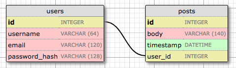
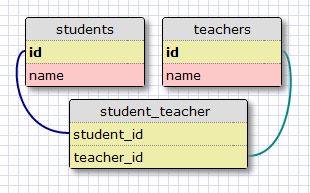
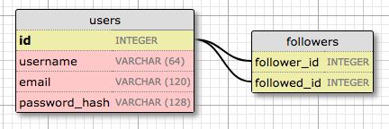

# Chapter 8 : Followers

在這一章中，我將進一步開發應用程式的資料庫。我希望應用程式的使用者能夠輕鬆選擇他們想要追蹤的其他使用者。因此，我將擴充資料庫以追蹤誰追蹤了誰，這比你想像的還要複雜。

### 目錄

- [Chapter 1: Hello, World!](/python/flask-mega-tutorial/chapter_1_hello_world)
- [Chapter 2: Templates](/python/flask-mega-tutorial/chapter_2_templates)
- [Chapter 3: Web Forms](/python/flask-mega-tutorial/chapter_3_web_forms)
- [Chapter 4: Database](/python/flask-mega-tutorial/chapter_4_database)
- [Chapter 5: User Logins](/python/flask-mega-tutorial/chapter_5_user_logins)
- [Chapter 6: Profile Page and Avatars](/python/flask-mega-tutorial/chapter_6_profile_page_and_avatars)
- [Chapter 7: Error Handling](/python/flask-mega-tutorial/chapter_7_error_handling)
- [Chapter 8: Followers](/python/flask-mega-tutorial/chapter_8_followers)
- [Chapter 9: Pagination](/python/flask-mega-tutorial/chapter_9_pagination)
- [Chapter 10: Email Support](/python/flask-mega-tutorial/chapter_10_email_support)
- [Chapter 11: Facelift](/python/flask-mega-tutorial/chapter_11_facelift)
- [Chapter 12: Dates and Times](/python/flask-mega-tutorial/chapter_12_dates_and_times)
- [Chapter 13: I18n and L10n](/python/flask-mega-tutorial/chapter_13_i18n_and_l10n)
- [Chapter 14: Ajax](/python/flask-mega-tutorial/chapter_14_ajax)
- [Chapter 15: A Better Application Structure](/python/flask-mega-tutorial/chapter_15_a_better_application_structure)
- [Chapter 16: Full-Text Search](/python/flask-mega-tutorial/chapter_16_full_text_search)
- [Chapter 17: Deployment on Linux](/python/flask-mega-tutorial/chapter_17_deployment_on_linux)
- [Chapter 19: Deployment on Docker Containers](/python/flask-mega-tutorial/chapter_19_deployment_on_docker_containers)
- [Chapter 20: Some JavaScript Magic](/python/flask-mega-tutorial/chapter_20_some_javascript_magic)
- [Chapter 21: User Notifications](/python/flask-mega-tutorial/chapter_21_user_notifications)
- [Chapter 22: Background Jobs](/python/flask-mega-tutorial/chapter_22_background_jobs)
- [Chapter 23: Application Programming Interfaces （APIs）](/python/flask-mega-tutorial/chapter_23_application_programming_interfaces_apis)

> 你正在閱讀 Flask Mega-Tutorial 的 2024 年版本。完整的課程也可以在 [Amazon](https://amzn.to/3ahVnPN) 以電子書和平裝書的形式訂購。感謝你的支持！
> 如果你正在尋找 2018 年版本的課程，你可以在[這裡](https://blog.miguelgrinberg.com/post/the-flask-mega-tutorial-part-i-hello-world-2018)找到它。

本章的 GitHub 連結有：[Browse](https://github.com/miguelgrinberg/microblog/tree/v0.8) [Zip](https://github.com/miguelgrinberg/microblog/archive/v0.8.zip) [Diff](https://github.com/miguelgrinberg/microblog/compare/v0.7...v0.8)

### 重新探討資料庫關係

我上面提到，我想要維護每個使用者的「被追蹤者」和「追蹤者」名單。不幸的是，關聯式資料庫並沒有我可以用於這些名單的列表類型，只有包含記錄和這些記錄之間關係的表格。

資料庫有一個代表使用者的表格，所需要的是找出可以模型化追蹤者 / 被追蹤者連結的適當關係類型。這是回顧基本資料庫關係類型的好時機：

#### 一對多

我在第四章中已經使用了一對多關係。這是這種關係的圖示：



由這種關係連結的兩個實體是使用者和帖子。我說一個使用者有許多帖子，一個帖子有一個使用者（或作者）。這種關係在資料庫中通過在「多」方使用外鍵來表示。在上面的關係中，外鍵是加入到帖子表的 user_id 欄位。這個欄位將每個帖子連結到使用者表中其作者的記錄。

很明顯，user_id 欄位提供了對給定帖子作者的直接訪問，但反過來呢？為了使關係有用，我應該能夠獲取由給定使用者撰寫的帖子列表。帖子表中的 user_id 欄位也足以回答這個問題，因為這一列被賦予了索引，以便於像「檢索所有 user_id 為 X 的帖子」這樣的有效查詢。

#### 多對多
多對多關係稍微複雜一些。例如，考慮一個有學生和老師的資料庫。我可以說一個學生有許多老師，一個老師有許多學生。這就像是從兩端重疊的兩個一對多關係。

對於這種類型的關係，我應該能夠查詢資料庫並獲得教導給定學生的老師名單，以及老師班上的學生名單。在關聯式資料庫中實際上不容易表示這一點，因為不能通過向現有表加入外鍵來完成。

表示多對多關係需要使用一個稱為關聯表的輔助表。以下是學生和老師範例的資料庫外觀：



儘管一開始可能不明顯，但具有兩個外鍵的關聯表能夠有效回答有關關係的所有查詢。

#### 多對一與一對一

多對一關係類似於一對多關係。區別在於這種關係是從「多」方來看的。

一對一關係是一對多的特例。表示方式類似，但在資料庫中加入了一個約束，以防止「多」方有多於一個連結。雖然在某些情況下這種類型的關係很有用，但它不像其他類型那麼常見。

### 表示追蹤者

查看所有關係類型的摘要，很容易確定追蹤追蹤者的適當數據模型是多對多關係，因為一個使用者追蹤許多使用者，並且一個使用者有許多追蹤者。但這裡有一個轉折。在學生和老師的例子中，我有兩個通過多對多關係相關的實體。但在追蹤者的情況下，我有使用者追蹤其他使用者，所以只有使用者。那麼多對多關係的第二個實體是什麼？

關係的第二個實體也是使用者。一個類別的實例與同一類別的其他實例相連的關係稱為自我參照關係，這正是我在這裡擁有的。

這是追蹤追蹤者的自我參照多對多關係圖：



追蹤者表是這種關係的關聯表。該表中的外鍵都指向使用者表中的條目，因為它將使用者與使用者連接。該表中的每條記錄代表一個追蹤者使用者和一個被追蹤者使用者之間的一個連結。像學生和老師的例子一樣，像這樣的設置允許資料庫回答我將需要的有關被追蹤者和追蹤者的所有問題。相當整齊。

### 資料庫模型表示

讓我們首先將追蹤者加入到資料庫。這是追蹤者關聯表。確保將其加入在 models.py 中的 User 模型上方，以便稍後模型可以參考它。

app/models.py: 追蹤者關聯表

```python
followers = sa.Table(
    'followers',
    db.metadata,
    sa.Column('follower_id', sa.Integer, sa.ForeignKey('user.id'),
              primary_key=True),
    sa.Column('followed_id', sa.Integer, sa.ForeignKey('user.id'),
              primary_key=True)
)
```

這是我在上面圖表中的關聯表的直接翻譯。請注意，我並未像對 users 和 posts 表那樣宣告這個表為一個模型。由於這是一個輔助表，除了外鍵之外沒有其他數據，我沒有建立相關的模型類別。

`sa.Table` 類別直接代表一個資料庫表格。表名作為第一個參數。第二個參數是元數據 (metadata)，是 SQLAlchemy 儲存資料庫中所有表格資訊的地方。在使用 Flask-SQLAlchemy 時，可以透過 `db.metadata` 獲得元數據實例。這個表的欄位是由 `sa.Column` 的實例初始化，包括欄位名、類型和選項。對於這個表，外鍵中沒有獨特的值可作為它們自己的主鍵，但外鍵的配對是唯一的。因此，兩個欄位都標記為主鍵。這稱為複合主鍵。

在 users 表中定義兩個多對多關係屬性：

`app/models.py`：多對多 followers 關係

```python
class User(UserMixin, db.Model):
    # ...
    following: so.WriteOnlyMapped['User'] = so.relationship(
        secondary=followers, primaryjoin=(followers.c.follower_id == id),
        secondaryjoin=(followers.c.followed_id == id),
        back_populates='followers')
    followers: so.WriteOnlyMapped['User'] = so.relationship(
        secondary=followers, primaryjoin=(followers.c.followed_id == id),
        secondaryjoin=(followers.c.follower_id == id),
        back_populates='following')
```

這個關係的設定不是那麼簡單。就像我對 posts 一對多關係所做的那樣，我使用 `so.relationship` 函式在模型類別中定義關係。但由於這個關係在兩邊都使用相同的模型，所以兩個關係屬性是一起定義的。

這個關係將 User 實例連結到其他 User 實例，作為約定，我們說這種關係中的左側使用者正在關注右側的使用者。我從左側使用者的角度定義名為 following 的關係，因為當我從左側查詢這個關係時，會得到左側使用者正在關注的使用者列表。相反地，followers 關係從右側開始，找出所有關注給定使用者的使用者。

兩個關係都使用 `so.WriteOnlyMapped` 類型定義，就像 posts 關係一樣。讓我們逐一檢查 `so.relationship()` 調用的參數：

- `secondary` 配置用於此關係的關聯表，我在這個類別上方定義了它。
- `primaryjoin` 表示連接實體到關聯表的條件。在 following 關係中，使用者必須與關聯表的 follower_id 屬性匹配，所以條件反映了這一點。`followers.c.follower_id` 表達式引用關聯表的 follower_id 欄位。在 followers 關係中，角色是相反的，所以使用者必須與 followed_id 欄位匹配。
- `secondaryjoin` 表示連接關聯表到關係另一邊使用者的條件。在 following 關係中，使用者必須與 followed_id 欄位匹配，而在 followers 關係中，使用者必須與 follower_id 欄位匹配。

如果這很難理解，不用擔心。我將在一會兒向你展示如何處理這些查詢，然後一切都會變得更清晰。

### 在新的資料庫遷移中記錄更改

```bash
(venv) $ flask db migrate -m "followers"
INFO  [alembic.runtime.migration] Context impl SQLiteImpl.
INFO  [alembic.runtime.migration] Will assume non-transactional DDL.
INFO  [alembic.autogenerate.compare] Detected added table 'followers'
  Generating /home/miguel/microblog/migrations/versions/ae346256b650_followers.py ... done

(venv) $ flask db upgrade
INFO  [alembic.runtime.migration] Context impl SQLiteImpl.
INFO  [alembic.runtime.migration] Will assume non-transactional DDL.
INFO  [alembic.runtime.migration] Running upgrade 37f06a334dbf -> ae346256b650, followers
```

### 加入和移除「關注」

感謝 SQLAlchemy ORM，使用者關注另一使用者可以在資料庫中記錄，並像操作列表那樣操作 following 和 followers 關係。例如，如果我有兩個存儲在 user1 和 user2 變數中的使用者，我可以使用這個簡單的語句讓第一個關注第二個：

```python
user1.following.add(user2)
```

要停止關注使用者，我可以這樣做：

```python
user1.following.remove(user2)
```

儘管加入和移除關注者相當簡單，我想在我的程式碼中推廣可重用性，所以我不打算在程式碼中隨意加入「adds」和「removes」。相反，我將在 User 模型中實現「關注」和「取消關注」功能作為方法。最好將應用邏輯從視圖函式移動到模型或其他輔助類別或模組中，因為你稍後會在本章看到，這樣做使單元測試變得更容易。

以下是在使用者模型中處理關注關係的更改：

`app/models.py`：加入和移除關注者

```python
class User(UserMixin, db.Model):
    #...

    def follow(self, user):
        if not self.is_following(user):
            self.following.add(user)

    def unfollow(self, user):
        if self.is_following(user):
            self.following.remove(user)

    def is_following(self, user):
        query = self.following.select().where(User.id == user.id)
        return db.session.scalar(query) is not None

    def followers_count(self):
        query = sa.select(sa.func.count()).select_from(
            self.followers.select().subquery())
        return db.session.scalar(query)

    def following_count(self):
        query = sa.select(sa.func.count()).select_from(
            self.following.select().subquery())
        return db.session.scalar(query)
```

#### 追隨與取消追隨的方法

`follow()` 和 `unfollow()` 方法使用了我之前展示的 `add()` 和 `remove()` 方法，這些方法屬於只寫關係物件。但在操作關係之前，它們會先使用 `is_following()` 輔助方法，以確保所請求的動作是合理的。例如，如果我要求 user1 追隨 user2，但事實上這種追隨關係在資料庫中已經存在，我就不想加入重複的資料。取消追隨的邏輯也是一樣的。

#### 確認是否已追隨

`is_following()` 方法會對追隨關係進行查詢，看看特定使用者是否已經包含在其中。所有只寫關係都有一個 `select()` 方法，它構建一個查詢，返回關係中的所有元素。在這種情況下，我不需要請求所有元素，我只是在尋找一個特定的使用者，所以我可以用 `where()` 子句限制查詢。

#### 追隨者和追隨數量的方法

`followers_count()` 和 `following_count()` 方法返回使用者的追隨者和追隨數量。這需要一種不同類型的查詢，其結果不是返回，而是只返回它們的數量。這些查詢的 `sa.select()` 子句指定了 SQLAlchemy 中的 `sa.func.count()` 函式，表示我想獲得函式的結果。然後加入了 `select_from()` 子句，以及需要計數的查詢。每當一個查詢作為更大查詢的一部分時，SQLAlchemy 要求將內部查詢通過調用 `subquery()` 方法轉換為子查詢。

### 獲取已追隨使用者的貼文

資料庫中對追隨者的支援幾乎完成，但我實際上還缺少一個重要功能。在應用程式的首頁，我將顯示所有被登入使用者追隨的人所撰寫的部落格文章，所以我需要制定一個資料庫查詢，以返回這些文章。

最明顯的解決方案是使用一個返回已追隨使用者列表的查詢，這會是 `user.following.select()`。執行這個查詢後，我可以進行另一個查詢，以獲得每個返回使用者的文章。一旦我有了所有文章，我可以將它們合併成一個單一列表，並按日期排序。聽起來不錯？其實不然。

這種方法有幾個問題。如果一個使用者追隨了一千人呢？我需要執行一千個資料庫查詢，才能收集所有文章。然後我還需要在內存中合併和排序這一千個列表。作為次要問題，考慮到應用程式的首頁最終會實現分頁，所以它不會顯示所有可用文章，只顯示最初的幾篇，並提供一個鏈

接以獲取更多（如果需要）。如果我要按日期顯示文章，除非我首先獲得所有文章並對它們進行排序，否則我怎麼知道哪些文章是所有已追隨使用者中最近的呢？這實際上是一個糟糕的解決方案，不具備擴展性。

要避免合併和排序部落格文章是不可能的，但在應用程式中這樣做會導致非常低效的過程。關係型資料庫擅長這類工作。資料庫有索引，使其能夠以比我在我的側面可能做到的更有效的方式執行查詢和排序。所以我真正想要的是提出一個單一的資料庫查詢，定義我想獲得的資訊，然後讓資料庫以最有效的方式提取出這些資訊。

下面你可以看到這個查詢：

`app/models.py`: 追隨的文章查詢

```python
class User(UserMixin, db.Model):
    #...
    def following_posts(self):
        Author = so.aliased(User)
        Follower = so.aliased(User)
        return (
            sa.select(Post)
            .join(Post.author.of_type(Author))
            .join(Author.followers.of_type(Follower))
            .where(Follower.id == self.id)
            .order_by(Post.timestamp.desc())
        )
```

這是我在這個應用程式中使用過的最複雜的查詢。我將逐一解析這個查詢。暫時忽略兩個 `so.aliased()` 調用，當你看這個查詢的結構時，會注意到它由兩個 `join()` 子句、`where()` 和 `order_by()` 四個主要部分定義：

```python
sa.select(Post)
    .join(...)
    .join(...)
    .where(...)
    .order_by(...)
```

### Joins

要了解連接操作是什麼，讓我們看一個例子。假設我有一個 User 表，內容如下：

| id | username |
|----|----------|
| 1  | john     |
| 2  | susan    |
| 3  | mary     |
| 4  | david    |

為了簡化問題，我沒有顯示使用者模型中的所有欄位，只顯示對這個查詢重要的部分。

假設追隨者關聯表說，使用者 john 追隨使用者 susan 和 david，使用者 susan 追隨 mary，使用者 mary 追隨 david。代表上述的資料是這樣的：

| follower_id | followed_id |
|-------------|-------------|
| 1           | 2           |
| 1           | 4           |
| 2           | 3           |
| 3           | 4           |

最後，posts 表包含來自每個使用者的一篇文章：

| id | text         | user_id |
|----|--------------|---------|
| 1  | post from susan | 2       |
| 2  | post from mary  | 3       |
| 3  | post from david | 4       |
| 4  | post from john  | 1       |

這個表也省略了一些不是討論部分的欄位。

這是查詢的第一部分，包括第一個 `join()` 子句，現在暫時去掉 `of_type(Author)`，我稍後會解釋：

```python
sa.select(Post)
    .join(Post.author)
```

### 查詢中的選擇部分

查詢的 `select()` 部分定義了需要獲取的實體，在這個案例中是貼文。接下來我要做的是將貼文資料表中的條目與 `Post.author` 關係進行連接。

連接（Join）是一種資料庫操作，它根據給定的條件結合兩個資料表中的行。組合後的資料表是一個臨時的資料表，在資料庫中並不存在，但在查詢過程中可以使用。當 `join()` 子句以一個關係作為參數時，SQLAlchemy 會結合關係的左右兩側的行。

以我上面定義的範例資料為例，對 `Post.author` 關係進行連接操作的結果是：

| post.id | post.text     | post.user_id | user.id | user.username |
|---------|---------------|--------------|---------|---------------|
| 1       | post from susan | 2            | 2       | susan         |
| 2       | post from mary  | 3            | 3       | mary          |
| 3       | post from david | 4            | 4       | david         |
| 4       | post from john  | 1            | 1       | john          |

你可能會注意到，在連接的資料表中 `post.user_id` 和 `user.id` 欄位的值總是相同的。因為我要求在 `Post.author` 關係上進行連接，這個關係將貼文連結到其作者，所以 SQLAlchemy 知道它需要將貼文資料表中的行與使用者資料表中的行相匹配。

實際上，上述連接所做的是建立一個擴展表，提供對貼文以及每個貼文的作者資訊的訪問。

不幸的是，現在事情變得更複雜了，因為接下來我需要再次連接上面的組合表，以加入追隨者。一旦我有了一個組合表，每行都有一個追隨者和他們所追隨的貼文以及該貼文的作者，然後我就可以輕鬆過濾出任何特定使用者應該看到的貼文。

這麼複雜的一個原因是，對於這個查詢，我們需要以兩種身份處理使用者。在上面的連接中，使用者是貼文的作者，但在第二次連接中，我需要將使用者視為其他使用者的追隨者。為了能夠清楚地告訴 SQLAlchemy 如何連接所有這些資料表，我需要有一種方法來獨立地作為作者和追隨者引用使用者。`so.aliased()` 的呼叫被用來建立兩個我可以在查詢中使用的 `User` 模型的參考。

因此，這個查詢中的第一次連接，它關注於將貼文與其作者結合起來，可以寫成如下：

```python
Author = so.aliased(User)
sa.select(Post)
    .join(Post.author.of_type(Author))
```

這裡 `of_type(Author)` 限定符在連接關係上告訴 SQLAlchemy，在查詢的其餘部分我將使用 `Author` 別名來引用關係的右側實體。

### 現在讓我們看看查詢中的第二次連接

```python
Author = so.aliased(User)
Follower = so.aliased(User)
sa.select(Post)
    .join(Post.author.of_type(Author))
    .join(Author.followers.of_type(Follower))
```

對於第二次連接，我希望 SQLAlchemy 在 `Author.followers` 關係上進行連接，其中 `Author` 是上面定義的 `User` 的別名。這是一個多對多關係，因此追隨者關聯資料表必須隱含地成為連接的一部分。由於這個新連接，加入到組合資料表中的使用者將使用 `Follower` 別名。

`User.followers` 關係在關聯資料表中的左側有追隨的使用者，由 `followed_id` 外鍵定義，右側有他們的追隨者，由 `follower_id` 外鍵定義。使用上面的範例追隨者關聯資料表，結合了貼文、它們的作者和它們的追隨者的資料表是：

| post.id | post.text     | post.user_id | author.id | author.username | follower.id | follower.username |
|---------|---------------|--------------|-----------|-----------------|-------------|-------------------|
| 1       | post from susan | 2            | 2         | susan           | 1           | john              |
| 2       | post from mary  | 3            | 3         | mary            | 2           | susan             |
| 3       | post from david | 4            | 4         | david           | 1           | john              |
| 3       | post from david | 4            | 4         | david           | 3           | mary              |

關於這次連接的結果有幾點有趣的事情要提到。首先，現在資料表中的每一行都有作為作者的使用者和作為追隨者的使用者，所以必須使用別名以避免混淆。

在這個連接的資料表中，`post.id == 3` 的貼文出現了兩次。你能告訴為什麼嗎？這篇貼文的作者是 david，`user.id == 4`。在追隨者關聯資料表中查找這個使用者，`followed_id` 外鍵下有 1 和 3 兩個使用者的條目，這意味著 david 被 john 和 mary 所追隨。由於這兩個使用者都必須與 david 寫的這篇貼文連接，所以連接操作建立了兩行，每行都有一個連接的使用者。

還有一篇貼文根本沒有出現。這是 `post.id == 4`，由 john 寫的。根據追隨者關聯資料表，沒有人追隨這個使用者，所以沒有追隨者可以與之匹配，因此連接將這篇貼文從結果中刪除。

### 過濾器 Filters

`join` 操作讓我獲得一個列表，列出所有被某個使用者關注的貼文，這比我實際想要的數據多了很多。我只對這個列表的一個子集感興趣，也就是只被一個使用者關注的貼文，所以我需要移除我不需要的所有條目，我可以用 `where()` 子句來做到這點。

這裡是查詢的過濾部分：

```python
.where(Follower.id == self.id)
```

由於這個查詢在 `User` 類別的方法中，`self.id` 表達式指的是我感興趣的使用者的 ID。`where()` 呼叫選擇了加入表中將這個使用者作為關注者的項目。記得，在這個查詢中的 `Follower` 是對 `User` 的別名，這是必須的，讓 SQLAlchemy 知道兩個使用者中哪一個是過濾條件的基礎。

假設我感興趣的使用者是 john，他的 ID 欄位設為 1。這是過濾後聯接表的樣子：

| post.id | post.text        | post.user_id | author.id | author.username | follower.id | follower.username |
| ------- | ---------------- | ------------ | --------- | --------------- | ----------- | ---------------- |
| 1       | post from susan  | 2            | 2         | susan           | 1           | john             |
| 3       | post from david  | 4            | 4         | david           | 1           | john             |

這些正是我想要的貼文！

記得這個查詢是在 `Post` 類別上發出的，所以即使我最後得到了一個更大的表，這個表是作為這個查詢的一部分由數據庫建立的，結果將是這個臨時表中包含的貼文，不包括加入操作加入的額外欄位。

### 排序 Sorting

過程的最後一步是對結果進行排序。查詢中做到這一點的部分是：

```python
.order_by(Post.timestamp.desc())
```

這裡我說的是我想按照貼文的 `timestamp` 欄位以降序排序結果。按照這種排序，第一個結果將是最新的博客貼文。

### 結合自己的和關注的貼文

我在 `followed_posts()` 函式中使用的查詢非常有用，但有一個限制。人們期望在他們關注的使用者時間線上看到自己的貼文，而上面定義的查詢並不包括使用者自己的貼文。

有兩種可能的方式來擴展這個查詢，以包括使用者自己的貼文。最直接的方式是保留查詢原樣，但確保所有使用者都關注自己。如果你是自己的關注者，那麼上面顯示的查詢將找到你自己的貼文以及你關注的所有人的貼文。這種方法的缺點是它會影響關注者計數。所有關注者計數將被增加一個，所以在顯示之前必須進行調整。

另一種做法是擴展查詢邏輯，讓結果來自於關注的貼文或使用者自己的。

經過考慮兩種選擇後，我決定採用第二種。下面你可以看到 `following_posts()` 方法在包括使用者自己的貼文通過聯合後的樣子：

app/models.py: 包括使用者自己的貼文的關注貼文查詢。

```python
def following_posts(self):
    Author = so.aliased(User)
    Follower = so.aliased(User)
    return (
        sa.select(Post)
        .join(Post.author.of_type(Author))
        .join(Author.followers.of_type(Follower), isouter=True)
        .where(sa.or_(
            Follower.id == self.id,
            Author.id == self.id,
        ))
        .group_by(Post)
        .order_by(Post.timestamp.desc())
    )
```

這個查詢的結構現在如下：

```python
sa.select(Post)
    .join(...)
    .join(..., isouter=True)
    .where(sa.or_(..., ...))
    .group_by(...)
    .order_by(...)
```

### Outer JOIN (外部連結)

第二個 join 現在是一個外部連接。你還記得上一節中提到的由 john 寫的貼文嗎？當第二個 join 被計算時，這篇貼文被丟棄了，因為這個使用者沒有關注者。為了能夠包括使用者自己的貼文，首先需要將 join 更改為保留在 join 右側沒有匹配項目的貼文。之前節中使用的連接稱為內部連接，只保留左側有右側匹配條目的條目。`isouter=True` 選項告訴 SQLAlchemy 使用左外部連接，它保留左側沒有匹配項目的條目。

使用左外部連接時，聯接表是：

| post.id |     post.text     | post.user_id | author.id | author.username | follower.id | follower.username |
|---------|-------------------|--------------|-----------|-----------------|-------------|------------------|
|    1    | post from susan   |      2       |     2     |     susan       |      1      |       john       |
|    2    | post from mary    |      3       |     3     |     mary        |      2      |       susan      |
|    3    | post from david   |      4       |     4     |     david       |      1      |       john       |
|    3    | post from david   |      4       |     4     |     david       |      3      |       mary       |
|    4    | post from john    |      1       |     1     |     john        |    null     |      null       |

外部連接確保了聯接表至少包含貼文表中的每一個貼文的一次發生。

### 複合過濾器 Compound Filters

聯接表（joined table）現在有了所有的貼文，所以我可以擴展 `where()` 子句，包括來自關注使用者的貼文以及自己的貼文。SQLAlchemy 提供了 `sa.or_()`、`sa.and_()` 和 `sa.not_()` 輔助工具來建立複合條件。在這種情況下，我需要使用 `sa.or_()` 來指定我有兩種選擇來選擇貼文。

讓我們來回顧更新後的過濾器：

```python
.where(sa.or_(
    Follower.id == self.id,
    Author.id == self.id,
))
```

在這裡，我再次利用別名，若無別名，便無法描述我想做的事。這個條件所表述的是，我想要獲得那些使用者是追隨者，或使用者是作者的貼文。

以 john 為例，篩選後的表格如下：

| post.id | post.text   | post.user_id | author.id | author.username | follower.id | follower.username |
| ------- | ----------- | ------------ | --------- | --------------- | ----------- | ---------------- |
| 1       | susan 的貼文 | 2            | 2         | susan           | 1           | john             |
| 3       | david 的貼文 | 4            | 4         | david           | 1           | john             |
| 4       | john 的貼文  | 1            | 1         | john            | null        | null             |

這很完美，因為這個列表包含了兩個被追隨的貼文以及使用者自己的貼文。

### 分組 Grouping

不用 `john`，我們來試試以 david 進行篩選：

| post.id | post.text   | post.user_id | author.id | author.username | follower.id | follower.username |
| ------- | ----------- | ------------ | --------- | --------------- | ----------- | ---------------- |
| 3       | david 的貼文 | 4            | 4         | david           | 1           | john             |
| 3       | david 的貼文 | 4            | 4         | david           | 3           | mary             |

這個使用者沒有追隨任何人，所以唯一的結果來自於使用者自己發布的貼文。但這裡有個複雜情況，這個使用者只寫了一篇貼文，但因為連接 (join) 的要求，這篇貼文被複製了，而篩選並未排除重複的項目。

在連接的表格上發生重複實際上非常普遍。如果你看完整的連接表，你也會發現 john 作為追隨者出現了兩次。因為這些連接包含了多對多的關係，所以兩邊都可能因為資料庫匹配兩邊的實體而出現重複。

為了在最終結果列表中消除重複，可以在查詢中加入一個 `group_by()` 子句。這個子句會在篩選完成後檢視結果，並消除提供參數的任何重複。對於這個查詢，我想確保沒有重複的貼文，所以我將 Post 作為參數傳遞，SQLAlchemy 將會將其解釋為模型的所有屬性。

### 測試 User 模型的單元測試

雖然我不認為我建構的追隨者實現是一個 "複雜" 功能，但我認為它並非瑣碎。當我編寫非瑣碎的程式碼時，我的關注點是確保這段程式碼在未來，當我在應用程式的不同部分進行修改時，仍將繼續工作。確保您已經寫的程式碼在未來仍然有效的最佳方式是建立一套自動化測試，每當進行更改時，您可以重新運行這些測試。

Python 包含一個非常實用的 unittest 套件，使編寫和執行單元測試變得容易。讓我們為 User 類中現有的方法在 tests.py 模組中編寫一些單元測試：

```python
## tests.py
import os
os.environ['DATABASE_URL'] = 'sqlite://'

from datetime import datetime, timezone, timedelta
import unittest
from app import app, db
from app.models import User, Post


class UserModelCase(unittest.TestCase):
    def setUp(self):
        self.app_context = app.app_context()
        self.app_context.push()
        db.create_all()

    def tearDown(self):
        db.session.remove()
        db.drop_all()
        self.app_context.pop()

    def test_password_hashing(self):
        u = User(username='susan', email='susan@example.com')
        u.set_password('cat')
        self.assertFalse(u.check_password('dog'))
        self.assertTrue(u.check_password('cat'))

    def test_avatar(self):
        u = User(username='john', email='john@example.com')
        self.assertEqual(u.avatar(128), ('https://www.gravatar.com/avatar/'
                                         'd4c74594d841139328695756648b6bd6'
                                         '?d=identicon&s=128'))

    def test_follow(self):
        u1 = User(username='john', email='john@example.com')
        u2 = User(username='susan', email='susan@example.com')
        db.session.add(u1)
        db.session.add(u2)
        db.session.commit()
        following = db.session.scalars(u1.following.select()).all()
        followers = db.session.scalars(u2.followers.select()).all()
        self.assertEqual(following, [])
        self.assertEqual(followers, [])

        u1.follow(u2)
        db.session.commit()
        self.assertTrue(u1.is_following(u2))
        self.assertEqual(u1.following_count(), 1)
        self.assertEqual(u2.followers_count(), 1)
        u1_following = db.session.scalars(u1.following.select()).all()
        u2_followers = db.session.scalars(u2.followers.select()).all()
        self.assertEqual(u1_following[0].username, 'susan')
        self.assertEqual(u2_followers[0].username, 'john')

        u1.unfollow(u2)
        db.session.commit()
        self.assertFalse(u1.is_following(u2))
        self.assertEqual(u1.following_count(), 0)
        self.assertEqual(u2.followers_count(), 0)

    def test_follow_posts(self):
        ## create four users
        u1 = User(username='john', email='john@example.com')
        u2 = User(username='susan', email='susan@example.com')
        u3 = User(username='mary', email='mary@example.com')
        u4 = User(username='david', email='david@example.com')
        db.session.add_all([u1, u2, u3, u4])

        ## create four posts
        now = datetime.now(timezone.utc)
        p1 = Post(body="post from john", author=u1,
                  timestamp=now + timedelta(seconds=1))
        p2 = Post(body="post from susan", author=u2,
                  timestamp=now + timedelta(seconds=4))
        p3 = Post(body="post from mary", author=u3,
                  timestamp=now + timedelta(seconds=3))
        p4 = Post(body="post from david", author=u4,
                  timestamp=now + timedelta(seconds=2))
        db.session.add_all([p1, p2, p3, p4])
        db.session.commit()

        ## setup the followers
        u1.follow(u2)  ## john follows susan
        u1.follow(u4)  ## john follows david
        u2.follow(u3)  ## susan follows mary
        u3.follow(u4)  ## mary follows david
        db.session.commit()

        ## check the following posts of each user
        f1 = db.session.scalars(u1.following_posts()).all()
        f2 = db.session.scalars(u2.following_posts()).all()
        f3 = db.session.scalars(u3.following_posts()).all()
        f4 = db.session.scalars(u4.following_posts()).all()
        self.assertEqual(f1, [p2, p4, p1])
        self.assertEqual(f2, [p2, p3])
        self.assertEqual(f3, [p3, p4])
        self.assertEqual(f4, [p4])


if __name__ == '__main__':
    unittest.main(verbosity=2)
```

### 新增使用者模型的測試

我新增了四個測試來檢驗使用者模型中的密碼哈希、使用者頭像和追隨者功能。`setUp()` 和 `tearDown()` 方法是單元測試框架在每個測試之前和之後分別執行的特殊方法。

我實施了一個小技巧，以防止單元測試使用我用於開發的常規數據庫。通過將 `DATABASE_URL` 環境變數設置為 `sqlite://`，我改變了應用配置，使 SQLAlchemy 在測試期間使用內存中的 SQLite 數據庫。這很重要，因為我不希望測試對我正在使用的數據庫進行更改。

`setUp()` 方法則建立一個應用上下文並推送它。這確保了 Flask 應用實例及其配置數據對 Flask 擴展可訪問。如果這一點此刻對您來說還不是很清晰，不用擔心，因為這將在稍後詳細介紹。

`db.create_all()` 調用建立了所有數據庫表。這是從頭開始快速建立數據庫的一種方式，非常適合測試。對於開發和生產使用，我已經向您展示了如何通過數據庫遷移建立數據庫表。

您可以使用以下命令運行整個測試套件：

```bash
(venv) $ python tests.py
[2023-11-19 14:51:07,578] INFO in __init__: Microblog startup
test_avatar (__main__.UserModelCase.test_avatar) ... ok
test_follow (__main__.UserModelCase.test_follow) ... ok
test_follow_posts (__main__.UserModelCase.test_follow_posts) ... ok
test_password_hashing (__main__.UserModelCase.test_password_hashing) ... ok

--
Ran 4 tests in 0.259s

OK
```

從現在開始，每次對應用進行更改時，您都可以重新運行測試，以確保正在測試的功能未受影響。此外，每次為應用加入新功能時，都應為其編寫單元測試。

### 將追隨者功能整合到應用中

數據庫和模型中的追隨者支持現在已經完成，但我還沒有將這些功能納入應用，所以我現在要加入它。

因為關注和取消關注操作會導致應用中的變更，所以我將把它們實現為 POST 請求，這些請求會因為提交網頁表單而從網頁瀏覽器觸發。將這些路由實現為 GET 請求會更容易，但那樣它們可能會在 CSRF 攻擊中被利用。由於 GET 請求更難以防止 CSRF，它們應該只用於不引入

狀態變更的操作。將它們作為表單提交的結果來實現更好，因為這樣可以向表單中加入 CSRF 令牌。

但是，當使用者只需要點擊「關注」或「取消關注」而不提交任何數據時，如何從網頁表單觸發關注或取消關注操作？為了實現這一點，表單將是空的。表單中唯一的元素將是 CSRF 令牌，它被實現為一個隱藏字段，由 Flask-WTF 自動加入，以及一個提交按鈕，使用者需要點擊它來觸發操作。由於這兩個操作幾乎相同，我將為兩者使用相同的表單。我將這個表單稱為 EmptyForm。

`app/forms.py`：關注和取消關注的空表單。

```python
class EmptyForm(FlaskForm):
    submit = SubmitField('提交')
```

讓我們在應用中加入兩個新路由來關注和取消關注使用者：

`app/routes.py`：關注和取消關注路由。

```python
from app.forms import EmptyForm

## ...

@app.route('/follow/<username>', methods=['POST'])
@login_required
def follow(username):
    form = EmptyForm()
    if form.validate_on_submit():
        user = db.session.scalar(
            sa.select(User).where(User.username == username))
        if user is None:
            flash(f'User {username} not found.')
            return redirect(url_for('index'))
        if user == current_user:
            flash('You cannot follow yourself!')
            return redirect(url_for('user', username=username))
        current_user.follow(user)
        db.session.commit()
        flash(f'You are following {username}!')
        return redirect(url_for('user', username=username))
    else:
        return redirect(url_for('index'))

@app.route('/unfollow/<username>', methods=['POST'])
@login_required
def unfollow(username):
    form = EmptyForm()
    if form.validate_on_submit():
        user = db.session.scalar(
            sa.select(User).where(User.username == username))
        if user is None:
            flash(f'User {username} not found.')
            return redirect(url_for('index'))
        if user == current_user:
            flash('You cannot unfollow yourself!')
            return redirect(url_for('user', username=username))
        current_user.unfollow(user)
        db.session.commit()
        flash(f'You are not following {username}.')
        return redirect(url_for('user', username=username))
    else:
        return redirect(url_for('index'))
```

這些路由中的表單處理更簡單，因為我們只需要實現提交部分。與登錄和編輯個人資料表單等其他表單不同，這兩個表單沒有自己的頁面，表單將由 `user()` 路由渲染並顯示在使用者的個人資料頁面上。`validate_on_submit()` 調用失敗的唯一原因是 CSRF 令牌丟失或無效，所以在這種情況下，我只是將應用重定向回首頁。

如果表單驗證通過，我會在實際執行關注或取消關注操作之前進行一些錯誤檢查。這是為了預防意外問題，並在出現問題時嘗試向使用者提供有用的訊息。

為了渲染關注或取消關注按鈕，我需要實例化一個 EmptyForm 對象並將其傳遞給 user.html 模板。因為這兩個操作是互斥的，我可以傳遞這個通用表單的單一實例給模板：

app/routes.py: 追蹤與取消追蹤路由。

```python
@app.route('/user/<username>')
@login_required
def user(username):
    ## ...
    form = EmptyForm()
    return render_template('user.html', user=user, posts=posts, form=form)
```

我現在可以在每個使用者的個人資料頁面中加入追蹤或取消追蹤表單：

app/templates/user.html: 使用者個人資料頁面中的追蹤和取消追蹤連結。

```html
        ...
        <h1> 使用者：{{ user.username }}</h1>
        <p>{{ user.about_me }}</p>
        <p > 最後上線時間：{{ user.last_seen }}</p>
        <p>{{ user.followers_count() }} 位追蹤者，追蹤中 {{ user.following_count() }} 位。</p>
        
        <p><a href="{{ url_for('edit_profile') }}"> 編輯你的個人資料 </a></p>
        
        <p>
            <form action="{{ url_for('follow', username=user.username) }}" method="post">
                {{form.hidden_tag() }}
                {{form.submit(value='追蹤') }}
            </form>
        </p>
        
        <p>
            <form action="{{ url_for('unfollow', username=user.username) }}" method="post">
                {{form.hidden_tag() }}
                {{form.submit(value='取消追蹤') }}
            </form>
        </p>
        
        ...
```

對於使用者個人資料模板的更動，在最後上線時間下方增加了一行，顯示該使用者有多少追蹤者和正在追蹤的使用者。而當你查看自己的個人資料時，原本有「編輯」連結的那一行現在可以有三種可能的連結：

1. 如果使用者正在查看自己的個人資料，「編輯」連結如先前所示。
2. 如果使用者正在查看一個目前未追蹤的使用者，則顯示「追蹤」表單。
3. 如果使用者正在查看一個目前已追蹤的使用者，則顯示「取消追蹤」表單。

為了重複使用 EmptyForm() 實例於追蹤和取消追蹤表單，我在渲染提交按鈕時傳遞一個 value 參數。在提交按鈕中，value 屬性定義了標籤，所以透過這個技巧，我可以根據我需要呈現給使用者的動作，改變提交按鈕中的文字。

此時你可以運行應用程式，建立一些使用者，並嘗試追蹤和取消追蹤使用者。你需要記住的唯一一件事是輸入你想要追蹤或取消追蹤的使用者的個人資料頁面 URL，因為目前無法查看使用者列表。例如，如果你想追蹤一個使用者名為 susan 的使用者，你

需要在瀏覽器的地址欄輸入 `http://localhost:5000/user/susan` 來訪問該使用者的個人資料頁面。確保你查看了追蹤和被追蹤的使用者數量如何隨著你發出追蹤或取消追蹤而變化。

我應該在應用程式的首頁顯示被追蹤的貼文列表，但我還沒有完成所有部分，因為在目前版本的應用程式中，使用者無法撰寫部落格貼文。所以我將延遲這個變更，直到該功能就緒。
