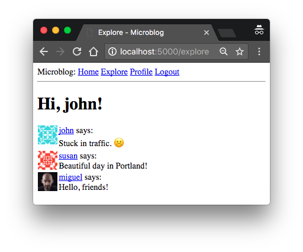
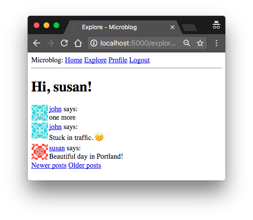

## Chapter 9: Pagination

> Posted by on [Miguel Grinberg](https://blog.miguelgrinberg.com/author/Miguel%20Grinberg)

這是 Flask Mega-Tutorial 系列的第九部分，在本章中，我將告訴你如何對資料庫條目的列表進行分頁。

### 目錄

- [Chapter 1: Hello, World!](/python/flask-mega-tutorial/chapter_1_hello_world)
- [Chapter 2: Templates](/python/flask-mega-tutorial/chapter_2_templates)
- [Chapter 3: Web Forms](/python/flask-mega-tutorial/chapter_3_web_forms)
- [Chapter 4: Database](/python/flask-mega-tutorial/chapter_4_database)
- [Chapter 5: User Logins](/python/flask-mega-tutorial/chapter_5_user_logins)
- [Chapter 6: Profile Page and Avatars](/python/flask-mega-tutorial/chapter_6_profile_page_and_avatars)
- [Chapter 7: Error Handling](/python/flask-mega-tutorial/chapter_7_error_handling)
- [Chapter 8: Followers](/python/flask-mega-tutorial/chapter_8_followers)
- [Chapter 9: Pagination](/python/flask-mega-tutorial/chapter_9_pagination)
- [Chapter 10: Email Support](/python/flask-mega-tutorial/chapter_10_email_support)
- [Chapter 11: Facelift](/python/flask-mega-tutorial/chapter_11_facelift)
- [Chapter 12: Dates and Times](/python/flask-mega-tutorial/chapter_12_dates_and_times)
- [Chapter 13: I18n and L10n](/python/flask-mega-tutorial/chapter_13_i18n_and_l10n)
- [Chapter 14: Ajax](/python/flask-mega-tutorial/chapter_14_ajax)
- [Chapter 15: A Better Application Structure](/python/flask-mega-tutorial/chapter_15_a_better_application_structure)
- [Chapter 16: Full-Text Search](/python/flask-mega-tutorial/chapter_16_full_text_search)
- [Chapter 17: Deployment on Linux](/python/flask-mega-tutorial/chapter_17_deployment_on_linux)
- [Chapter 19: Deployment on Docker Containers](/python/flask-mega-tutorial/chapter_19_deployment_on_docker_containers)
- [Chapter 20: Some JavaScript Magic](/python/flask-mega-tutorial/chapter_20_some_javascript_magic)
- [Chapter 21: User Notifications](/python/flask-mega-tutorial/chapter_21_user_notifications)
- [Chapter 22: Background Jobs](/python/flask-mega-tutorial/chapter_22_background_jobs)
- [Chapter 23: Application Programming Interfaces （APIs）](/python/flask-mega-tutorial/chapter_23_application_programming_interfaces_apis)


> 你正在閱讀 Flask Mega-Tutorial 的 2024 年版本。完整的課程也可以在 [Amazon](https://amzn.to/3ahVnPN) 以電子書和平裝書的形式訂購。感謝你的支持！
> 如果你正在尋找 2018 年版本的課程，你可以在[這裡](https://blog.miguelgrinberg.com/post/the-flask-mega-tutorial-part-i-hello-world-2018)找到它。

在第八章中，我進行了一些資料庫變更，這對支持社交網絡中非常流行的「追蹤者」模式是必要的。有了這個功能後，我準備移除我在開始時設置的最後一塊臨時搭建，即假貼文。在本章中，應用程式將開始接受來自使用者的部落格貼文，並且在首頁和個人資料頁面以分頁列表的形式呈現它們。

本章的 GitHub 連結為：[Browse](https://github.com/miguelgrinberg/microblog/tree/v0.9) [Zip](https://github.com/miguelgrinberg/microblog/archive/v0.9.zip) [Diff](https://github.com/miguelgrinberg/microblog/compare/v0.8...v0.9)


### 提交部落格貼文
首頁需要有一個表單，使用者可以在其中輸入新的貼文。首先我建立一個表單類別：

app/forms.py: 部落格提交表單。

```python
class PostForm(FlaskForm):
    post = TextAreaField('說點什麼', validators=[
        DataRequired(), Length(min=1, max=140)])
    submit = SubmitField('提交')
```

接下來，我可以將這個表單加入到應用程式主頁面的模板中：

app/templates/index.html: 首頁模板中的貼文提交表單

```html



    <h1> 嗨，{{ current_user.username }}！</h1>
    <form action=""method="post">
        {{form.hidden_tag() }}
        <p>
            {{form.post.label}}<br>
            {{form.post(cols=32, rows=4) }}<br>
            
            <span style="color: red;">[{{ error }}]</span>
            
        </p>
        <p>{{ form.submit() }}</p>
    </form>
    
    <p>
    {{post.author.username}} 說： <b>{{ post.body }}</b>
    </p>
    

```

這個模板中的更動與之前處理的表單類似。最後一部分是在視圖函數中加入表單的建立和處理：

app/routes.py: 首頁視圖函數中的貼文提交表單。

```python
from app.forms import PostForm
from app.models import Post

@app.route('/', methods=['GET', 'POST'])
@app.route('/index', methods=['GET', 'POST'])
@login_required
def index():
    form = PostForm()
    if form.validate_on_submit():
        post = Post(body=form.post.data, author=current_user)
        db.session.add(post)
        db.session.commit()
        flash('你的貼文現在已發布！')
        return redirect(url_for('index'))
    posts = [
        {
            'author': {'username': 'John'},
            'body': '波特蘭的天氣真好！'
        },
        {
            'author': {'username': 'Susan'},
            'body': '《復仇者聯盟》電影太酷了！'
        }
    ]
    return render_template("index.html", title='首頁', form=form,
                           posts=posts)
```

讓我們一一回顧這個視圖函數的變更：

1. 我現在引入了 Post 和 PostForm 類別。
2. 我接受在與首頁視圖函數相關的兩個路由中的 POST 請求，除了 GET 請求，

因為這個視圖函數現在將接收表單數據。
3. 表單處理邏輯將一個新的 Post 紀錄插入到資料庫中。
4. 模板收到表單物件作為附加參數，這樣它就可以將其渲染到頁面上。

在繼續之前，我想提及一些與網頁表單處理相關的重要事項。請注意，在我處理表單數據後，我通過發送重定向到首頁來結束請求。我本可以輕易地跳過重定向，讓函數繼續進行到模板渲染部分，因為這已經是首頁視圖函數。

那麼，為什麼要發送重定向到相同頁面？因為這是一個標準做法，總是以重定向回應由網頁表單提交產生的 POST 請求。這有助於緩解網頁瀏覽器中刷新命令實現方式的一個煩惱。當你按下刷新鍵時，網頁瀏覽器只是重新發送上一個請求。如果最後的請求是帶有表單提交的 POST 請求，那麼刷新將會重新提交表單。由於這是意料之外的，瀏覽器會要求使用者確認重複提交，但大多數使用者不會理解瀏覽器在詢問什麼。如果 POST 請求以重定向回應，則瀏覽器被指示發送 GET 請求以獲取重定向中指示的頁面，所以現在最後的請求不再是 POST 請求，而刷新命令的工作方式更加可預測。

這個簡單的技巧被稱為 Post/Redirect/Get 模式。它避免了當使用者在提交網頁表單後不慎刷新頁面時，插入重複貼文的情況。

### 顯示部落格貼文
如果你還記得，我建立了一些假的部落格貼文，這些貼文我已經在首頁顯示了很長時間。這些假對象是在 index 視圖函數中明確建立的，作為一個簡單的 Python 列表：

```python
    posts = [
        {
            'author': {'username': 'John'},
            'body': '波特蘭的天氣真好！'
        },
        {
            'author': {'username': 'Susan'},
            'body': '《復仇者聯盟》電影太酷了！'
        }
    ]
```
但現在我有了 User 模型中的 following_posts() 方法，它返回一個查詢，用於獲取給定使用者想要看到的貼文。所以現在我可以用真實的貼文替換假貼文：

app/routes.py: 在首頁顯示真實貼文。

```python
@app.route('/', methods=['GET', 'POST'])
@app.route('/index', methods=['GET', 'POST'])
@login_required
def index():
    ## ...
    posts = db.session.scalars(current_user.following_posts()).all()
    return render_template("index.html", title='首頁', form=form,
                           posts=posts)
```
User 類別的 following_posts 方法返回一個已配置的 SQLAlchemy 查詢物件，用於從資料庫中獲取使用者感興趣的貼文。在執行此查詢並對結果物件調用 all() 後，posts 變數最終包含了所有結果的列表。所以我最終得到的結構非常類似於我一直使用的假貼文。這麼接近以至於模板甚至不需要更改。

### 使尋找追蹤使用者更容易
正如你所注意到的，應用程式在讓使用者尋找其他使用者進行追蹤方面做得不是很好。實際上，根本沒有辦法看到還有哪些其他使用者。我將通過一些簡單的更改來解決這個問題。

我將建立一個新頁面，我將其稱為「探索」頁面。這個頁面的運作方式類似於首頁，但不僅僅顯示追蹤使用者的貼文，還將顯示來自所有使用者的全球貼文流。這是新的探索視圖函數：

app/routes.py: 探索視圖函數。

```python
@app.route('/explore')
@login_required
def explore():
    query = sa.select(Post).order_by(Post.timestamp.desc())
    posts = db.session.scalars(query).all()
    return render_template('index.html', title='探索', posts=posts)
```
你注意到這個視圖函數中有些奇怪的事情了嗎？render_template() 調用引用了 index.html 模板，我在應用程式的主頁面中使用它。由於這個頁面將與主頁非常相似，我決定重用模板。但與主頁的一個區別是，在探索頁面中我不想有撰寫部落格貼文的表單，所以在這個視圖函數中，我沒有在 render_template() 調用中包括 form 參數。

為了防止 index.html 模板在嘗試渲染不存在的

網頁表單時崩潰，我將加入一個條件，僅在視圖函數傳遞表單時渲染表單：

app/templates/index.html: 使部落格貼文提交表單可選。

```html



    <h1> 嗨，{{ current_user.username }}！</h1>
    
    <form action=""method="post">
        ...
    </form>
    
    ...

```
我還將在導航欄中加入一個連結到這個新頁面，就在首頁連結之後：

app/templates/base.html: 導航欄中的探索頁面連結。

```html
        <a href="{{ url_for('explore') }}"> 探索 </a>
```
記得我在第六章介紹的 _post.html 子模板，用於在使用者個人資料頁面渲染部落格貼文嗎？這是一個小模板，從使用者個人資料頁面模板中包含，並在單獨的文件中編寫，這樣它也可以從其他模板中使用。我現在將對它進行一個小改進，那就是將部落格貼文作者的使用者名顯示為可點擊的連結：

app/templates/_post.html: 在部落格貼文中顯示作者連結。

```html
    <table>
        <tr valign="top">
            <td></td>
            <td>
                <a href="{{ url_for('user', username=post.author.username) }}">
                    {{post.author.username}}
                </a>
                說：<br>{{ post.body }}
            </td>
        </tr>
    </table>
```
我現在可以使用這個子模板在首頁和探索頁面渲染部落格貼文：

app/templates/index.html: 使用部落格貼文子模板。

```html
    ...
    
        
    
    ...
```
子模板期望存在一個名為 post 的變數，這正是 index 模板中的循環變數的名稱，所以這樣做非常完美。

通過這些小改動，應用程式的可用性大大提升。現在使用者可以訪問探索頁面閱讀來自未知使用者的部落格貼文，並根據這些貼文找到新的使用者進行追蹤，這可以通過簡單地點擊使用者名來訪問個人資料頁面來完成。很棒，對吧？

此時，我建議你再次嘗試應用程式，以便體驗這些最新的使用者界面改進。你可能還想建立一些不同的使用者，並以他們的身份撰寫貼文，這樣系統就有來自多個使用者的多樣化內容。



### 部落格貼文的分頁

應用程式看起來比以往更好，但在首頁顯示所有追蹤的貼文將很快成為一個問題。想像一下，如果一個使用者追蹤了一千篇貼文，甚至一百萬篇？你可以想像，管理這麼大的貼文列表會非常慢且低效。

為了解決這個問題，我打算對貼文列表進行分頁。這意味著我最初只會一次顯示有限數量的貼文，並包括向前和向後導航的連結，以瀏覽完整的貼文列表。Flask-SQLAlchemy 通過 db.paginate() 函數原生支持分頁，這個函數的工作方式類似於 db.session.scalars()，但內建了分頁功能。例如，如果我想獲取使用者的前二十篇追蹤貼文，我可以這樣做：

```python
>>> query = sa.select(Post).order_by(Post.timestamp.desc())
>>> posts = db.paginate(query, page=1, per_page=20, error_out=False).items
```
paginate 函數可以在任何查詢上調用。它接受幾個參數，其中以下三個最為重要：

- page：頁碼，從 1 開始
- per_page：每頁的項目數
- error_out：錯誤標誌。如果為 True，當請求範圍外的頁面時，將自動向客戶端返回 404 錯誤。如果為 False，對於範圍外的頁面將返回空列表。

從 db.paginate() 返回的值是一個 Pagination 對象。這個對象的 items 屬性包含了請求頁面中的項目列表。Pagination 對象中還有其他有用的東西，我稍後會討論。

現在讓我們思考一下我如何在 index() 視圖函數中實現分頁。我可以從在應用程式中加入一個配置項開始，以確定每頁將顯示多少項目。

config.py: 每頁貼文配置。

```python
class Config(object):
    ## ...
    POSTS_PER_PAGE = 3
```
在配置文件中擁有這些可以改變行為的應用程式範圍 “旋鈕” 是個好主意，因為這樣我可以去一個地方進行調整。在最終的應用程式中，我當然會使用比每頁三個項目更大的數字，但對於測試來說，使用小數字是有用的。

接下來，我需要決定如何將頁碼納入應用程式的 URL 中。一種相當普遍的方式是使用查詢字串參數來指定一個可選的頁碼，如果沒有給出，則默認為第 1 頁。這裡有一些範例 URL，展示了我將如何實現這一點：

- 第 1 頁，隱式：http://localhost:5000/index
- 第 1 頁，顯式：http://localhost:5000/index?page=1
- 第 3 頁：http://localhost:5000/index?page=3

要訪問查詢字串中給出的參數，我可以使用 Flask 的 request.args 物件。你已經在第 5 章中看到過這一點，當時我實現了來自 Flask-Login 的使用者登錄 URL，有時會包括一個 next 查詢字串參數。

下面你可以看到我如何向首頁和探索視圖函數中加入分頁：

app/routes.py: 跟隨者關聯表

```python
@app.route('/', methods=['GET', 'POST'])
@app.route('/index', methods=['GET', 'POST'])
@login_required
def index():
    ## ...
    page = request.args.get('page', 1, type=int)
    posts = db.paginate(current_user.following_posts(), page=page,
                        per_page=app.config['POSTS_PER_PAGE'], error_out=False)
    return render_template('index.html', title='首頁', form=form,
                           posts=posts.items)

@app.route('/explore')
@login_required
def explore():
    page = request.args.get('page', 1, type=int)
    query = sa.select(Post).order_by(Post.timestamp.desc())
    posts = db.paginate(query, page=page,
                        per_page=app.config['POSTS_PER_PAGE'], error_out=False)
    return render_template("index.html", title='探索', posts=posts.items)
```
這些更改使得這兩個路由決定要顯示的頁碼，要麼從 page 查詢字串參數，要麼從默認值 1，然後使用 paginate() 方法僅檢索所需頁面的結果。確定頁面大小的 POSTS_PER_PAGE 配置項目通過 app.config 物件訪問。

注意這些更改有多麼簡短，並且每次更改時受影響的程式碼量很小。我嘗試寫應用程式的每一部分，而不對其他部分的工作方式做任何假設，這使我能夠寫出模組化且健壯的應用程式，這些應用程式更容易擴展和測試，並且不太可能失敗或有錯誤。

繼續並嘗試分頁支持。首先確保你已經寫了超過三篇部落格貼文。在探索頁面上更容易看到這一點，它顯示了來自所有使用者的貼文。現在你只會看到最近的三篇貼文。如果你想看下一個三篇，請在瀏覽器的地址欄中輸入 http://localhost:5000/explore?page=2。

### 頁面導航 Page Navigation
下一個更改是在部落格貼文列表底部加入連結，讓使用者可以導航到下一頁或 / 和上一頁。記得我提到過 paginate() 調用的返回值是來自 Flask-SQLAlchemy 的 Pagination 類的對象嗎？到目前為止，我已經使用了這個對象的 items 屬性，其中包含了為選定頁面檢索的項目列表。但這個對象還有一些其他屬性，在構建分頁連結時非常有用：

- has_next：如果當前頁面後面至少還有一頁，則為 True
- has_prev：如果當前頁面前面至少還有一頁，則為 True
- next_num：下一頁的頁碼
- prev_num：上一頁的頁碼

使用這四個元素，我可以生成下一頁和上一頁的連結，並將它們傳遞給模板進行呈現：


app/routes.py: Next and previous page links.
```python

@app.route('/', methods=['GET', 'POST'])
@app.route('/index', methods=['GET', 'POST'])
@login_required
def index():
    ## ...
    page = request.args.get('page', 1, type=int)
    posts = db.paginate(current_user.following_posts(), page=page,
                        per_page=app.config['POSTS_PER_PAGE'], error_out=False)
    next_url = url_for('index', page=posts.next_num) \
        if posts.has_next else None
    prev_url = url_for('index', page=posts.prev_num) \
        if posts.has_prev else None
    return render_template('index.html', title='Home', form=form,
                           posts=posts.items, next_url=next_url,
                           prev_url=prev_url)

 @app.route('/explore')
 @login_required
 def explore():
    page = request.args.get('page', 1, type=int)
    query = sa.select(Post).order_by(Post.timestamp.desc())
    posts = db.paginate(query, page=page,
                        per_page=app.config['POSTS_PER_PAGE'], error_out=False)
    next_url = url_for('explore', page=posts.next_num) \
        if posts.has_next else None
    prev_url = url_for('explore', page=posts.prev_num) \
        if posts.has_prev else None
    return render_template("index.html", title='Explore', posts=posts.items,
                           next_url=next_url, prev_url=prev_url)
```

這兩個視圖函數中的 `next_url` 和 `prev_url`` 將被設置為 Flask 的 `url_for()` 函數返回的 URL，但僅在該方向有頁面可前往時才會設置。如果當前頁面位於貼文集合的端點之一，則 Pagination 物件的 `has_next` 或 `has_prev` 屬性將為 False，此時該方向的連結將設置為 None。

`url_for()` 函數的一個有趣方面是，你可以向它加入任何關鍵字參數，如果這些參數的名稱不是路由定義的 URL 的一部分，那麼 Flask 將它們作為查詢參數包含在內。

分頁連結被設置到 index.html 模板中，現在讓我們在頁面上的貼文列表下方渲染它們：

app/templates/index.html: 在模板上渲染分頁連結。

```html
    ...
    
        
    
    
    <a href="{{ prev_url}}"> 較新的貼文 </a>
    
    
    <a href="{{ next_url}}"> 較舊的貼文 </a>
    
    ...
```
這項更改在首頁和探索頁面的貼文列表下方新增了兩個連結。第一個連結標記為「較新的貼文」，指向前一頁（請記住我按最新排序顯示貼文，所以第一頁是最新內容的頁面）。第二個連結標記為「較舊的貼文」，指向下一頁貼文。如果這兩個連結中的任何一個為 None，則它會通過條件從頁面上省略。



### 使用者個人資料頁面的分頁
對首頁的更改目前足夠了。然而，使用者個人資料頁面上也有一個貼文列表，僅顯示該個人資料擁有者的貼文。為了保持一致性，應該將使用者個人資料頁面更改為與首頁的分頁風格相匹配。

我首先更新使用者個人資料視圖函數，該函數仍然包含一個假貼文物件列表。

app/routes.py: 使用者個人資料視圖函數中的分頁。

```python
@app.route('/user/<username>')
@login_required
def user(username):
    user = db.first_or_404(sa.select(User).where(User.username == username))
    page = request.args.get('page', 1, type=int)
    query = user.posts.select().order_by(Post.timestamp.desc())
    posts = db.paginate(query, page=page,
                        per_page=app.config['POSTS_PER_PAGE'],
                        error_out=False)
    next_url = url_for('user', username=user.username, page=posts.next_num) \
        if posts.has_next else None
    prev_url = url_for('user', username=user.username, page=posts.prev_num) \
        if posts.has_prev else None
    form = EmptyForm()
    return render_template('user.html', user=user, posts=posts.items,
                           next_url=next_url, prev_url=prev_url, form=form)
```
為了從使用者那裡獲取貼文列表，我利用了 user.posts 關係被定義為僅寫關係的事實，這意味

著該屬性具有返回相關物件查詢的 `select()` 方法。我取這個查詢並加入 `order_by()` 子句，以便首先獲得最新的貼文，然後像我對首頁和探索頁面中的貼文那樣進行分頁。請注意，此頁面中由 `url_for()` 函數生成的分頁連結需要額外的 username 參數，因為它們指回使用者個人資料頁面，該頁面的 URL 中有這個使用者名作為動態組件。

最後，user.html 模板的更改與我在首頁所做的相同：

app/templates/user.html: 使用者個人資料模板中的分頁連結。

```html
    ...
    
        
    
    
    <a href="{{ prev_url}}"> 較新的貼文 </a>
    
    
    <a href="{{ next_url}}"> 較舊的貼文 </a>
    
```
在你完成對分頁功能的實驗後，你可以將 `POSTS_PER_PAGE` 配置項設置為一個更合理的值：

config.py: 每頁貼文配置。

```python
class Config(object):
    ## ...
    POSTS_PER_PAGE = 25
```
